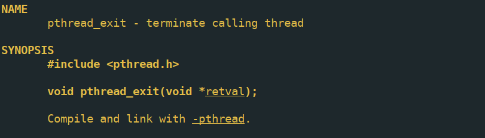
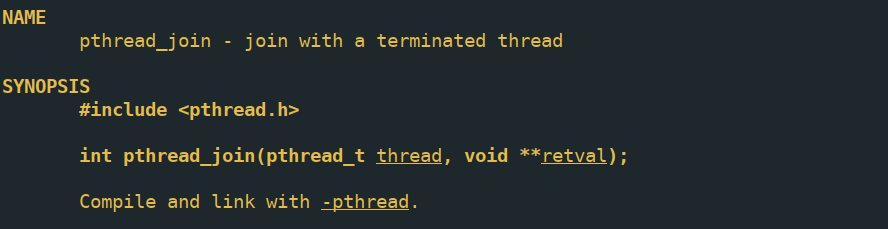
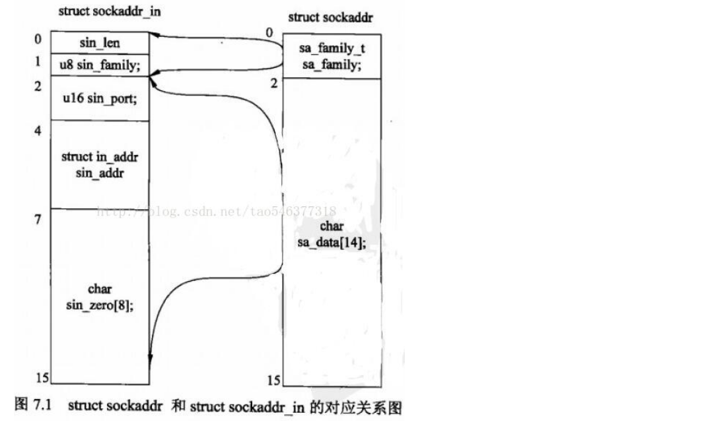
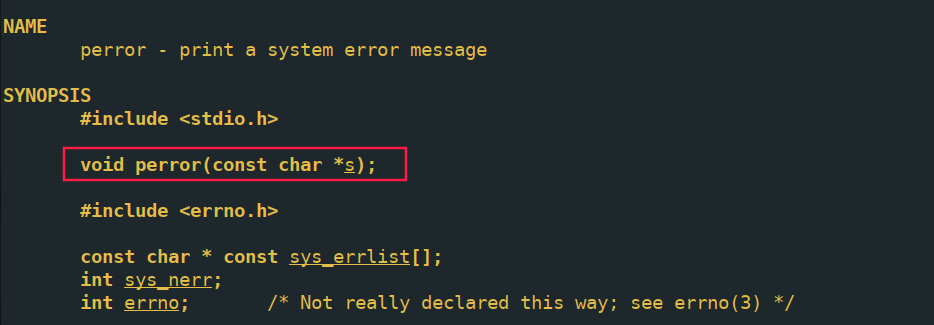
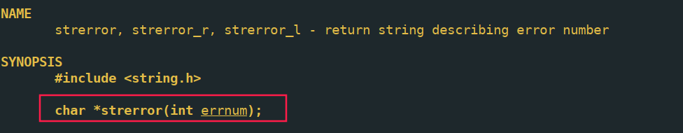

# c语言程序设计

## 指针操作

#### 声明函数指针

```c
void (*funP)(int) ;   //声明一个指向同样参数、返回值的函数指针变量。
int (*fArray[10]) ( int ); // 声明函数指针数组
```

#### 声明函数指针类型

```c
typedef void(*FunType)(int);// 声明FunType类型为一个函数指针
void callFun(FunType fp,int x);// 声明后的类型可以用在函数参数中
```

#### 声明指针数组

```c
int* p1[10];// p1 是一个长度为10的数组,数组中存放整形指针变量
```

#### 声明数组指针

```c
int (*p2)[10];//p2 是一个指向含有10个整型数字数组的指针
```

#### 动态分配数组指针

```c
char (*a)[N];//指向数组的指针
a = (char (*)[N])malloc(sizeof(char *) * m);
```

## 文件操作


## 多线程与多进程

### 多线程pthread

#### 创建线程

pthread是linux下符合posix标准的线程库,其中关于线程的操作包括线程创建\线程设置\线程同步\线程取消等操作.线程函数的原型为


线程函数原型是一个参数为void类型指针,返回值为void类型指针的函数,创建成功返回0,失败返回错误代码,thread为pthread_t类型的指针,attr为线程属性

```c
pthread_t t_thread;
res = pthread_create(&t_thread, NULL, thread_func, (void*)message);
if(res != 0){
    perror("线程创建失败！");
    exit(EXIT_FAILURE);
}
```

#### 结束线程

pthread_exit用于线程内部主动结束,传入的参数可以被pthread_join得到





简单的示例

```c
#include<stdio.h>
#include<stdlib.h>
#include<string.h>
#include<pthread.h>
#include<unistd.h>
#include<sys/types.h>
char message[50] = "THREAD_TEST";
void* thread_func(void *arg);
int main(){
    pthread_t t_thread;
    void *thread_result;
    int res;
    res = pthread_create(&t_thread, NULL, thread_func, (void*)message);
    if(res != 0){
        perror("线程创建失败！");
        exit(EXIT_FAILURE);
    }
    printf("wait for the thread!\n");
    pthread_join(t_thread, &thread_result);
    printf("线程已结束，返回值为%s\n", (char*)thread_result);
    printf("message的值为%s\n", message);
    free(thread_result);
    exit(EXIT_SUCCESS);
}

void* thread_func(void *arg){
    printf("线程正在运行，参数为%s\n", (char*)arg);
    sleep(3);
    strcpy(message, "线程修改");
    char* buf = (char*)malloc(strlen("线程执行完毕！"));
    strcpy(buf, "线程执行完毕！");
    pthread_exit(buf);
}
```

#### 取消线程

线程在运行的过程中可以被主线程中的函数取消,但是线程内部要先设置可以被取消的选项.这两个问题，我们都可以利用线程的取消点(cancellation points)来避免。线程的cancel type有两种：PTHREAD_CANCEL_DEFERRED和PTHREAD_CANCEL_ASYNCHRONOUS，前者为默认类型，意味着线程只有在取消点处才能被cancel。也就是说，在对线程pthread_cancel()之后，线程还要继续执行到下一个取消点才会退出。
可以通过pthread_setcanceltype()来改变线程的cancel type，但强烈不建议这样做，因为你如果改为PTHREAD_CANCEL_ASYNCHRONOUS类型，线程可以在代码的任何地方退出，就很难处理上述两个资源释放问题。

##### **与线程取消相关的pthread函数**

int **pthread_cancel**(pthread_t thread)
发送终止信号给thread线程，如果成功则返回0，否则为非0值。发送成功并不意味着thread会终止。

int **pthread_setcancelstate**(int state,  int *oldstate) 
设置本线程对Cancel信号的反应，state有两种值：PTHREAD_CANCEL_ENABLE（缺省）和PTHREAD_CANCEL_DISABLE，
分别表示收到信号后设为CANCLED状态和忽略CANCEL信号继续运行；old_state如果不为NULL则存入原来的Cancel状态以便恢复。 

int **pthread_setcanceltype**(int type, int *oldtype) 
设置本线程取消动作的执行时机，type由两种取值：PTHREAD_CANCEL_DEFFERED和PTHREAD_CANCEL_ASYCHRONOUS，仅当Cancel状态为Enable时有效，分别表示收到信号后继续运行至下一个取消点再退出和立即执行取消动作（退出）；oldtype如果不为NULL则存入运来的取消动作类型值。 

void **pthread_testcancel**(void)
是说pthread_testcancel在不包含取消点，但是又需要取消点的地方创建一个取消点，以便在一个没有包含取消点的执行代码线程中响应取消请求.
线程取消功能处于启用状态且取消状态设置为延迟状态时，pthread_testcancel()函数有效。
如果在取消功能处处于禁用状态下调用pthread_testcancel()，则该函数不起作用。
请务必仅在线程取消线程操作安全的序列中插入pthread_testcancel()。除通过pthread_testcancel()调用以编程方式建立的取消点意外，pthread标准还指定了几个取消点。测试退出点,就是测试cancel信号.

##### **取消点**

线程取消的方法是向目标线程发Cancel信号，但如何处理Cancel信号则由目标线程自己决定，或者忽略、或者立即终止、或者继续运行至Cancelation-point（取消点），由不同的Cancelation状态决定。

线程接收到CANCEL信号的缺省处理（即pthread_create()创建线程的缺省状态）是继续运行至取消点，也就是说设置一个CANCELED状态，线程继续运行，只有运行至Cancelation-point的时候才会退出。

pthreads标准指定了几个取消点，其中包括：
(1)通过pthread_testcancel调用以编程方式建立线程取消点。
(2)线程等待pthread_cond_wait或pthread_cond_timewait()中的特定条件。
(3)被sigwait(2)阻塞的函数
(4)一些标准的库调用。通常，这些调用包括线程可基于阻塞的函数。

缺省情况下，将启用取消功能。有时，您可能希望应用程序禁用取消功能。如果禁用取消功能，则会导致延迟所有的取消请求，
直到再次启用取消请求。 
根据POSIX标准，pthread_join()、pthread_testcancel()、pthread_cond_wait()、pthread_cond_timedwait()、sem_wait()、sigwait()等函数以及
read()、write()等会引起阻塞的系统调用都是Cancelation-point，而其他pthread函数都不会引起Cancelation动作。
但是pthread_cancel的手册页声称，由于LinuxThread库与C库结合得不好，因而目前C库函数都不是Cancelation-point；但CANCEL信号会使线程从阻塞的系统调用中退出，并置EINTR错误码，因此可以在需要作为Cancelation-point的系统调用前后调用pthread_testcancel()，从而达到POSIX标准所要求的目标.
即如下代码段：
**pthread_testcancel**();
retcode = read(fd, buffer, length);
**pthread_testcancel**();

注意：
**程序设计方面的考虑,如果线程处于无限循环中，且循环体内没有执行至取消点的必然路径，则线程无法由外部其他线程的取消请求而终止。因此在这样的循环体的必经路径上应该加入pthread_testcancel()调用.**


##### **线程终止的清理工作**

Posix的线程终止有两种情况：正常终止和非正常终止。
线程主动调用pthread_exit()或者从线程函数中return都将使线程正常退出，这是可预见的退出方式；
非正常终止是线程在其他线程的干预下，或者由于自身运行出错（比如访问非法地址）而退出，这种退出方式是不可预见的。

不论是可预见的线程终止还是异常终止，都会存在资源释放的问题，在不考虑因运行出错而退出的前提下，如何保证线程终止时能顺利的释放掉自己所占用的资源，特别是锁资源，就是一个必须考虑解决的问题。
最经常出现的情形是资源独占锁的使用：线程为了访问临界资源而为其加上锁，但在访问过程中被外界取消，如果线程处于响应取消状态，且采用异步方式响应，或者在打开独占锁以前的运行路径上存在取消点，则该临界资源将永远处于锁定状态得不到释放。外界取消操作是不可预见的，因此的确需要一个机制来简化用于资源释放的编程。

在POSIX线程API中提供了一个pthread_cleanup_push()/ pthread_cleanup_pop()函数,
对用于自动释放资源—从pthread_cleanup_push()的调用点到pthread_cleanup_pop()之间的程序段中的终止动作（包括调用pthread_exit()和取消点终止）都将执行pthread_cleanup_push()所指定的清理函数。

API定义如下：
void pthread_cleanup_push(void (*routine) (void *), void *arg)
void pthread_cleanup_pop(int execute)

pthread_cleanup_push()/pthread_cleanup_pop()采用先入后出的栈结构管理，void routine(void *arg)函数
在调用pthread_cleanup_push()时压入清理函数栈，多次对pthread_cleanup_push() 的调用将在清理函数栈中形成一个函数链；
从pthread_cleanup_push的调用点到pthread_cleanup_pop之间的程序段中的终止动作（包括调用pthread_exit()和异常终止，不包括return）
都将执行pthread_cleanup_push()所指定的清理函数。

在执行该函数链时按照压栈的相反顺序弹出。execute参数表示执行到 pthread_cleanup_pop()时
是否在弹出清理函数的同时执行该函数，为0表示不执行，非0为执行；这个参数并不影响异常终止时清理函数的执行。

一个取消线程的简单示例


#### 线程同步


##### 信号量

include<semaphore.h>

sem_init

sem_post

sem_wait

sem_destroy

```c
#include<stdio.h>
#include<stdlib.h>
#include<unistd.h>
#include<string.h>
#include<pthread.h>
#include<semaphore.h>
//thread_func declaration
void *thread_func(void* arg);
//semaphore global var
sem_t semth;
//buff used to receive the user input
#define BUFSIZE 1024
char buf[BUFSIZE];
//man function
int main(){
    //var declaration:int res, pthread_t used to create pthread,void thread_res used to join
    int res;
    pthread_t thread;
    void *thread_res;

    if((res = sem_init(&semth, 0, 0)) != 0){
        perror("create semaphore failed");
        exit(EXIT_FAILURE);
    }
//pthread create with error detection
    if((res = pthread_create(&thread, NULL, thread_func, NULL)) != 0){
        perror("create thread failed");
        exit(EXIT_FAILURE);
    }
//prompt information
    printf("Please input string information and type 'end' to exit!");
//get user input and make a P operation on sem_t
    while(strncmp(buf, "end", 3) != 0){
        fgets(buf, BUFSIZE, stdin);
        sem_post(&semth);
    }
//join the thread
    if((res = pthread_join(thread, &thread_res)) != 0){
        perror("thread join failed");
        exit(EXIT_FAILURE);
    }
//destory the semaphore
    if((res = sem_destroy(&semth)) != 0){
        perror("destory semaphore failed");
        exit(EXIT_FAILURE);
    }
//exit
    exit(EXIT_SUCCESS);
}

//thread_func definition
void *thread_func(void *arg){
//make V operation on sem_t
    sem_wait(&semth);
//while loop , get user info from buff, and make V operation on sem_t
    while(strncmp(buf, "end", 3) != 0){
        printf("you type:%s\n", buf);
        sem_wait(&semth);
    }
    fputs("exiting...\n", stdout);
//pthread_exit
    pthread_exit(0);
}
```

##### 互斥量

pthread_mutex_init/pthread_mutex_lock/pthread_mutex_unlock/pthread_mutex_destory

```c
#include<stdio.h>
#include<stdlib.h>
#include<string.h>
#include<unistd.h>
#include<pthread.h>
#include<semaphore.h>
// global var declaration
pthread_mutex_t mutex;//global mutex lock
int exit_time = 1;//running symbol
char work_area[1024];
void* thread_func(void* arg){
    printf("子线程正在执行，对互斥量加锁\n");
    pthread_mutex_lock(&mutex);
    while(strncmp(work_area, "end", 3) != 0){
        printf("len:%d\n", strlen(work_area) - 1);
        work_area[0] = '\0';
        printf("解锁互斥量\n");
        pthread_mutex_unlock(&mutex);
        puts("睡眠1秒！\n");
        sleep(1);
        printf("判断信息是否为空\n");
        
        while(work_area[0] == '\0'){
            printf("轮询直到有信息传送！\n");
            if(work_area[0] == '\0'){
                sleep(1);
            }else{
                pthread_mutex_lock(&mutex);
                break;
            }
            
        }
    }
    exit_time = 0;
    work_area[0] = '\0';
    pthread_mutex_unlock(&mutex);
    pthread_exit(EXIT_SUCCESS);
}

int main(){
    pthread_t thread;
    int res;
    void * thread_res;
    
    pthread_mutex_init(&mutex, NULL);
    pthread_mutex_lock(&mutex);
    if((res = pthread_create(&thread, NULL, thread_func, NULL)) != 0){
        perror("创建线程失败！");
        exit(EXIT_FAILURE);
    }
    
    while(exit_time){
        printf("type your string:\n");
        fgets(work_area, 1024, stdin);
        pthread_mutex_unlock(&mutex);
        while(1){
            if(work_area[0] != '\0'){
                puts("数据未被取出");
                sleep(1);
            }else{

                pthread_mutex_lock(&mutex);
                break;

            }
        }
        
    }
    pthread_mutex_unlock(&mutex);
    printf("wait for the thread exit!\n");
    if((res = pthread_join(thread, thread_res)) != 0){
        perror("等待线程结束出错！");
        exit(EXIT_FAILURE);
    }
    printf("thread exited!");
    pthread_mutex_destroy(&mutex);
    exit(EXIT_SUCCESS);
}
```

##### 条件变量

条件变量与一般与互斥量一起使用,实现程序的条件等待

```c
#include <pthread.h>
#include <stdio.h>
#include <stdlib.h>

#define NUM_THREADS  3
#define TCOUNT 10
#define COUNT_LIMIT 12

int     count = 0;
pthread_mutex_t count_mutex;
pthread_cond_t count_threshold_cv;

void *inc_count(void *t) //增加count
{
    int i;
    long my_id = (long)t;

    for (i=0; i < TCOUNT; i++)
    {
        pthread_mutex_lock(&count_mutex);
        count++;

        if (count == COUNT_LIMIT) //满足条件后
        {
            printf("inc_count(): thread %ld, count = %d  Threshold reached. ",my_id, count);
            pthread_cond_signal(&count_threshold_cv);//通知
            printf("Just sent signal.\n");
        }
        printf("inc_count(): thread %ld, count = %d, unlocking mutex\n",my_id, count);

        //这里释放锁的同时 sleep 1 秒中可以保证线程2和线程3交替获得锁并执行
        pthread_mutex_unlock(&count_mutex);
        sleep(1);
    }//end for
    pthread_exit(NULL);
}

void *watch_count(void *t) //检查条件变量
{
    long my_id = (long)t;

    printf("Starting watch_count(): thread %ld\n", my_id);

    pthread_mutex_lock(&count_mutex);
    while (count < COUNT_LIMIT)//这里用while防止虚假唤醒
    {
        printf("watch_count(): thread %ld Count= %d. Going into wait...\n", my_id,count);
        pthread_cond_wait(&count_threshold_cv, &count_mutex);//阻塞后自动释放锁
        printf("watch_count(): thread %ld Condition signal received. Count= %d\n", my_id,count);
        printf("watch_count(): thread %ld Updating the value of count...\n", my_id,count);
        count += 125;
        printf("watch_count(): thread %ld count now = %d.\n", my_id, count);
    }
    printf("watch_count(): thread %ld Unlocking mutex.\n", my_id);
    pthread_mutex_unlock(&count_mutex);
    pthread_exit(NULL);
}

int main(int argc, char *argv[])
{
    int i, rc; 
    long t1=1, t2=2, t3=3;
    pthread_t threads[3];//3个线程
    pthread_attr_t attr;//attr

    /* 初始化 mutex 和 condition variable  */
    pthread_mutex_init(&count_mutex, NULL); 
    pthread_cond_init (&count_threshold_cv, NULL);

    pthread_attr_init(&attr);
    pthread_attr_setdetachstate(&attr, PTHREAD_CREATE_JOINABLE);
    pthread_create(&threads[0], &attr, watch_count, (void *)t1);//线程1关注count值
    pthread_create(&threads[1], &attr, inc_count, (void *)t2);//线程2增加count值
    pthread_create(&threads[2], &attr, inc_count, (void *)t3);//线程3增加count值

    for (i = 0; i < NUM_THREADS; i++) 
    {
        pthread_join(threads[i], NULL);
    }//等待所有线程完成
    printf ("Main(): Waited and joined with %d threads. Final value of count = %d. Done.\n", NUM_THREADS, count);

    /* Clean up and exit */
    pthread_attr_destroy(&attr);
    pthread_mutex_destroy(&count_mutex);
    pthread_cond_destroy(&count_threshold_cv);
    pthread_exit (NULL);

}

```

#### 使用pthread实现线程池

声明一个线程池需要线程池大小,线程池的工作队列,线程池的互斥锁与条件变量,线程池是否退出标志信息

```c
#ifndef __T_POOL_H__
#define __T_POOL_H__

#include<pthread.h>
#include<ctype.h>
#include<sys/socket.h>
#include<sys/types.h>
#include <sys/select.h>
#include <netinet/in.h>
#include <arpa/inet.h>
#include <netdb.h>
#include "logging.h"

typedef struct tpool_work_t{
    void* (*work_routine)(int, struct sockaddr_in*, Logger* logger);
    int args;
    struct sockaddr_in *client_addr;
    Logger* logger;
    struct tpool_work_t* next;
}tpool_work;

typedef struct tpool_t{
    size_t shutdown;
    size_t maxnum_thread;
    pthread_t *thread_id;
    tpool_work* tpool_head;
    pthread_cond_t queue_ready;
    pthread_mutex_t queue_lock;
}tpool;
/**
 * @brief:
 *      create thread pool
 * */
int create_tpool(tpool** pool, size_t max_thread_num);
void destroy_tpool(tpool* pool);
int add_task_2_tpool(tpool* pool, void *(*routine)(int, struct sockaddr_in*, Logger*), int clientFd, struct sockaddr_in *clientAddr, Logger* logger);

#endif
```

实现代码如下

```c
#include "tpool.h"
#include <unistd.h>
#include <errno.h>
#include <string.h>
#include <stdlib.h>
#include <stdio.h>

static void *work_routine(void *args)
{
    tpool *pool = (tpool *)args;
    tpool_work *work = NULL;

    while (1)
    {
        pthread_mutex_lock(&pool->queue_lock);
        while (!pool->tpool_head && !pool->shutdown)
        { // if there is no works and pool is not shutdown, it should be suspended for being awake
            pthread_cond_wait(&pool->queue_ready, &pool->queue_lock);
        }

        if (pool->shutdown)
        {
            pthread_mutex_unlock(&pool->queue_lock); //pool shutdown,release the mutex and exit
            pthread_exit(NULL);
        }

        /* tweak a work*/
        work = pool->tpool_head;
        pool->tpool_head = (tpool_work *)pool->tpool_head->next;
        pthread_mutex_unlock(&pool->queue_lock);

        work->work_routine(work->args, work->client_addr, work->logger);

        free(work);
    }
    return NULL;
}

int create_tpool(tpool **pool, size_t max_thread_num)
{
    (*pool) = (tpool *)malloc(sizeof(tpool));
    if (NULL == *pool)
    {
        printf("in %s,malloc tpool failed!,errno = %d,explain:%s\n", __func__, errno, strerror(errno));
        exit(-1);
    }
    (*pool)->shutdown = 0;
    (*pool)->maxnum_thread = max_thread_num;
    (*pool)->thread_id = (pthread_t *)malloc(sizeof(pthread_t) * max_thread_num);
    if ((*pool)->thread_id == NULL)
    {
        printf("in %s,init thread id failed,errno = %d,explain:%s", __func__, errno, strerror(errno));
        exit(-1);
    }
    (*pool)->tpool_head = NULL;
    if (pthread_mutex_init(&((*pool)->queue_lock), NULL) != 0)
    {
        printf("in %s,initial mutex failed,errno = %d,explain:%s", __func__, errno, strerror(errno));
        exit(-1);
    }

    if (pthread_cond_init(&((*pool)->queue_ready), NULL) != 0)
    {
        printf("in %s,initial condition variable failed,errno = %d,explain:%s", __func__, errno, strerror(errno));
        exit(-1);
    }

    for (int i = 0; i < max_thread_num; i++)
    {
        if (pthread_create(&((*pool)->thread_id[i]), NULL, work_routine, (void *)(*pool)) != 0)
        {
            printf("pthread_create failed!\n");
            exit(-1);
        }
    }
    return 0;
}

void destroy_tpool(tpool *pool)
{
    tpool_work *tmp_work;

    if (pool->shutdown)
    {
        return;
    }
    pool->shutdown = 1;

    pthread_mutex_lock(&pool->queue_lock);
    pthread_cond_broadcast(&pool->queue_ready);
    pthread_mutex_unlock(&pool->queue_lock);

    for (int i = 0; i < pool->maxnum_thread; i++)
    {
        pthread_join(pool->thread_id[i], NULL);
    }
    free(pool->thread_id);
    while (pool->tpool_head)
    {
        tmp_work = pool->tpool_head;
        pool->tpool_head = (tpool_work *)pool->tpool_head->next;
        free(tmp_work);
    }

    pthread_mutex_destroy(&pool->queue_lock);
    pthread_cond_destroy(&pool->queue_ready);
    free(pool);
}

int add_task_2_tpool(tpool *pool, void *(*routine)(int, struct sockaddr_in*, Logger*), int clientFd, struct sockaddr_in* clientAddr, Logger* logger)
{
    tpool_work *work, *member;

    if (!routine)
    {
        printf("rontine is null!\n");
        return -1;
    }

    work = (tpool_work *)malloc(sizeof(tpool_work));
    if (!work)
    {
        printf("in %s,malloc work error!,errno = %d,explain:%s\n", __func__, errno, strerror(errno));
        return -1;
    }

    work->work_routine = routine;
    work->args = clientFd;
    work->logger = logger;
    work->client_addr = clientAddr;
    work->next = NULL;

    pthread_mutex_lock(&pool->queue_lock);
    member = pool->tpool_head;
    if (!member)
    {
        pool->tpool_head = work;
    }
    else
    {
        while (member->next)
        {
            member = (tpool_work *)member->next;
        }
        member->next = work;
    }

    //notify the pool that new task arrived!
    pthread_cond_signal(&pool->queue_ready);
    pthread_mutex_unlock(&pool->queue_lock);
    return 0;
}

```

### 多进程

#### fork与vfork

linux下多进程使用fork与vfork系统调用实现。fork会在内存中复制一个一样的进程映像，进入子进程后，子进程可以选择执行自己想要执行的操作。vfork与fork不同的是，vfork不会复制进程映像，因为创建子进程后一般使用exec系列调用执行新的程序，先复制，然后被替换，那么复制操作就是没有意义的。fork会返回一个pid_t类型的值，在父进程中该值是子进程id，在子进程中该值是0。

```c
NAME
       fork - create a child process

SYNOPSIS
       #include <sys/types.h>
       #include <unistd.h>

       pid_t fork(void);

```

一个使用fork的例子

```c
pid_t pid = fork();
if(pid == 0){
    // child process
    
}else{
    // parent process
    waitpid(pid, NULL, 0);
}
```


#### 程间通信

##### pipe管道

linux系统调用pipe会创建一个管道，一端用于读，一端用于写

```c
#include <unistd.h>

int pipe(int pipefd[2]);

#define _GNU_SOURCE             /* See feature_test_macros(7) */
#include <fcntl.h>              /* Obtain O_* constant definitions */
#include <unistd.h>

int pipe2(int pipefd[2], int flags);

```

pipe()  creates  a  pipe, a unidirectional data channel that can be used for interprocess communication.  The array pipefd is used to return two file descriptors referring to the ends of the pipe.  pipefd[0]  refers  to the  read  end of the pipe.  pipefd[1] refers to the write end of the pipe.  Data written to the write end of  the pipe is buffered by the kernel until it is read from the read end of the pipe.  For further details,  see   pipe(7).

在父进程中使用pipe创建管道以后fork一个子进程，此时子进程与父进程都有pipe数组，pipe在使用完毕后需要及时关闭，如果未关闭的话，系统会认为还有数据未处理，另一端的操作会被阻塞。

一个使用pipe和fork实现命令行管道通信的例子

```c
#include <stdio.h>
#include <stdlib.h>
#include <string.h>
#include <unistd.h>
#include <sys/types.h>
#include <sys/wait.h>
#include <fcntl.h>

// Assume that each command line has at most 256 characters (including NULL)
#define MAX_CMDLINE_LEN 256

// Assume that we have at most 16 pipe segments
#define MAX_PIPE_SEGMENTS 16

// Assume that each segment has at most 256 characters (including NULL)
#define MAX_SEGMENT_LENGTH 256

#define MAX_OUTPUT_LENGTH 1024

void process_cmd(char *cmdline);
void tokenize(char **argv, char *line, int *numTokens, char *token);
/* The main function implementation */
int main()
{
    char cmdline[MAX_CMDLINE_LEN];
    fgets(cmdline, MAX_CMDLINE_LEN, stdin);
    process_cmd(cmdline);
    return 0;
}

void set_noblocking(int fd)
{
    int flags = fcntl(fd, F_GETFL, 0);
    flags |= O_NONBLOCK;
    fcntl(fd, F_SETFL, flags);
}

void process_cmd(char *cmdline)
{
    char middle_content[MAX_OUTPUT_LENGTH];
    memset(middle_content, '\0', MAX_OUTPUT_LENGTH);
    char **cmds = (char **)malloc(sizeof(char *) * MAX_PIPE_SEGMENTS);
    memset(cmds, 0, sizeof(char *) * MAX_PIPE_SEGMENTS);
    int cmd_count;
    tokenize(cmds, cmdline, &cmd_count, "|\n");
    for (int i = 0; i < cmd_count; i++)
    {
        // write data to stdin of child process
        int write_fds[2];
        if (pipe(write_fds) != 0)
        {
            exit(EXIT_FAILURE);
        }
        // used to get output from child process
        int read_fds[2];
        if (pipe(read_fds) != 0)
        {
            exit(EXIT_FAILURE);
        }
        write(write_fds[1], middle_content, strlen(middle_content));

        pid_t pid = fork();
        if (pid == 0)
        {
            // child process
            // close useless file descriptor
            close(write_fds[1]);
            close(read_fds[0]);
           // dump write_fds[0] to stdin
            if (dup2(write_fds[0], STDIN_FILENO) == -1)
            {
                exit(EXIT_FAILURE);
            };
            // dump read_fds[1] to stdout
            if (dup2(read_fds[1], STDOUT_FILENO) == -1)
            {
                exit(EXIT_FAILURE);
            };
            char command[MAX_SEGMENT_LENGTH];
            memset(command, '\0', MAX_SEGMENT_LENGTH);
            strncpy(command, cmds[i], strlen(cmds[i]));
            int argc;
            char *argv[16];
            tokenize(argv, command, &argc, " \n");
            argv[argc] = NULL;
            execvp(argv[0], argv);

            perror("execv:");
        }
        else
        {
            // close useless file descriptor
            close(write_fds[0]);
            close(write_fds[1]);
            close(read_fds[1]);
            // set read pipe no blocking
            set_noblocking(read_fds[0]);
            waitpid(pid, NULL, 0);
            int read_res = read(read_fds[0], middle_content, MAX_OUTPUT_LENGTH);
            middle_content[read_res] = '\0';
            close(read_fds[0]);
        }
    }
    printf("%s", middle_content);
    free(cmds);
}
// Implementation of tokenize function
void tokenize(char **argv, char *line, int *numTokens, char *delimiter)
{
    int argc = 0;
    char *token = strtok(line, delimiter);
    while (token != NULL)
    {
        argv[argc++] = token;
        token = strtok(NULL, delimiter);
    }
    argv[argc++] = NULL;
    *numTokens = argc - 1;
}

```

dup是linux用来dump文件描述符的工具，了解一下dup2

```c
#include <unistd.h>

int dup(int oldfd);
int dup2(int oldfd, int newfd);

#define _GNU_SOURCE             /* See feature_test_macros(7) */
#include <fcntl.h>              /* Obtain O_* constant definitions */
#include <unistd.h>

int dup3(int oldfd, int newfd, int flags);
```

The dup2() system call performs the same task as dup(), but instead of using the lowest-numbered unused  file   descriptor,  it  uses the file descriptor number specified in newfd.  If the file descriptor newfd was previously open, it is silently closed before being reused.

dup2会关闭newfd本来的连接，使用newfd重新打开oldfd指向的文件，该调用完成之后，newfd会指向与oldfd相同的文件。这个功能在我们想操作子进程标准输入与标准输出时有用。比如我们想把父进程的数据发送到子进程的标准输入，使用

```C
dup2(pipe_fds[0], STDIN_FILENO);
```

父进程发送到pipe_fds[1]的数据都会算作子进程的标准输入。

还有使用

```
dup2(pipe_fds[1], STDOUT_FILENO);
```

会使stdout指向pipe_fds[1],输出到标准输出的内容都会输出到pipe_fds[1],在管道的另一端pipe_fds[0]可以读取内容。

##### 信号

当我们想终止某个命令行在前台执行的进程时，按下键盘的crtl-c，进程会受到一个称为sigint的信号，程序退出。

信号是linux系统实现的软中断机制。在一定程度上实现了进程间通信。

软中断信号（signal，又简称为信号）用来通知进程发生了异步事件。在软件层次上是对中断机制的一种模拟，在原理上，一个进程收到一个信号与处理器收到一个中断请求可以说是一样的。信号是进程间通信机制中唯一的异步通信机制，一个进程不必通过任何操作来等待信号的到达，事实上，进程也不知道信号到底什么时候到达。进程之间可以互相通过系统调用kill发送软中断信号。内核也可以因为内部事件而给进程发送信号，通知进程发生了某个事件。信号机制除了基本通知功能外，还可以传递附加信息

###### 信号分类

使用kill -l可以看到支持的信号类型


我们在某个进程设置信号处理函数，当该进程接收到对应信号时，引发对应的动作

相关api：kill(), signal(), sigaction(),相关数据结构： struct sigaction;

waitpid函数可以用来等待某个进程状态变化。

```c
NAME
       wait, waitpid, waitid - wait for process to change state

SYNOPSIS
       #include <sys/types.h>
       #include <sys/wait.h>

       pid_t wait(int *wstatus);

       pid_t waitpid(pid_t pid, int *wstatus, int options);

       int waitid(idtype_t idtype, id_t id, siginfo_t *infop, int options);
                       /* This is the glibc and POSIX interface; see
                          NOTES for information on the raw system call. */

```

pid参数的值

```
The value of pid can be:

       < -1   meaning wait for any child process whose process group ID is equal to the absolute value
              of pid.

       -1     meaning wait for any child process.

       0      meaning wait for any child process whose process group ID is equal to that of the  call‐
              ing process.

       > 0    meaning wait for the child whose process ID is equal to the value of pid.
```

options参数的值

```
WNOHANG     return immediately if no child has exited.

WUNTRACED   also  return  if  a  child  has stopped (but not traced via ptrace(2)).  	Status for traced children which have stopped is provided even if this option  is  		not  specified.

WCONTINUED (since Linux 2.6.10)
      also return if a stopped child has been resumed by delivery of SIGCONT.
```

wstatus是一个结果参数，指向的整数中保存了进程的状态信息，使用一些预定义的宏可以查看进程因何种原因产生了信号

```
If wstatus is not NULL, wait() and waitpid() store status information in the int to  which  it  points.   This integer  can  be  inspected  with  the  following  macros (which take the integer itself as an argument, not a pointer to it, as is done in wait() and waitpid()!):

      WIFEXITED(wstatus)
              returns true if the child terminated normally, that is, by calling exit(3) or _exit(2), or by returning from main().

       WEXITSTATUS(wstatus)
              returns  the  exit  status  of  the child.  This consists of the least significant 8 bits of the status argument that the child specified in a call to exit(3) or _exit(2) or as  the  argument  for  a  return  statement in main().  This macro should be employed only if WIFEXITED returned true.

       WIFSIGNALED(wstatus)
              returns true if the child process was terminated by a signal.

       WTERMSIG(wstatus)
              returns  the  number  of  the  signal that caused the child process to terminate.  This macro should be employed only if WIFSIGNALED returned true.

       WCOREDUMP(wstatus)
              returns true if the child produced a core dump.  This macro should  be  employed  only  if  WIFSIGNALED returned true.
      WIFSTOPPED(wstatus)
              returns true if the child process was stopped by delivery of a signal; this is  possible  only  if  the call was done using WUNTRACED or when the child is being traced (see ptrace(2)).

       WSTOPSIG(wstatus)
              returns the number of the signal which caused the child to stop.  This macro should be employed only if  WIFSTOPPED returned true.

       WIFCONTINUED(wstatus)
              (since Linux 2.6.10) returns true if the child process was resumed by delivery of SIGCONT.
```

SIGCHLD信号是在父子进程通信过程中常用的信号，当子进程状态发生改变，会给父进程发送sigchld信号，父进程在sigchld信号的处理函数中使用waitpid函数检查子进程发生了何种状态改变。当程序中有多进程代码，父进程要及时检查子进程状态，避免子进程成为僵尸进程。

具体的例子可以参照附录：一个使用信号通信的shell程序

##### 消息队列

##### 共享内存


## socket网络程序设计

设计socket程序时,要提前设计好通信协议,socket通信步骤范式十分明显,对服务端程序来说

-   向系统申请套接字(socket调用)
-   设置socket选项(可选setsockopt)
-   绑定socket地址(bind)
-   监听端口(listen)
-   接受请求(accept)
-   处理请求

对客户端来说

-   申请套接字(socket)
-   设置socket选项
-   连接服务器(connect)
-   处理数据

### 相关函数

#### 分配socket描述符

```c
NAME
       socket - create an endpoint for communication

SYNOPSIS
       #include <sys/types.h>          /* See NOTES */
       #include <sys/socket.h>

       int socket(int domain, int type, int protocol);

```


出错时返回-1,并error会被设置为错误代码,调用形式如下

```c
serverFd = socket(AF_INET, SOCK_STREAM, 0);
```

#### 设置socket选项

```c
NAME
       getsockopt, setsockopt - get and set options on sockets

SYNOPSIS
       #include <sys/types.h>          /* See NOTES */
       #include <sys/socket.h>

       int getsockopt(int sockfd, int level, int optname,
                      void *optval, socklen_t *optlen);
       int setsockopt(int sockfd, int level, int optname,
                      const void *optval, socklen_t optlen);
```

出错时返回-1,成功返回0,sockfd表示套接字描述符,level表示设置选项的level,socket操作时一般设置为SOL_SOCKET, optval是一个指针,指向要设置选项的值,optlen是optval的大小

调用示例

```c
int enable = 1;
setsockopt(server->serverFd, SOL_SOCKET, SO_REUSEADDR, &enable, sizeof(int));
```

#### 解析地址

由于字节序的问题,设置socket地址时,需要将主机字节序的数据,转换为网络字节序数据,htons可以将本机整型的数据转换为网络整形,用于转换端口.gethostbyname可以将字符串形式表示的主机名称解析为网络字节序的ip地址

```c
NAME
       htonl, htons, ntohl, ntohs - convert values between host and network byte order
SYNOPSIS
       #include <arpa/inet.h>
       uint32_t htonl(uint32_t hostlong);
       uint16_t htons(uint16_t hostshort);
       uint32_t ntohl(uint32_t netlong);
       uint16_t ntohs(uint16_t netshort);
```


```c
NAME
       gethostbyname,  gethostbyaddr, sethostent, gethostent, endhostent, h_errno, herror, hstrerror,
       gethostbyaddr_r, gethostbyname2, gethostbyname2_r, gethostbyname_r, gethostent_r - get network
       host entry

SYNOPSIS
       #include <netdb.h>
       extern int h_errno;

       struct hostent *gethostbyname(const char *name);

```

```c
The hostent structure is defined in <netdb.h> as follows:

           struct hostent {
               char  *h_name;            /* official name of host */
               char **h_aliases;         /* alias list */
               int    h_addrtype;        /* host address type */
               int    h_length;          /* length of address */
               char **h_addr_list;       /* list of addresses */
           }
           #define h_addr h_addr_list[0] /* for backward compatibility */

```


失败时返回null,herror与hstrerror分别从h_errno中获取错误信息

getaddrinfo, getnameinfo, gai_strerror

```c
struct addrinfo {
    int              ai_flags;
    int              ai_family;
    int              ai_socktype;
    int              ai_protocol;
    socklen_t        ai_addrlen;
    struct sockaddr *ai_addr;
    char            *ai_canonname;
    struct addrinfo *ai_next;
};
NAME
       getaddrinfo, freeaddrinfo, gai_strerror - network address and service translation

SYNOPSIS
       #include <sys/types.h>
       #include <sys/socket.h>
       #include <netdb.h>

       int getaddrinfo(const char *node, const char *service,
                       const struct addrinfo *hints,
                       struct addrinfo **res);

       void freeaddrinfo(struct addrinfo *res);

       const char *gai_strerror(int errcode);
```


调用范例

```c
int hostname_to_ip(char * hostname , char* ip)
{
	struct hostent *he;
	struct in_addr **addr_list;
	int i;
	if ( (he = gethostbyname( hostname ) ) == NULL) 
	{
		// get the host info
		herror("gethostbyname");
		return 1;
	}
	addr_list = (struct in_addr **) he->h_addr_list;
	
	for(i = 0; addr_list[i] != NULL; i++) 
	{
		//Return the first one;
		strcpy(ip , inet_ntoa(addr_list[i]) );
		return 0;
	}
	return 1;
}


struct hostent *hostinfo;
hostinfo = gethostbyname(hostname);
server->serverAddress->sin_port = htons(port);
server->serverAddress->sin_family = AF_INET;
server->serverAddress->sin_addr = *(struct in_addr *)*hostinfo->h_addr_list;
```

inet_ntoa将网络字节序的主机地址解析为本机可读的字符串,ntohs,将网络主机端口转换为整数

示例

```c
fprintf(stdout, "get connection from : (%s, %d) with fd: %d\n", inet_ntoa(clientAddress->sin_addr), ntohs(clientAddress->sin_port), clientFd);
```

getaddrinfo 组合了gethostbyname与getservbyname的功能.

inet_pton将字符串类型的ip地址转换为网络地址


#### 绑定地址

```c
NAME
       bind - bind a name to a socket

SYNOPSIS
       #include <sys/types.h>          /* See NOTES */
       #include <sys/socket.h>

       int bind(int sockfd, const struct sockaddr *addr,
                socklen_t addrlen);
```


失败返回-1,成功返回0

调用范例

```c
bind(server->serverFd, (struct sockaddr *)(server->serverAddress), sizeof(struct sockaddr_in)
```

#### 接受请求

```c
NAME
       accept, accept4 - accept a connection on a socket

SYNOPSIS
       #include <sys/types.h>          /* See NOTES */
       #include <sys/socket.h>

       int accept(int sockfd, struct sockaddr *addr, socklen_t *addrlen);
```


失败返回-1,成功的话返回接收到的套接字描述符

调用示例

```c
struct sockaddr_in *clientAddress = (struct sockaddr_in *)malloc(sizeof(struct sockaddr_in));
int clientLen = sizeof(clientAddress);
clientFd = accept(server->serverFd, (struct sockaddr *)clientAddress, (socklen_t * __restrict) & clientLen);
```

### 地址的初始化

用到的地址结构

```c
struct sockaddr {
	sa_family_t sa_family;
	char        sa_data[14];
}

struct sockaddr_in {  
    short            sin_family;       // 2 bytes e.g. AF_INET, AF_INET6  
    unsigned short   sin_port;    // 2 bytes e.g. htons(3490)  
    struct in_addr   sin_addr;     // 4 bytes see struct in_addr, below  
    char             sin_zero[8];     // 8 bytes zero this if you want to  
};  
  
struct in_addr {  
    unsigned long s_addr;          // 4 bytes load with inet_pton()  
};  
```

linux 中关于socket的系统调用基本都是用sockaddr，但是该地址设置非常不方便，将ip地址与端口混淆，编写程序时，应该使用sockaddr_in



典型的初始化socket地址的方式为

```c
struct sockaddr_in server_addr;
server_addr.sin_family = AF_INET;
server_addr.sin_port = htons(port);
inet_pton(AF_INET, "127.0.0.1", &server_addr.sin_addr);
bind(sockfd, (struct sockaddr*)&server_addr, sizeof(server_addr));
```

下面的例子从struct sockaddr_in类型的变量中获取端口号与ip地址，同样的创建sockaddr_in类型的变量，传入的时候强制转换为sockaddr

```c
struct sockaddr_in client_addr;
int client_addr_len = sizeof(client_addr);
bzero(&client_addr, sizeof(client_addr));
char line[100];
recvfrom(socket_fd, line, MSG_MAXLENGTH, MSG_WAITALL, (struct sockaddr *)&client_addr, (socklen_t *)&client_addr_len);
printf("accept connection from: [%s %d]\n", inet_ntoa(client_addr.sin_addr), ntohs(client_addr.sin_port));
```


### 异步编程之 select

c程序中read与write操作默认阻塞程序执行,要实现异步socket通信,需要使用检测机制,判断socket是否有数据接收,或是数据是否可以发送,最原始的检测手段为select系统调用,win与linux通用

参数分别表示要检测的文件描述符的个数,可读检测列表,可写检测列表,异常列表,与阻塞等待的时间,传入0表示非阻塞,立即返回

与select有关的一些系统调用被封装到宏中

```c
NAME
       select, pselect, FD_CLR, FD_ISSET, FD_SET, FD_ZERO - synchronous I/O multiplexing

SYNOPSIS
       /* According to POSIX.1-2001, POSIX.1-2008 */
       #include <sys/select.h>

       /* According to earlier standards */
       #include <sys/time.h>
       #include <sys/types.h>
       #include <unistd.h>

       int select(int nfds, fd_set *readfds, fd_set *writefds,
                  fd_set *exceptfds, struct timeval *timeout);

       void FD_CLR(int fd, fd_set *set);
       int  FD_ISSET(int fd, fd_set *set);
       void FD_SET(int fd, fd_set *set);
       void FD_ZERO(fd_set *set);
```


```c
 #include <stdio.h>
 #include <stdlib.h>
 #include <sys/time.h>
 #include <sys/types.h>
 #include <unistd.h>

int main(void)
{
    fd_set rfds;
    struct timeval tv;
    int retval;

    /* Watch stdin (fd 0) to see when it has input. */

    FD_ZERO(&rfds);
    FD_SET(0, &rfds);

    /* Wait up to five seconds. */

    tv.tv_sec = 5;
    tv.tv_usec = 0;
    retval = select(1, &rfds, NULL, NULL, &tv);
    /* Don't rely on the value of tv now! */

    if (retval == -1)
        perror("select()");
    else if (retval)
    	printf("Data is available now.\n");
    /* FD_ISSET(0, &rfds) will be true. */
    else
    	printf("No data within five seconds.\n");

    exit(EXIT_SUCCESS);
}
```

### 异步编程之epoll

相关的系统调用,epoll_create,epoll_ctl,epoll_wait,create用于创建一个用于处理其他描述符事件的描述符句柄,ctl用于修改要监听的文件描述符的事件,wait用于等待事件.相关的数据结构如下

```c
typedef union epoll_data {
    void        *ptr;
    int          fd;
    uint32_t     u32;
    uint64_t     u64;
} epoll_data_t;

struct epoll_event {
    uint32_t     events;      /* Epoll events */
    epoll_data_t data;        /* User data variable */
};

```

events是预先定义的一组宏

```
       The events member is a bit mask composed by ORing together zero or more of the following available event types:

       EPOLLIN
              The associated file is available for read(2) operations.

       EPOLLOUT
              The associated file is available for write(2) operations.

       EPOLLRDHUP (since Linux 2.6.17)
              Stream socket peer closed connection, or shut down writing half of connection.  (This flag is  especially useful for writing simple code to detect peer shutdown when using Edge Triggered monitoring.)

       EPOLLPRI
              There is an exceptional condition on the file descriptor.  See the discussion of POLLPRI in poll(2).

       EPOLLERR
              Error  condition  happened  on the associated file descriptor.  This event is also reported for the writeend of a pipe when the read end has been closed.  epoll_wait(2) will always report for this event; it  is not necessary to set it in events.

```


epoll_ctl声明如下

```c
NAME
       epoll_ctl - control interface for an epoll file descriptor

SYNOPSIS
       #include <sys/epoll.h>

       int epoll_ctl(int epfd, int op, int fd, struct epoll_event *event);
```

其中op可选的操作有如下三种

```c
EPOLL_CTL_ADD
    Register the target file descriptor fd on the epoll instance referred to by the file descriptor
    epfd and associate the event event with the internal file linked to fd.

EPOLL_CTL_MOD
    Change the event event associated with the target file descriptor fd.

EPOLL_CTL_DEL
    Remove  (deregister) the target file descriptor fd from the epoll instance referred to by epfd.
    The event is ignored and can be NULL (but see BUGS below).

```


分别用于增加,修改,删除在文件描述符上监听的事件.

epoll_create声明如下

```c
NAME
       epoll_create, epoll_create1 - open an epoll file descriptor

SYNOPSIS
       #include <sys/epoll.h>

       int epoll_create(int size);
```

返回创建成功的描述符,如果失败的话返回-1,根据manual文档的描述,size参数当前已经变为可选项,因为之前版本的epoll_create使用size参数来分配存放监听描述符的内存,现在操作系统可以动态分配这部分内存,但是size参数需要大于0,以和之前版本的epoll兼容.

epoll_wait声明如下

```c
NAME
       epoll_wait, epoll_pwait - wait for an I/O event on an epoll file descriptor

SYNOPSIS
       #include <sys/epoll.h>

       int epoll_wait(int epfd, struct epoll_event *events,int maxevents, int timeout);
```

| 参数      | 含义                                          |
| --------- | --------------------------------------------- |
| epfd      | epoll_create返回的描述符                      |
| events    | 存放epoll结果的事件指针                       |
| maxevents | 最多返回事件的个数                            |
| timeout   | 超时时间(-1表示阻塞,0表示立即返回,单位是毫秒) |

一个简单的例子

server.c

```c
#include <stdio.h>
#include <unistd.h>
#include <stdlib.h>
#include <string.h>
#include <sys/types.h>
#include <errno.h>
#include <sys/socket.h>
#include <netinet/in.h>			/* socket类定义需要*/
#include <sys/epoll.h>			/* epoll头文件 */
#include <fcntl.h>	                /* nonblocking需要 */
#include <sys/resource.h>		/* 设置最大的连接数需要setrlimit */
 
#define	MAXEPOLL	10000	/* 对于服务器来说，这个值可以很大的！ */
#define	MAXLINE		1024
#define 	PORT			6000
#define	MAXBACK	1000
 
//!> 设置非阻塞
//!> 
int setnonblocking( int fd )
{
	if( fcntl( fd, F_SETFL, fcntl( fd, F_GETFD, 0 )|O_NONBLOCK ) == -1 )
	{
		printf("Set blocking error : %d\n", errno);
		return -1;
	}
	return 0;
}
 
int main( int argc, char ** argv )
{
	int 		listen_fd;
	int 		conn_fd;
	int 		epoll_fd;
	int 		nread;
	int 		cur_fds;				//!> 当前已经存在的数量
	int 		wait_fds;				//!> epoll_wait 的返回值
	int		i;
	struct sockaddr_in servaddr;
	struct sockaddr_in cliaddr;
	struct 	epoll_event	ev;
	struct 	epoll_event	evs[MAXEPOLL];
	struct 	rlimit	rlt;		//!> 设置连接数所需
	char 	buf[MAXLINE];
	socklen_t	len = sizeof( struct sockaddr_in );
 
	//!> 设置每个进程允许打开的最大文件数
	//!> 每个主机是不一样的哦，一般服务器应该很大吧！
	//!> 
	rlt.rlim_max = rlt.rlim_cur = MAXEPOLL;
	if( setrlimit( RLIMIT_NOFILE, &rlt ) == -1 )	
	{
		printf("Setrlimit Error : %d\n", errno);
		exit( EXIT_FAILURE );
	}
	
	//!> server 套接口
	//!> 
	bzero( &servaddr, sizeof( servaddr ) );
	servaddr.sin_family = AF_INET;
	servaddr.sin_addr.s_addr = htonl( INADDR_ANY );
	servaddr.sin_port = htons( PORT );
	
	//!> 建立套接字
	if( ( listen_fd = socket( AF_INET, SOCK_STREAM, 0 ) ) == -1 )
	{
		printf("Socket Error...\n" , errno );
		exit( EXIT_FAILURE );
	}
	
	//!> 设置非阻塞模式
	//!> 
	if( setnonblocking( listen_fd ) == -1 )
	{
		printf("Setnonblocking Error : %d\n", errno);
		exit( EXIT_FAILURE );
	}
	
	//!> 绑定
	//!>
	if( bind( listen_fd, ( struct sockaddr *)&servaddr, sizeof( struct sockaddr ) ) == -1 )
	{
		printf("Bind Error : %d\n", errno);
		exit( EXIT_FAILURE );
	}
 
	//!> 监听
	//!> 
	if( listen( listen_fd, MAXBACK ) == -1 )
	{
		printf("Listen Error : %d\n", errno);
		exit( EXIT_FAILURE );
	}
	
	//!> 创建epoll
	//!> 
	epoll_fd = epoll_create( MAXEPOLL );	//!> create
	ev.events = EPOLLIN | EPOLLET;		//!> accept Read!
	ev.data.fd = listen_fd;					//!> 将listen_fd 加入
	if( epoll_ctl( epoll_fd, EPOLL_CTL_ADD, listen_fd, &ev ) < 0 )
	{
		printf("Epoll Error : %d\n", errno);
		exit( EXIT_FAILURE );
	}
	cur_fds = 1;
	
	while( 1 )
	{
		if( ( wait_fds = epoll_wait( epoll_fd, evs, cur_fds, -1 ) ) == -1 )
		{
			printf( "Epoll Wait Error : %d\n", errno );
			exit( EXIT_FAILURE );
		}
 
		for( i = 0; i < wait_fds; i++ )
		{
			if( evs[i].data.fd == listen_fd && cur_fds < MAXEPOLL )	
													//!> if是监听端口有事
			{
				if( ( conn_fd = accept( listen_fd, (struct sockaddr *)&cliaddr, &len ) ) == -1 )
				{
					printf("Accept Error : %d\n", errno);
					exit( EXIT_FAILURE );
				}
				
				printf( "Server get from client !\n"/*,  inet_ntoa(cliaddr.sin_addr), cliaddr.sin_port */);
				
				ev.events = EPOLLIN | EPOLLET;		//!> accept Read!
				ev.data.fd = conn_fd;					//!> 将conn_fd 加入
				if( epoll_ctl( epoll_fd, EPOLL_CTL_ADD, conn_fd, &ev ) < 0 )
				{
					printf("Epoll Error : %d\n", errno);
					exit( EXIT_FAILURE );
				}
				++cur_fds; 
				continue;		
			}
			
			//!> 下面处理数据
			//!> 
			nread = read( evs[i].data.fd, buf, sizeof( buf ) );
			if( nread <= 0 )						//!> 结束后者出错
			{
				close( evs[i].data.fd );
				epoll_ctl( epoll_fd, EPOLL_CTL_DEL, evs[i].data.fd, &ev );	//!> 删除计入的fd
				--cur_fds;					//!> 减少一个呗！
				continue;
			}
			
			write( evs[i].data.fd, buf, nread );			//!> 回写
			
		}
	}
	
	close( listen_fd );
	return 0;
}
```

client.c

```c
#include <stdio.h>
#include <unistd.h>
#include <stdlib.h>
#include <string.h>
#include <errno.h>
#include <netinet/in.h>
#include <sys/types.h>
#include <sys/socket.h>
#include  <arpa/inet.h>
#include <sys/select.h>
 
#define MAXLINE 1024
#define SERV_PORT 6000
 
//!> 注意输入是由stdin，接受是由server发送过来
//!> 所以在client端也是需要select进行处理的
void send_and_recv( int connfd )
{
	FILE * fp = stdin;
	int   lens;
	char send[MAXLINE];
	char recv[MAXLINE];
	fd_set rset;
	FD_ZERO( &rset );
	int maxfd = ( fileno( fp ) > connfd ? fileno( fp ) : connfd  + 1 );	
							        //!> 输入和输出的最大值
	int n;
	
	while( 1 )
	{
		FD_SET( fileno( fp ), &rset );
		FD_SET( connfd, &rset );			//!> 注意不要把rset看作是简单的一个变量
								//!> 注意它其实是可以包含一组套接字的哦，
								//!> 相当于是封装的数组！每次都要是新的哦！
		
		if( select( maxfd, &rset, NULL, NULL, NULL ) == -1 )
		{
			printf("Client Select Error..\n");
			exit(EXIT_FAILURE  );
		}
		
		//!> if 连接口有信息
		if( FD_ISSET( connfd, &rset ) )	//!> if 连接端口有信息
		{
			printf( "client get from server ...\n" );
			memset( recv, 0, sizeof( recv ) );
			n = read( connfd, recv, MAXLINE );
			if( n == 0 )
			{
				printf("Recv ok...\n");
				break;
			}
			else if( n == -1 )
			{
				printf("Recv error...\n");
				break;
			}
			else
			{
				lens = strlen( recv );
				recv[lens] = '\0';
				//!> 写到stdout
				write( STDOUT_FILENO, recv, MAXLINE );
				printf("\n");
			}
 
		}
		
		//!> if 有stdin输入
		if( FD_ISSET( fileno( fp ), &rset ) )	//!> if 有输入
		{
			//!> printf("client stdin ...\n");
			
			memset( send, 0, sizeof( send ) );
			if( fgets( send, MAXLINE, fp ) == NULL )
			{
				printf("End...\n");
				exit( EXIT_FAILURE );
			}
			else
			{
				//!>if( str )
				lens = strlen( send );
				send[lens-1] = '\0';		//!> 减一的原因是不要回车字符
								//!> 经验值：这一步非常重要的哦！！！！！！！！
				if( strcmp( send, "q" ) == 0 )
				{
					printf( "Bye..\n" );
					return;
				}
				
				printf("Client send : %s\n", send);
				write( connfd, send, strlen( send ) );
			}
		}
		
	}
	
}
 
int main( int argc, char ** argv )
{
	//!> char * SERV_IP = "10.30.97.188";
	char 	buf[MAXLINE];
	int   	connfd;
	struct sockaddr_in servaddr;
	
	if( argc != 2 )
	{
		printf("Input server ip !\n");
		exit( EXIT_FAILURE );
	}
	
	//!> 建立套接字
	if( ( connfd = socket( AF_INET, SOCK_STREAM, 0 ) ) == -1 )
	{
		printf("Socket Error...\n" , errno );
		exit( EXIT_FAILURE );
	}
 
	//!> 套接字信息
	bzero(&servaddr, sizeof(servaddr));
    servaddr.sin_family = AF_INET;
    servaddr.sin_port = htons(SERV_PORT);
    inet_pton(AF_INET, argv[1], &servaddr.sin_addr);
	
	//!> 链接server
	if( connect( connfd, ( struct sockaddr *  )&servaddr, sizeof( servaddr ) ) < 0 )
	{
		printf("Connect error..\n");
		exit(EXIT_FAILURE);
	}	
	/*else
	{
		printf("Connet ok..\n");
	}*/
 
	//!>
	//!> send and recv
	send_and_recv( connfd );
	
	//!> 
 
	close( connfd );
	printf("Exit\n");
	
	return 0;
}
```


epoll与select和poll先比性能更高,使用事件回调的机制,减小了操作系统的负担,推荐使用


### 设计模式

#### tcp

使用多线程方式,创建两个消息队列,一个待发送队列,一个接收队列,所有网络操作放到一个线程中进行,使用锁保持线程同步。tcp连接需要使用多路复用，在发送和接收时需要检测当前是否可读或可写

#### udp

udp是无连接的协议，所以发送与接收数据时，使用迭代的方式而不是异步复用。

## 日志记录与错误输出

### 相关函数

错误输出相关的函数perror,strerror.

当linux系统调用执行失败的时候,会在errno全局变量记录错误代码,perror函数会根据该错误代码,将错误信息输出到标准输出. strerror会根据参数表示的错误代码,返回该代码的字符串描述

用法大致如下





errno是全局的记录错误代码的变量,传入strerror函数中,获取错误字符串的字符串描述

```c
fprintf(stderr, "read file failed: %s\n", strerror(errno))
```


### 记录源文件信息

定义如下宏

```c
#define LOG_STDOUT(format, ...) fprintf(stdout, "[%s@%s %d]: " format "\n", __func__, __FILE__, __LINE__, ##__VA_ARGS__)
#define LOG_ERROR(format, ...) fprintf(stderr, "[%s@%s %d]: " format "\n", __func__, __FILE__, __LINE__, ##__VA_ARGS__)
```

在使用时,调用相关宏定义,输出函数名称,文件名称,行号等信息

```c
LOG_ERROR( "cannot parse http header information!");
```

## 解析命令行参数

解析命令行参数，使用getopt与getopt_long

在解析参数的过程中，getopt会返回合法选项，每次调用getopt后，如果有参数的话，optarg指向参数，optind是argv中下一个参数的下标，

当解析到未知参数，会将该选项放入optopt，getopt返回？，opterr表示错误代码，getopt将错误信息输出到错误输出

```c
#include<stdio.h>
#include<unistd.h>
extern char *optarg;
extern int opterr, optind, optopt;
int main(int argc, char *argv[]){
    int opt;
    while((opt = getopt(argc, argv, "if:rs")) != -1){
        switch(opt){
            case 'i': 
            case 'r': 
            case 's': 
                printf("option:%c\n", opt);
                break;
            case 'f': 
                printf("filename:%s\n", optarg);
            default: 
                printf("unknown argument!\n");
                break;
        }
    }
    for(;optind < argc; optind++){
        printf("argument:%s\n", argv[optind]);
    }
    return 0;
}
```


## cmake项目管理

vscode安装cmake扩展后，使用quick stark创建cmake项目

launch json

```json
{
    // Use IntelliSense to learn about possible attributes.
    // Hover to view descriptions of existing attributes.
    // For more information, visit: https://go.microsoft.com/fwlink/?linkid=830387
    "version": "0.2.0",
    "configurations": [{
        "name": "(gdb) Launch",
        "type": "cppdbg",
        "request": "launch",
        "program": "${command:cmake.launchTargetPath}",
        "args": [],
        "stopAtEntry": false,
        "cwd": "${workspaceFolder}",
        "environment": [],
        "externalConsole": false,
        "MIMode": "gdb",
        "setupCommands": [{
            "description": "Enable pretty-printing for gdb",
            "text": "-enable-pretty-printing",
            "ignoreFailures": true
        }]
    }]
}
```

在cmakelist文件中，添加程序链接时需要的第三方库，比如pthread使用

```cmake
find_package(Threads)
target_link_libraries(mash ${CMAKE_THREAD_LIBS_INIT})
# or
target_link_libraries(mash pthread)
```


## gcc与gdb调试教程


## 生产力工具

引入对应库文件时，要将对应头文件与源文件包含进来，此时，可以使用pkg-config获得需要的cflags选项，如`pkg-config --cflags glib-2.0`


编译pthread代码时，要添加-lpthread库支持编译选项

编译glib相关代码时，需添加-lglib-2.0支持，并且使用pkg-config --cflags glib-2.0包含需要的头文件

gdb调试程序时，指定程序运行参数有三种形式
	形式一：gdb --args ./youexec -a paramA -b paramB
	形式二:gdb youexec; execute the "set args -a paramA -b paramB" in gdb
	形式三：gdb yourexec; execute the "run -a paramA -b paramB" in gdb

在gdb中，使用info functions可以查看程序函数列表

在gdb调试多进程代码时， 使用set follow-fork-mode child|parent设置跟踪调试子进程还是父进程代码

ssh-keygen -f "/home/user/.ssh/known_hosts" -R ip_addr可以将 已经添加的公钥删除，用于远程服务器密钥发生改变的情形


vmware 启动虚拟机时报错，“Could not open /dev/vmmon: No such file or directory. Please make sure that the kernel module `vmmon' is loaded",
	模块未加载至内存，需要启动/etc/init.d/vmware start   systemctl start vmware


vscode 与pyenv  在配置过pyenv的目录下使用vscode时，最好吧sys.path的内容添加到设置中的extrapath中，以完成代码提示功能

## 附录

### shell-父子进程与信号

```c
/* This is the only file you should update and submit. */

/* Fill in your Name and GNumber in the following two comment fields
 * Name:
 * GNumber:
 */
#include <string.h>
#include "logging.h"
#include "shell.h"
#include <sys/types.h>
#include <sys/wait.h>
#include <sys/stat.h>
#include <sys/fcntl.h>
#include <pthread.h>
#include <signal.h>
#define max_command_length 100
#define max_argument_count 50
#define max_job_count 50

// foreground process group id
// static pid_t foreground_pgid = 0;
// backgrouond process group id, all background process will be put into this group
// static pid_t background_pgid = 55555;
/* Constants */
// static const char *shell_path[] = {"./", "/usr/bin/", NULL};
static const char *built_ins[] =
	{"quit", "help", "kill", "jobs", "fg", "bg", NULL};

/* Feel free to define additional functions and update existing lines */

int foreground_process_id = -1;
// global job index
int current_job_count = 0;

// process struct
typedef struct process_t
{
	int job_id;				// id of job
	char command_line[100]; // command
	pid_t process_id;		// pid
	char status[10];		// status
	Cmd_aux aux;
} Process;

// global jobs array, store job relative information
Process jobs[max_job_count];
void wait_process(pid_t process_id, int foreground);
/**
 * set process id with -1
 * */
void init_jobs()
{
	for (int i = 0; i < max_job_count; i++)
	{
		jobs[i].process_id = -1;
	}
}

int find_blank_job()
{
	for (int i = 0; i < max_job_count; i++)
	{
		if (jobs[i].process_id == -1)
		{
			return i;
		}
	}
	return -1;
}

int find_job_index(int process_id)
{
	int job_index = -1;
	for (int i = 0; i < max_job_count; i++)
	{
		if (jobs[i].process_id == process_id)
		{
			job_index = i;
		}
	}
	return job_index;
}

void delete_job(int job_index)
{
	strncpy(jobs[job_index].status, "DEAD", 4);
	jobs[job_index].status[4] = '\0';
	jobs[job_index].process_id = -1;
	if (jobs[job_index].aux.in_file)
	{
		free(jobs[job_index].aux.in_file);
		jobs[job_index].aux.in_file = NULL;
	}
	if (jobs[job_index].aux.out_file)
	{
		free(jobs[job_index].aux.out_file);
		jobs[job_index].aux.out_file = NULL;
	}
}

void delete_process(int process_id)
{
	int job_index = -1;
	for (int i = 0; i < max_job_count; i++)
	{
		if (process_id == jobs[i].process_id)
		{
			job_index = i;
			break;
		}
	}
	if (job_index == -1)
	{
		return;
	}
	else
	{
		delete_job(job_index);
	}
}
/**
 * check background process status, if something happened, change process status
 * */
void check_bg_status_func(int id)
{
	// pid_t process_id = *(pid_t *)id;

	for (int i = 0; i < max_job_count; i++)
	{
		// process_id not -1 and process type is background process
		if (jobs[i].process_id != -1)
		{
			// printf("check status of process : %d\n", jobs[i].process_id);
			wait_process(jobs[i].process_id, !jobs[i].aux.is_bg);
		}
	}
}

/**
 * signal function  for SIGINT received
 * */
void process_crtl_c(int sig)
{
	// show log info
	log_ctrl_c();
	// printf("crtl-c: process %d\n", foreground_process_id);
	// if no process is running foreground
	if (foreground_process_id == -1)
	{
		return;
	}
	else
	{
		// send SIGTERM to foreground process
		kill(foreground_process_id, SIGINT);
		wait_process(foreground_process_id, 1);
		foreground_process_id = -1;
		return;
	}
}

/**
 * signal function for crtl-z
 * 
 * */
void process_crtl_z(int sig)
{
	log_ctrl_z();
	// no process is running foreground
	if (foreground_process_id == -1)
	{
		return;
	}
	else
	{
		kill(foreground_process_id, SIGTSTP);
		int job_index = 0;
		for (int i = 0; i < max_job_count; i++)
		{
			if (jobs[i].process_id == foreground_process_id)
			{
				job_index = i;
				break;
			}
		}
		strncpy(jobs[job_index].status, "Stopped", 7);
		jobs[job_index].status[7] = '\0';
		jobs[job_index].aux.is_bg = 1;
	}
	foreground_process_id = -1;
}

void change_process_foreground(int job_id)
{
	// find job in job array relative to job_id
	int job_index = -1;
	for (int i = 0; i < max_job_count; i++)
	{
		if (jobs[i].job_id == job_id)
		{
			job_index = i;
			break;
		}
	}
	if (job_index == -1)
	{
		log_jobid_error(job_id);
		return;
	}
	else
	// change job to foreground
	{

		jobs[job_index].aux.is_bg = 0;
		// change pgid to foreground pgid
		// int ret = setpgid(jobs[job_index].process_id, foreground_pgid);
		// if(ret == -1){
		// 	perror("setpgid");
		// }
		foreground_process_id = jobs[job_index].process_id;
		log_job_fg(jobs[job_index].process_id, jobs[job_index].command_line);
		kill(jobs[job_index].process_id, SIGCONT);
		log_job_fg_cont(jobs[job_index].process_id, jobs[job_index].command_line);

		int status = 0;
		// wait for process terminated
		int ret = waitpid(foreground_process_id, &status, WUNTRACED);
		if (ret != 0 && ret != -1)
		{
			if (WIFEXITED(status))
			{
				log_job_fg_term(jobs[job_index].process_id, jobs[job_index].command_line);
				delete_job(job_index);
			}
			else if (WIFSTOPPED(status))
			{
				jobs[job_index].aux.is_bg = 1;
			}
		}
	}
}

void change_process_state_background(int job_id)
{
	// find job data relative to job id
	int job_index = -1;
	for (int i = 0; i < max_job_count; i++)
	{
		if (jobs[i].job_id == job_id)
		{
			job_index = i;
			break;
		}
	}
	if (job_index == -1)
	{
		log_jobid_error(job_id);
		return;
	}
	else
	{
		// send stop signal to process
		log_job_bg(jobs[job_index].process_id, jobs[job_index].command_line);
		kill(jobs[job_index].process_id, SIGCONT);
	}
}

void wait_process(pid_t process_id, int foreground)
{
	int status = 0;
	// printf("waiting process : %d\n", process_id);
	int ret = -1;
	if (foreground)
	{
		ret = waitpid(process_id, &status, WUNTRACED | WCONTINUED);
	}
	else
	{
		ret = waitpid(process_id, &status, WNOHANG | WUNTRACED | WCONTINUED);
	}

	// printf("wait process : %d returned %d\n", process_id, ret);
	int job_index = find_job_index(process_id);
	if (ret == -1)
	// error occured
	{
		// perror("waitpid failed: ");
		return;
	}
	else if (ret == 0)
	{
		return;
	}
	else if (WIFSTOPPED(status))
	// stopped
	{
		strncpy(jobs[job_index].status, "Stopped", 7);
		jobs[job_index].status[7] = '\0';
		if (jobs[job_index].aux.is_bg)
		{
			log_job_bg_stopped(process_id, jobs[job_index].command_line);
		}
		else
		{
			jobs[job_index].aux.is_bg = 1;
			log_job_fg_stopped(process_id, jobs[job_index].command_line);
		}
	}
	else if (WIFSIGNALED(status))
	// killed by signal
	{
		strncpy(jobs[job_index].status, "DEAD", 4);
		jobs[job_index].status[4] = '\0';
		if (jobs[job_index].aux.is_bg)
		{
			log_job_bg_term_sig(process_id, jobs[job_index].command_line);
		}
		else
		{
			log_job_fg_term_sig(process_id, jobs[job_index].command_line);
		}
		// printf("%d\n", WIFSIGNALED(status));
		delete_job(job_index);
	}
	else if (WIFEXITED(status))
	{
		// printf("%d\n", WIFEXITED(status));
		// printf("%d\n", WTERMSIG(status));
		strncpy(jobs[job_index].status, "DEAD", 4);
		jobs[job_index].status[4] = '\0';
		if (jobs[job_index].aux.is_bg)
		{
			log_job_bg_term(process_id, jobs[job_index].command_line);
		}
		else
		{
			log_job_fg_term(foreground_process_id, jobs[job_index].command_line);
		}
		delete_job(job_index);
	}
	else if (WIFCONTINUED(status))
	{
		strncpy(jobs[job_index].status, "Running", 7);
		jobs[job_index].status[7] = '\0';
		if (jobs[job_index].aux.is_bg)
		{
			log_job_bg_cont(process_id, jobs[job_index].command_line);
		}
		else
		{
			log_job_fg_cont(process_id, jobs[job_index].command_line);
		}
	}
	// printf("log by wait child signal\n");
	if (!foreground)
	{
		// log_prompt();
	}
}

void register_signal()
{
	struct sigaction int_act, int_oldact;
	int_act.sa_flags = 0;
	int_act.sa_handler = process_crtl_c;
	sigaction(SIGINT, &int_act, &int_oldact);

	struct sigaction stp_act, stp_oldact;
	stp_act.sa_flags = 0;
	stp_act.sa_handler = process_crtl_z;
	sigaction(SIGTSTP, &stp_act, &stp_oldact);

	struct sigaction child_act;
	child_act.sa_flags = 0;
	child_act.sa_handler = check_bg_status_func;
	sigaction(SIGCHLD, &child_act, NULL);
}

void command_quit()
{
	// release memory
	for (int i = 0; i < max_job_count; i++)
	{
		if (jobs[i].process_id != -1)
		{
			delete_process(jobs[i].process_id);
		}
	}

	log_quit();
	exit(0);
}

void show_jobs()
{
	// find jobs with background  property
	// printf("jobs start\n");
	int job_count = 0;
	int job_indexes[20];
	for (int i = 0; i < max_job_count; i++)
	{
		if (jobs[i].process_id != -1)
		{
			job_indexes[job_count++] = i;
		}
	}
	// printf("find %d jobs\n", job_count);
	log_job_number(job_count);
	for (int i = 0; i < job_count; i++)
	{
		log_job_details(jobs[job_indexes[i]].job_id, jobs[job_indexes[i]].process_id,
						jobs[job_indexes[i]].status, jobs[job_indexes[i]].command_line);
	}
	// printf("jobs log finished!\n");
}

int check_builtin(char *command)
{
	int i = 0;
	while (i < 6)
	{
		if (strncmp(built_ins[i], command, strlen(built_ins[i])) == 0)
		{
			return 1;
		}
		i++;
	}
	return 0;
}

void process_builtin_command(char **argv)
{
	if (strcmp(argv[0], "help") == 0)
	{
		log_help();
	}
	// quit
	else if (strcmp(argv[0], "quit") == 0)
	{
		command_quit();
	}
	// fg
	else if (strcmp(argv[0], "fg") == 0)
	{
		change_process_foreground(atoi(argv[1]));
	}
	// bg
	else if (strcmp(argv[0], "bg") == 0)
	{
		change_process_state_background(atoi(argv[1]));
	}
	// jobs
	else if (strcmp(argv[0], "jobs") == 0)
	{
		show_jobs();
	}
	// kill
	else if (strcmp(argv[0], "kill") == 0)
	{
		int sig_id = atoi(argv[1]);
		pid_t process_id = atoi(argv[2]);
		kill(process_id, sig_id);
		log_kill(sig_id, process_id);
	}
}

/* main */
/* The entry of your shell program */
int main()
{
	init_jobs();
	char cmdline[MAXLINE]; /* Command line */
	/* Intial Prompt and Welcome */
	log_prompt();
	log_help();
	register_signal();
	/* Shell looping here to accept user command and execute */
	while (1)
	{

		char *argv[MAXARGS]; /* Argument list */
		Cmd_aux aux;		 /* Auxilliary cmd info: check shell.h */
		aux.in_file = NULL;
		aux.out_file = NULL;
		aux.is_append = 0;
		aux.is_bg = 0;
		/* Print prompt */
		// printf("log by main\n");
		log_prompt();

		/* Read a line */
		// note: fgets will keep the ending '\n'
		if (fgets(cmdline, MAXLINE, stdin) == NULL)
		{
			if (errno == EINTR)
				continue;
			exit(-1);
		}

		if (feof(stdin))
		{
			exit(0);
		}

		/* Parse command line */
		// printf("get commandline: %s\n", cmdline);
		cmdline[strlen(cmdline) - 1] = '\0'; /* remove trailing '\n' */
		char original_cmd[100];
		strncpy(original_cmd, cmdline, strlen(cmdline));

		original_cmd[strlen(cmdline)] = '\0';
		if (strlen(cmdline) == 0)
		{
			continue;
		}
		parse(cmdline, argv, &aux);
		// help
		if (check_builtin(argv[0]))
		{
			process_builtin_command(argv);
			continue;
		}
		/* Evaluate command */
		/* add your implementation here */

		// find a blank job data struct
		int job_index = find_blank_job();
		

		// block SIGCHLD
		sigset_t new_set, old_set;
		sigemptyset(&new_set);
		sigemptyset(&old_set);
		sigaddset(&new_set, SIGCHLD);
		sigprocmask(SIG_BLOCK, &new_set, &old_set);

		strncpy(jobs[job_index].command_line, original_cmd, strlen(original_cmd));
		jobs[job_index].command_line[strlen(original_cmd)] = '\0';
		jobs[job_index].aux = aux;
		jobs[job_index].process_id = fork();
		jobs[job_index].job_id = current_job_count;
		current_job_count++;
		strncpy(jobs[job_index].status, "Running", 7);
		jobs[job_index].status[7] = '\0';

		if (jobs[job_index].process_id == 0)
		{
			// child process
			int ret;

			ret = setpgid(getpid(), 0);

			if (ret == -1)
			{
				perror("setgpid failed");
			}
			// printf(" process %d has pgid: %d\n", getpid(), getpgrp());
			if (aux.in_file != NULL)
			{
				if (access(aux.in_file, F_OK | R_OK) != 0)
				{
					log_file_open_error(aux.in_file);
					return 2;
				}
				else
				{
					int in_fd = open(aux.in_file, O_RDONLY);
					dup2(in_fd, STDIN_FILENO);
				}
			}
			if (aux.out_file != NULL)
			{

				int out_fd;
				if (access(aux.out_file, F_OK) == -1)
				{
					creat(aux.out_file, 0777);
				}
				if (aux.is_append)
				{

					out_fd = open(aux.out_file, O_APPEND | O_RDWR);
				}
				else
				{
					out_fd = open(aux.out_file, O_RDWR);
				}
				if (out_fd == -1)
				{
					log_file_open_error(aux.out_file);
				}
				// printf("out fd: %d\n", out_fd);
				dup2(out_fd, STDOUT_FILENO);
			}

			char path[50];
			// try path ./ /usr/bin/ /bin/
			char *path_prefix[] = {"./", "/usr/bin/", "/bin/"};
			for (int i = 0; i < 3; i++)
			{
				memset(path, '\0', 50);
				strncpy(path, path_prefix[i], strlen(path_prefix[i]));
				path[strlen(path_prefix[i])] = '\0';
				strcat(path, argv[0]);
				if (execv(path, argv) == -1)
				{
					continue;
				}
			}
			log_command_error(cmdline);
			exit(1);
		}
		else
		{
			// unblock sigchld
			sigprocmask(SIG_UNBLOCK, &new_set, &old_set);
			// parent process
			// background process

			if (aux.is_bg)
			{
				log_start_bg(jobs[job_index].process_id, original_cmd);
				foreground_process_id = -1;
			}
			// foreground process
			else
			{
				// wait child process finished
				log_start_fg(jobs[job_index].process_id, original_cmd);
				foreground_process_id = jobs[job_index].process_id;
				wait_process(foreground_process_id, 1);
			}
		}
	}
}
/* end main */

/* required function as your staring point; 
 * check shell.h for details
 */

void parse(char *cmd_line, char *argv[], Cmd_aux *aux)
{
	char *pch = NULL;
	pch = strtok(cmd_line, " ");
	int argv_index = 0;
	while (pch != NULL)
	{
		if (*pch == '>')
		{
			if (strlen(pch) == 1)
			{
				pch = strtok(NULL, " ");
				aux->out_file = (char *)malloc(sizeof(char) * (strlen(pch) + 1));
				strncpy(aux->out_file, pch, strlen(pch));
				aux->out_file[strlen(pch)] = '\0';
				aux->is_append = 0;
			}
			else if (strlen(pch) == 2)
			{
				pch = strtok(NULL, " ");
				aux->out_file = (char *)malloc(sizeof(char) * (strlen(pch) + 1));
				strncpy(aux->out_file, pch, strlen(pch));
				aux->out_file[strlen(pch)] = '\0';
				aux->is_append = 1;
			}
			else
			{
				// printf("invalid command!\n");
				return;
			}
		}
		else if (*pch == '<')
		{
			if (strlen(pch) == 1)
			{
				pch = strtok(NULL, " ");
				aux->in_file = (char *)malloc(sizeof(char) * (strlen(pch) + 1));
				strncpy(aux->in_file, pch, strlen(pch));
				aux->in_file[strlen(pch)] = '\0';
			}
			else
			{
				// printf("invalid command\n");
				return;
			}
		}
		else if (*pch == '&')
		{
			aux->is_bg = 1;
		}
		else
		{
			argv[argv_index] = pch;
			argv_index++;
		}
		pch = strtok(NULL, " ");
	}
	argv[argv_index] = NULL;
}

```


