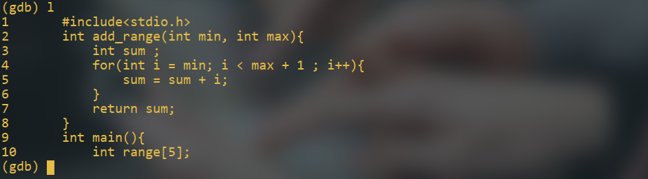
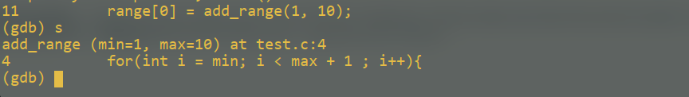
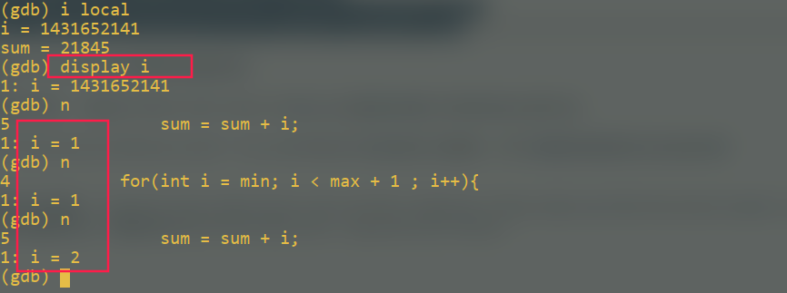

# debug_with_gdb

### gdb 是什么

gdb是linux操作系统特有的调试工具，可以完成一般IDE提供的所有调试功能。使用gdb调试程序之前，必须使用gcc的-g选项编译程序，使生成的可执行文件中附带有源代码文件的信息。

### 编写gdb例程

编写例程如下，随后使用gdb调试该程序，注意编译时加入-g选项
```c
#include<stdio.h>
int add_range(int min, int max){
    int sum ;
    for(int i = min; i < max + 1 ; i++){
        sum = sum + i;
    }
    return sum;
}
int main(){
    int range[5];
    range[0] = add_range(1, 10);
    range[1] = add_range(1, 100);
    printf("range[0]=%d\n", range[0]);
    printf("range[1]=%d\n", range[1]);
    return 0;
}
```
gdb exec_name进入调试界面，使用help查看当前可用的命令种类


### 查看源码

使用l（list）查看源代码，一次10行，当我们在gdb中直接回车，默认执行上次命令


### 设置命令行参数

-   形式一：gdb --args ./youexec -a paramA -b paramB
-   形式二:gdb youexec; execute the "set args -a paramA -b paramB" in gdb
-   形式三：gdb yourexec; execute the "run -a paramA -b paramB" in gdb

### 开始执行程序

使用start命令开始执行程序，程序停留在main函数第一行


### 单步执行程序

n（next）可以单步执行程序，s（step）命令可以跳入函数中查看函数执行的细节




### 查看程序调用堆栈

使用bt（backtrace）命令查看程序栈帧，可以在不同栈帧中切换来查看不同环境的变量值。使用i（info）查看变量值

切换至main堆栈，查看main函数中本地变量的值


### 打印变量值

p（print）打印某变量的值


### 跟踪变量值

display可以现实每步程序运行之后某变量的值

如果不再需要display的结果，可以使用undisplay取消显示


### 从当前函数返回

finish使当前函数运行至return返回


### 运行时更改变量

在程序中，如果发现某变量赋值不当，可以直接在调试中更改该变量的值，查看程序运行结果set var name=value

初步调试指令如下
backtrace\finish\frame\info\list\next\print\set var\start\step

### 断点
编写例程如下
```c
#include<stdio.h>
#include<string.h>
int main(){
    char num[10];
    int sum = 0;
    while(1){
        scanf("%s", num);
        long sum = 0;
        if(strcmp(num, "q") == 0){
            break;
        }
        for( int i = 0; i< strlen(num); i++ ){
            sum = sum*10 + num[i] - '0';
        }
        printf("sum=%d\n", sum);
    }
    return 0;
}
```
#### 设置断点

使用gdb调试程序，break命令在某行设置一个断点

break后不仅可以跟行号，还可以跟函数名称，使用continue命令继续执行程序，遇到断点自动停止。使用disable breakpoints num可以暂时禁用某个断点，run运行程序，程序停止在我们设置的第一个断点位置

```
(gdb) run
Starting program: /home/xiaozhi/code/C++/grammar/break_test 

Breakpoint 1, main () at break_test.c:7
7	        scanf("%s", num);
(gdb) 
```

#### 查看断点信息

```shell
(gdb) info break
Num     Type           Disp Enb Address            What
1       breakpoint     keep y   0x000055555555474a in main at break_test.c:7
	breakpoint already hit 1 time
2       breakpoint     keep y   0x00005555555547d2 in main at break_test.c:15
	breakpoint already hit 1 time

```

#### 禁用断点

```
disable breakpoints b_num
```

#### 删除断点

```
delete break num
```


断点调试常用指令
break n\break function_name\break ... if ...\continue\ delete breakpoints num\disable breakpoints num\enable num\run\

### 观察点

观察点可以让我们监视某个内存单元，当单元的内容改变时，提示我们它发生了那些变化，常用在程序某个变量发生改变，但我们又不知道它何时发生了改变的情况
使用watch设置观察点，查看某个变量的变化情况

```shell
(gdb) watch sum
Hardware watchpoint 3: sum
(gdb) continue
Continuing.
123

Hardware watchpoint 3: sum

Old value = 123
New value = 0
main () at break_test.c:9
9	        if(strcmp(num, "q") == 0){
```

使用info watchpoints查看当前观察点
`info watch`
x命令用来打印内存空间的值，b表示按字节，5表示打印5组

```shell
(gdb) x/5b num
0x7fffffffc916:	49	50	51	0	0
```


### 段错误

使用gdb的backtrace指令可以让我们容易发现段错误由何引起

```shell
(gdb) run
Starting program: /home/xiaozhi/code/C++/linux/debug/segmentfault 
12

Program received signal SIGSEGV, Segmentation fault.
0x00007ffff7a7dffb in _IO_vfscanf_internal (s=<optimized out>, format=<optimized out>, 
    argptr=argptr@entry=0x7fffffffc840, errp=errp@entry=0x0) at vfscanf.c:1898
1898	vfscanf.c: No such file or directory.
(gdb) bt
#0  0x00007ffff7a7dffb in _IO_vfscanf_internal (s=<optimized out>, format=<optimized out>, 
    argptr=argptr@entry=0x7fffffffc840, errp=errp@entry=0x0) at vfscanf.c:1898
#1  0x00007ffff7a89138 in __isoc99_scanf (format=<optimized out>) at isoc99_scanf.c:37
#2  0x0000555555554688 in main () at segmentfault.c:4
```


​    


