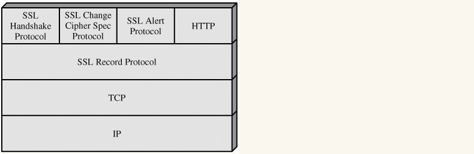
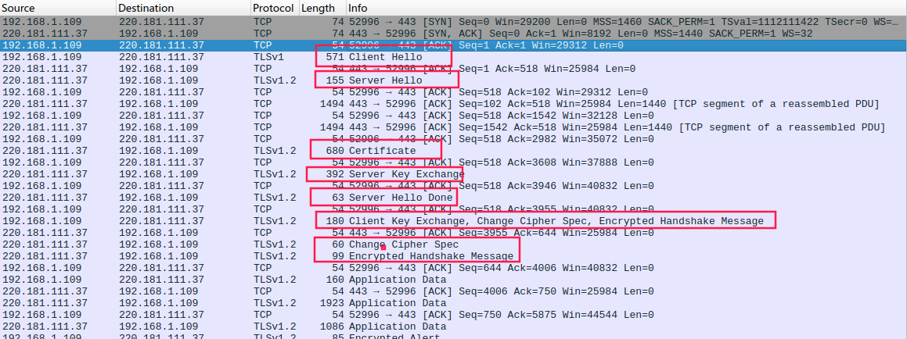
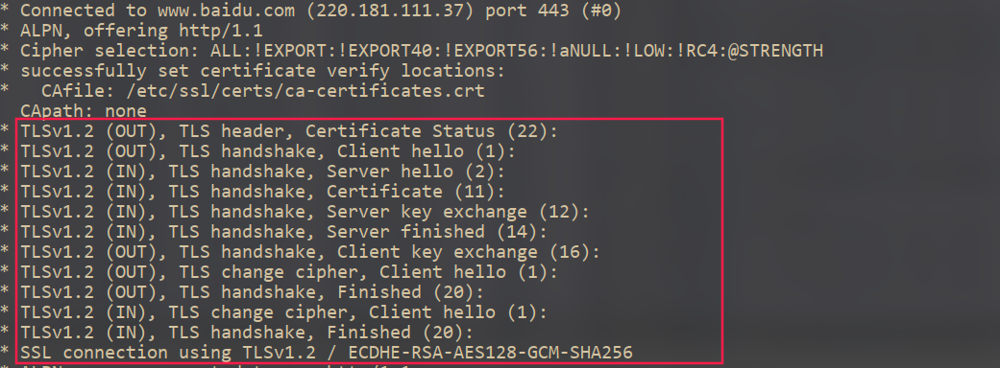

# SSL协议分析

## 1. ssl协议概述

### 1.1 概述

ssl协议运行于tcp协议之上，通过一系列的协商加密，保护数据传输安全性、完整性。ssl协议主要包括两方面的内容，记录协议与握手协议，握手协议负责处理ssl握手，协商会话秘钥，记录协议负责对来往数据分块加密。互联网目前位置加密方式分为两大类，对称秘钥加密与非对称秘钥加密，非对称秘钥加密安全性较好，但是性能受限，对称秘钥可以获得良好的网络性能。因此，ssl协议使用非对称秘钥协商技术（DH算法）获取会话秘钥，得到会话秘钥之后，采用对称秘钥加密的方式加密应用程序数据。

### 1.2 协议组成

ssl协议共包括ssl握手协议、ssl密码规范变更协议、ssl报警协议、ssl记录层协议，分布结构如下图



SSL通过握手协议确认通信参数建立连接，密码规范变更协议用于通知对方之后通信将采用协商好的加密算法进行加密，ssl报警协议用于认证不成功时提示报警信息，记录层协议用于将上层要发送的数据分块、加密发送，将接收到的数据解密，重组，再返回给上层

## 2. ssl握手过程

握手过程主要包括四个步骤，客户端向服务端发送握手请求，服务端响应客户端请求，客户端对服务端进行认证，协商会话秘钥，握手确认。图解如下


各个消息内容如下

-   client hello
    客户端发起请求，以明文传输请求信息，包含版本信息，加密套件候选列表，压缩[算法](http://lib.csdn.net/base/datastructure)候选列表，随机数（random_A)，扩展字段等信息。其中，随机数用于DH算法协商会话秘钥
-   server hello
    服务端根据client hello返回协商的信息结果，包括选择使用的协议版本 version，选择的加密套件 cipher suite，选择的压缩算法 compression method、一个随机数(random_S) 等，其中随机数用于后续的密钥协商
-   certificate
    服务器证书，用于客户端验证服务器身份
-   server key exchange
    将服务器DH算法初始信息发送给客户端（DH算法细节见附录）
-   server hello done
    服务器hello消息结束
-   server certificate verify
    客户端根据服务器发来的数字证书，查询相关ca，验证证书，如果证书不合法，浏览器会提示用户是否继续。
-   client key exchange
    将客户端DH算法初始信息发送给服务器，产生一个随机数，并使用服务器公钥加密（记为pre-master）后发送给服务器。此步骤之后，服务器与客户端都具有会话阶段生成的三个随机数（为了增加随机性，所以使用给三个），使用DH算法计算会话秘钥（服务端与客户端相同）
-   change cipher spec
    通知对方接下来的通信都使用会话秘钥进行加密
-   encrypted client message
    结合之前所有通信参数的 hash 值与其它相关信息生成一段数据，采用会话密钥 session secret 与算法进行加密，然后发送给服务器用于数据与握手验证
-   change cipher spec
    服务端接收到client key exchange信息后，得到了之前创建的共三个随机数，使用随机数生成会话秘钥，将会话过程中的相关信息做一次hash生成hashcode1，使用生成的会话秘钥对客户端发送过来的encrypted client message进行解密得到hashcode2，比对hashcode1与hashcode2，如果相同，说明协商过程正常，未出现问题，此时，服务器发送此信息，说明接下来服务器发送给客户端的信息都使用协商好的会话秘钥进行加密
-   encrypted server message
    通encrypted client message一样，结合之前所有通信参数的 hash 值与其它相关信息生成一段数据，采用会话密钥 session secret 与算法进行加密，然后发送给客户端用于数据与握手验证

## 3. 握手过程数据包分析

一次访问baidu.com的数据包如下图



每次一端发送一条tcp信息，另一方返回ack信息予以确认，在终端中查看该次请求的详细信息

```shell
curl -l --tlsv1.2 -v https://www.baidu.com
```



图中清晰的表示了tls握手过程中ssl信息交换的过程. 命令行工具ssldump可以非常详细的显示tls数据信息

## 4. openssl的engine机制

### 4.1 openssl目录结构

源码目录结构如下


比较重要的有apps、crypto、engines、ssl

-   ssl是握手协议的实现，证书校验等
-   apps目录是openssl命令行工具，用于在命令行使用openssl功能
-   crypto包括了openssl中一些基本的结构
    -   bio提供了网络IO操作的通用接口，可以理解为openssl自己实现的网络通信框架
    -   evp提供了调用各种加密算法的接口方便算法的增加与删除，提供了底层密码算法的抽象，应用在使用加密解密操作时，主要使用evp层提供的接口
    -   各种对称加密与非对称加密算法的实现
    -   一些通用数据结构的实现
    -   engine目录主要是openssl预留的用于加载第三方密码库的引擎，为evp层的算法调用提供统一的接口

### 4.2 openssl模块

模块之间的调用顺序如下


在engines component中可以加载自己的加密算法，供高层调用，openssl分层结构如下


openssl定义了上层加解密接口EVP层，屏蔽了大量底层细节，通过openssl的engine机制，定义新的外部扩展引擎，在其中实现需要的算法，然后通过动态引擎引入，通过一些编译手段可以达到支持自定义算法的目的


# 附录

## 有关TLS协议的一些概念介绍

1.  ca（Certification Authority）

    CA是认证电子商务和网上银行交易的权威性、可信赖性及公正性的第三方机构，是电子商务的重要基础设施，是电子商务的安全保证。用于认证服务器公钥。

2.  数字证书（认证）
    数字证书是CA机构签发给某网站的数字身份证明，证书中主要包含了服务器公钥，服务器域名，到期时间等重要信息。客户端请求服务端认证的时候，服务端将证书发送给客户端，客户端随后请求CA认证该证书是否有效

3.  数字签名（防抵赖）
    在rsa公开秘钥加密过程中，使用私钥加密的数据，可以使用对应的公钥解密，使用公钥直接对数据进行处理，可以理解为使用公钥加密，仅能通过对应的私钥解密。公钥对大家公开，私钥仅自己保存。如果我们给某人发送一段使用自己的私钥加密过的数据，如果对方使用我们的公钥对数据解密后可以得到相应数据，那么就可以确定，这段数据确实是我们发送的。在实际的应用过程中，通常会使用hash算法生成信息摘要（数据完整性检验），随后使用自己的私钥加密摘要，附加在消息末尾发送出去，接收端接收到以后，对消息正文运行相同的hash算法，得到信息摘要，与解密出来的信息摘要进行比对，如果相同，则信息是我们发送的无疑。

## DH算法简介

见
https://baike.baidu.com/item/Diffie-Hellman/9827194

## 参考

协议过程分析

https://blog.csdn.net/rtmdk/article/details/78138299

https://blog.csdn.net/lvxiangan/article/details/42147711

https://www.cnblogs.com/zimmer/p/4343632.html

rfc文档

https://www.ietf.org/rfc/rfc2246.txt

http://www.kipway.com/kipway_TSL.html