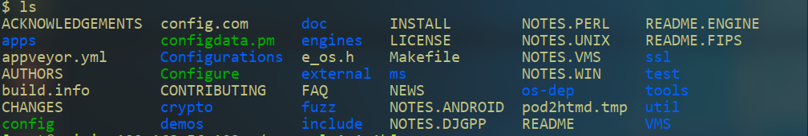
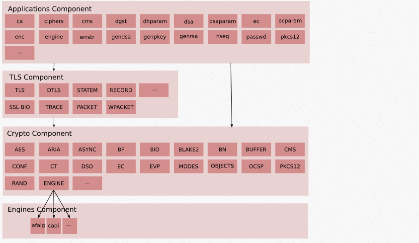
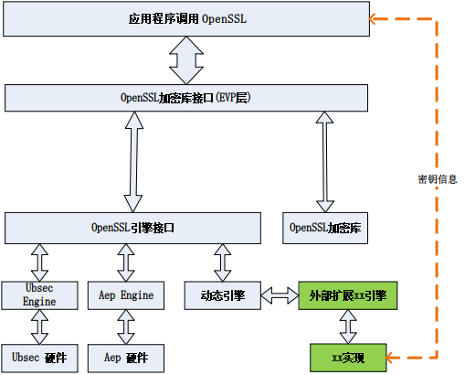
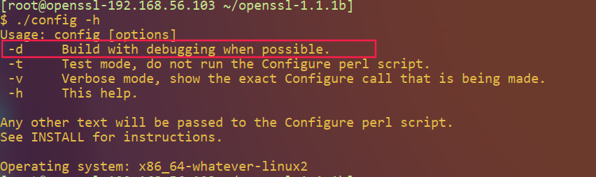
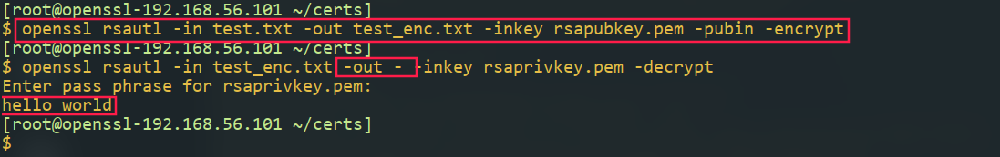
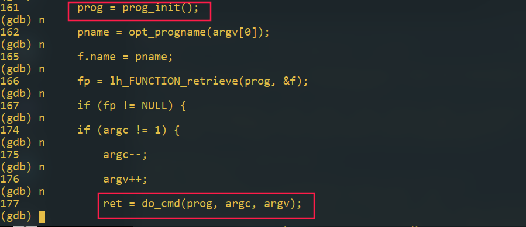
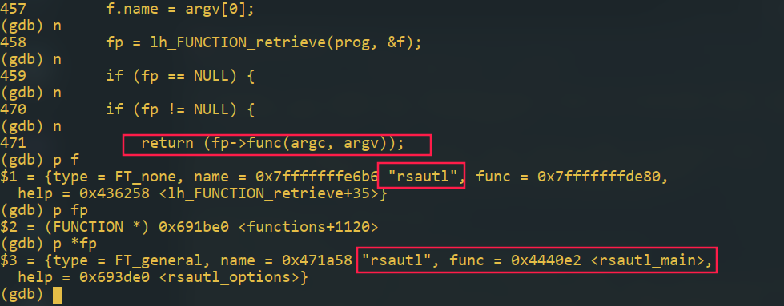
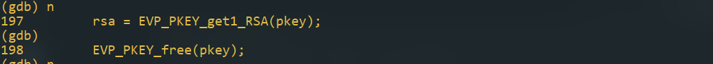
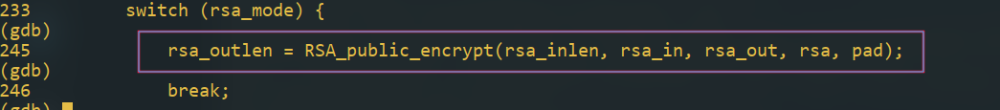
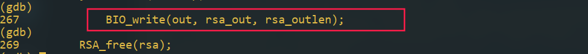

openssl部分源码概览

## 1. openssl目录结构

源码目录结构如下



比较重要的有apps、crypto、engines、ssl

-   ssl是握手协议的实现，证书校验等
-   apps目录是openssl命令行工具，用于在命令行使用openssl功能
-   crypto包括了openssl中一些基本的结构
    -   bio提供了IO操作的通用接口，包括： 内存、
        文件、日志、标准输入输出、 socket（ TCP/UDP）、加/解密、摘要和 ssl 通道等
    -   evp提供了调用各种加密算法的接口方便算法的增加与删除，提供了底层密码算法的抽象，应用在使用加密解密操作时，主要使用evp层提供的接口
    -   各种对称加密与非对称加密算法的实现
    -   engine目录主要是openssl预留的用于加载第三方密码库的引擎，为evp层的算法调用提供统一的接口
    -   stack实现了openssl自己的堆栈结构
    -   lhash实现了hash数据结构
    -   在crypto文件夹下以mem开头的文件定义了内存分配与释放函数
    -   crypto下的dso目录中包含了动态库加载的实现，各个平台下加载动态函数库的函数不一样，路径分隔符、动态库名称也不一样，openssl使用dso模块屏蔽了这些不同
    -   conf目录中包含了openssl读取配置文件的实现
    -   rand目录中是随机数模块实现

## 2. openssl模块

模块之间的调用顺序如下



在engines component中可以加载自己的加密算法，供高层调用，openssl分层结构如下



openssl定义了上层加解密接口EVP层，屏蔽了大量底层细节，通过openssl的engine机制，定义新的外部扩展引擎，在其中实现需要的算法，然后通过动态引擎引入，通过一些编译手段可以达到支持自定义算法的目的


## 3. openssl中ssl实现

SSL 协议源码位于 ssl 目录下。它实现了 sslv2、 sslv3、 TLS 以及 DTLS（ Datagram TLS，
基于 UDP 的 TLS 实现）。 ssl 实现中，对于每个协议，都有客户端实现(XXX_clnt.c)、服务
端实现(XXX_srvr.c)、加密实现(XXX_enc.c)、记录协议实现(XXX_pkt.c)、 METHOD 方法
(XXX_meth.c)、客户端服务端都用到的握手方法实现(XXX_both.c)，以及对外提供的函数实
现(XXX_lib.c)，比较有规律

### 重要数据结构

ssl 的主要数据结构定义在 ssl.h 中。主要的数据结构有 SSL_CTX、SSL 和 SSL_SESSION。
SSL_CTX 数据结构主要用于 SSL 握手前的环境准备，设置 CA 文件和目录、设置 SSL 握手
中的证书文件和私钥、设置协议版本以及其他一些 SSL 握手时的选项。 SSL 数据结构主要
用于 SSL 握手以及传送应用数据。 SSL_SESSION 中保存了主密钥、 session id、读写加解密
钥、读写 MAC 密钥等信息。 SSL_CTX 中缓存了所有 SSL_SESSION 信息， SSL 中包含
SSL_CTX。一般 SSL_CTX 的初始化在程序最开始调用，然后再生成 SSL 数据结构。由于
SSL_CTX 中缓存了所有的 SESSION，新生成的 SSL 结构又包含 SSL_CTX 数据，所以通过
SSL 数据结构能查找以前用过的 SESSION id，实现 SESSION 重用

### 调试s_server与s_client工具

##### 编译程序

执行config指令时加入-d参数



```shell
./config -d
make all
make install
```

s_server,s_client是openssl源码包中自带的调用openssl编程接口的两个实例，是很好的分析openssl接口使用的教程，下面通过调试这两个工具，得到接口调用的步骤

##### 生成证书

```shell
/usr/local/ssl/misc/CA.pl -newca
openssl req -newkey rsa:1024 -out req1.pem -keyout sslclientkey.pem
openssl req -newkey rsa:1024 -out req2.pem -keyout sslserverkey.pem
openssl ca -in req1.pem -out sslclientcert.pem
openssl ca -in req2.pem -out sslservercert.pem
```

#####  使用gdb调试s_server,s_client

```shell
gdb openssl
gdb> set args s_server -cert sslservercert.pem -key sslserverkey.pem -CAfile demoCA/cacert.pem 
# following commands should run with another terminal
gdb openssl
gdb> set args s_client  -CAfile demoCA/cacert.pem
# 如果验证客户端证书，就需要加上客户端证书信息
# set args s_client  -CAfile demoCA/cacert.pem -cert sslclientcert.pem -key sslclientkey.pem
# 同时在服务端使用-Verify选项指明验证客户端证书
#use default address and port
```

#####  单步跟踪调试

服务端关键调用（仅列出与ssl调用有关的部分，s_server相关处理细节不做讨论）

初始化ssl环境（由s_server处理命令行参数）


-   SSL_CONF_CTX_new()
    The function SSL_CONF_CTX_new() allocates and initialises an **SSL_CONF_CTX** structure for use with the SSL_CONF functions.
-   X509_VERIFY_PARAM_new()
-   SSL_CONF_CTX_set_flags
-   SSL_CTX_new
-   SSL_CTX_clear_mode
-   SSL_CTX_set_quiet_shutdown

s_server加载证书与秘钥

s_server根据证书获取dh参数

将dh参数设置进ssl上下文中

将证书秘钥信息设置进ssl上下文

SSL_CTX_use_certificate

SSL_CTX_use_PrivateKey

设置验证函数

SSL_CTX_set_verify

SSL_CTX_set_session_id_context

SSL_CTX_set_cookie_generate_cb

 SSL_CTX_set_cookie_verify_cb

SSL_CTX_set_stateless_cookie_generate_cb

SSL_CTX_set_stateless_cookie_verify_cb

执行循环接收客户端请求

​	BIO_sock_init()# 初始化BIOsocket

​	将原始socket地址信息转换为BIOsocket信息

​	接收socket请求

​		con = SSL_new(ctx)#创建ssl连接

​		SSL_set_session_id_contex

​		BIO_new_socket

​		SSL_set_bio

​		SSL_set_accept_state

​		SSL_renegotiate

​		SSL_do_handshake

​		SSL_verify_client_post_handshake

​		BIO_write

​	使用slelect收发数据

## 4. openssl中的rsa实现

### 数据结构

由于在rsa算法过程中需要使用大数运算，openssl中定义了自己的大数数据结构

```c
//crypto/bn/bn_lcl.h
struct bignum_st {
    BN_ULONG *d;                /* Pointer to an array of 'BN_BITS2' bit
                                 * chunks. */
    int top;                    /* Index of last used d +1. */
    /* The next are internal book keeping for bn_expand. */
    int dmax;                   /* Size of the d array. */
    int neg;                    /* one if the number is negative */
    int flags;
};
```

```c
//crypto/bn/bn_lcl.h
/* Used for montgomery multiplication */
struct bn_mont_ctx_st {
    int ri;                     /* number of bits in R */
    BIGNUM RR;                  /* used to convert to montgomery form */
    BIGNUM N;                   /* The modulus */
    BIGNUM Ni;                  /* R*(1/R mod N) - N*Ni = 1 (Ni is only
                                 * stored for bignum algorithm) */
    BN_ULONG n0[2];             /* least significant word(s) of Ni; (type
                                 * changed with 0.9.9, was "BN_ULONG n0;"
                                 * before) */
    int flags;
};

```

rsa总数据结构如下

```c
struct rsa_st {
    /*
     * The first parameter is used to pickup errors where this is passed
     * instead of aEVP_PKEY, it is set to 0
     */
    int pad;
    long version;
    const RSA_METHOD *meth;
    /*meth指向了rsa_method结构体类型，该结构体中存放了一些rsa操作的函数指针，通过该指针，可以改变openssl默认的rsa实现算法*/
    /* functional reference if 'meth' is ENGINE-provided */
    ENGINE *engine;
    BIGNUM *n;
    BIGNUM *e;
    BIGNUM *d;
    BIGNUM *p;
    BIGNUM *q;
    BIGNUM *dmp1;
    BIGNUM *dmq1;
    BIGNUM *iqmp;
    /* be careful using this if the RSA structure is shared */
    CRYPTO_EX_DATA ex_data;
    int references;
    int flags;
    /* Used to cache montgomery values */
    BN_MONT_CTX *_method_mod_n;
    BN_MONT_CTX *_method_mod_p;
    BN_MONT_CTX *_method_mod_q;
    /*
     * all BIGNUM values are actually in the following data, if it is not
     * NULL
     */
    char *bignum_data;
    BN_BLINDING *blinding;
    BN_BLINDING *mt_blinding;
    CRYPTO_RWLOCK *lock;
};
```

RSA_METHOD，根据函数指针的名称，不难看出该函数指针需要实现的功能，包括公钥加解密、私钥加解密、模指数、签名算法、认证算法、生成秘钥算法、初始化

```c
struct rsa_meth_st {
    char *name;
    int (*rsa_pub_enc) (int flen, const unsigned char *from,
                        unsigned char *to, RSA *rsa, int padding);
    int (*rsa_pub_dec) (int flen, const unsigned char *from,
                        unsigned char *to, RSA *rsa, int padding);
    int (*rsa_priv_enc) (int flen, const unsigned char *from,
                         unsigned char *to, RSA *rsa, int padding);
    int (*rsa_priv_dec) (int flen, const unsigned char *from,
                         unsigned char *to, RSA *rsa, int padding);
    /* Can be null */
    int (*rsa_mod_exp) (BIGNUM *r0, const BIGNUM *I, RSA *rsa, BN_CTX *ctx);
    /* Can be null */
    int (*bn_mod_exp) (BIGNUM *r, const BIGNUM *a, const BIGNUM *p,
                       const BIGNUM *m, BN_CTX *ctx, BN_MONT_CTX *m_ctx);
    /* called at new */
    int (*init) (RSA *rsa);
    /* called at free */
    int (*finish) (RSA *rsa);
    /* RSA_METHOD_FLAG_* things */
    int flags;
    /* may be needed! */
    char *app_data;
    /*
     * New sign and verify functions: some libraries don't allow arbitrary
     * data to be signed/verified: this allows them to be used. Note: for
     * this to work the RSA_public_decrypt() and RSA_private_encrypt() should
     * *NOT* be used RSA_sign(), RSA_verify() should be used instead.
     */
    int (*rsa_sign) (int type,
                     const unsigned char *m, unsigned int m_length,
                     unsigned char *sigret, unsigned int *siglen,
                     const RSA *rsa);
    int (*rsa_verify) (int dtype, const unsigned char *m,
                       unsigned int m_length, const unsigned char *sigbuf,
                       unsigned int siglen, const RSA *rsa);
    /*
     * If this callback is NULL, the builtin software RSA key-gen will be
     * used. This is for behavioural compatibility whilst the code gets
     * rewired, but one day it would be nice to assume there are no such
     * things as "builtin software" implementations.
     */
    int (*rsa_keygen) (RSA *rsa, int bits, BIGNUM *e, BN_GENCB *cb);
};
```

在rsa_crpt.c中有以下几个函数的实现，通过rsa类型参数，调用对应函数，实现rsa公钥加解密、私钥加解密

```c
int RSA_public_encrypt(int flen, const unsigned char *from, unsigned char *to,
                       RSA *rsa, int padding)
{
    return (rsa->meth->rsa_pub_enc(flen, from, to, rsa, padding));
}

int RSA_private_encrypt(int flen, const unsigned char *from,
                        unsigned char *to, RSA *rsa, int padding)
{
    return (rsa->meth->rsa_priv_enc(flen, from, to, rsa, padding));
}

int RSA_private_decrypt(int flen, const unsigned char *from,
                        unsigned char *to, RSA *rsa, int padding)
{
    return (rsa->meth->rsa_priv_dec(flen, from, to, rsa, padding));
}

int RSA_public_decrypt(int flen, const unsigned char *from, unsigned char *to,
                       RSA *rsa, int padding)
{
    return (rsa->meth->rsa_pub_dec(flen, from, to, rsa, padding));
}

int RSA_flags(const RSA *r)
{
    return ((r == NULL) ? 0 : r->meth->flags);
}

```

### rsa实现

在rsa.h中可以找到如下声明

```c
/* these are the actual RSA functions  具体的rsa实现*/
const RSA_METHOD *RSA_PKCS1_OpenSSL(void);
const RSA_METHOD *RSA_null_method(void);
```

这两个函数的定义如下

```c
const RSA_METHOD *RSA_PKCS1_OpenSSL(void)
{
    return &rsa_pkcs1_ossl_meth;
}
const RSA_METHOD *RSA_null_method(void)
{
    return (&rsa_null_meth);
}
```

rsa_pkcs1_ossl_meth定义如下

```c
static RSA_METHOD rsa_pkcs1_ossl_meth = {
    "OpenSSL PKCS#1 RSA (from Eric Young)",
    rsa_ossl_public_encrypt,
    rsa_ossl_public_decrypt,     /* signature verification */
    rsa_ossl_private_encrypt,    /* signing */
    rsa_ossl_private_decrypt,
    rsa_ossl_mod_exp,
    BN_mod_exp_mont,            /* XXX probably we should not use Montgomery
                                 * if e == 3 */
    rsa_ossl_init,
    rsa_ossl_finish,
    RSA_FLAG_FIPS_METHOD,       /* flags */
    NULL,
    0,                          /* rsa_sign */
    0,                          /* rsa_verify */
    NULL                        /* rsa_keygen */
};
```

此结构体变量实现了函数指针映射功能，将实现的相关函数映射到RSA_METHOD中，具体的实现在rsa_ossl.c中

以rsa_ossl_public_encrypt为例，该函数中核心调用

```c
if (!rsa->meth->bn_mod_exp(ret, f, rsa->e, rsa->n, ctx,rsa->_method_mod_n))
```

此处bn_mod_exp对应BN_mod_exp_mont，在BN_mod_exp_mont函数中，又调用了BN_mod_mul_montgomery实现核心功能

```c
..........
if (!start)
            for (i = 0; i < j; i++) {
                if (!BN_mod_mul_montgomery(r, r, r, mont, ctx))
                    goto err;
            }

        /* wvalue will be an odd number < 2^window */
        if (!BN_mod_mul_montgomery(r, r, val[wvalue >> 1], mont, ctx))
            goto err;
.......
```

BN_mod_mul_montgomery又通过bn_mul_mont实现

```c
 if (num > 1 && a->top == num && b->top == num) {
        if (bn_wexpand(r, num) == NULL)
            return (0);
        if (bn_mul_mont(r->d, a->d, b->d, mont->N.d, mont->n0, num)) {
            r->neg = a->neg ^ b->neg;
            r->top = num;
            bn_correct_top(r);
            return (1);
        }
}
```

### 调试跟踪rsa加密过程

以私钥加密为例，跟踪调试查看以上函数调用过程，方便起见已预先生成了rsa私钥与对应的公钥

```shell
openssl genrsa -out rsaprivkey.pem -passout pass:111111 -des3 1024
openssl rsa -in rsaprivkey.pem -passin pass:111111 -out rsapubkey.pem -pubout
```

创建测试文本

```
echo "hello world" > test.txt
```

使用公钥加密

```shell
openssl rsautl -in test.txt -out test_enc.txt -inkey rsapubkey.pem -pubin -encrypt
```

使用私钥解密输出

```shell
openssl rsautl -in test_enc.txt -out - -inkey rsaprivkey.pem -decrypt
```



使用gdb调试加密过程

```shell
gdb openssl
(gdb) set print pretty on
(gdb) set args rsautl -in test.txt -out test_enc.txt -inkey rsapubkey.pem -pubin -encrypt
(gdb) start
```

在主程序中，获取第一个命令参数，调用do_cmd函数，执行rsautl功能



在此函数中，进入rsautl_main



先获取命令行参数，本例中包括输入文件、输出文件、输入的公钥、要执行的模式（encrypt）

加载公钥


从得到的pkey中获取rsa结构



调用刚才讨论过的公钥加密函数



将加密后的数据写入文件



