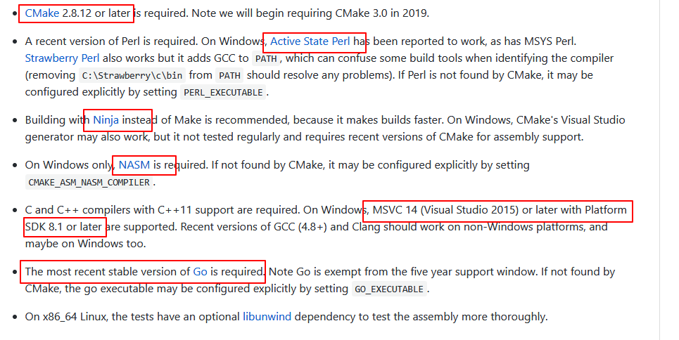
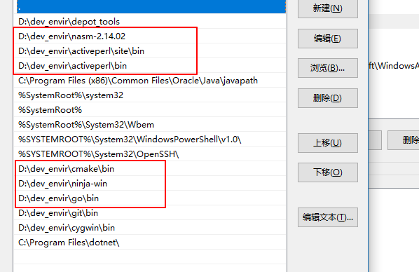
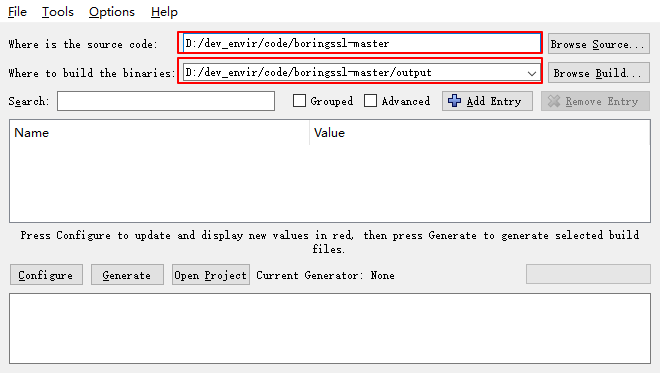
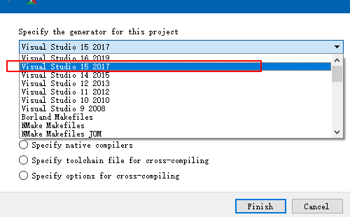
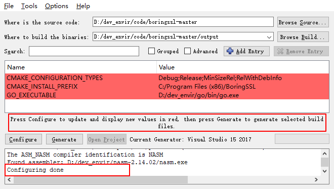
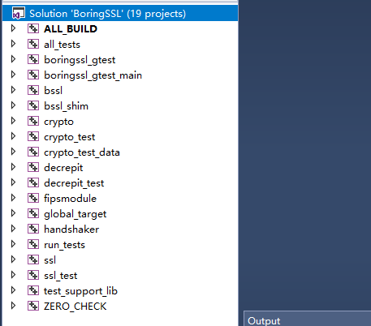
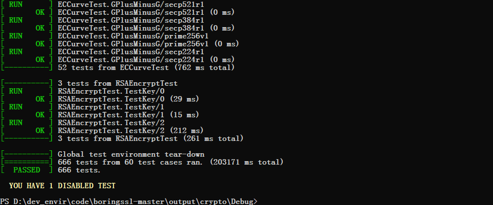

# Boringssl编译手记

#### **boringssl是什么**

boringssl是google根据自己日常需求，在openssl的基础上稍作修改开发出的ssl库，使用在google的众多产品中

#### **配置编译环境**

1.  访问github上的boringssl项目镜像，根据readme文件中的描述，building.md中记录了如何编译构建boringssl
    

2.  访问building.md得到环境依赖信息
    

3.  环境依赖如上图，cmake 、active perl 、 nasm 、visual studio with windows sdk 、 go，除了visual studio，文件中均给出了下载链接，下载安装即可，安装完成后，将软件安装目录的bin文件夹添加进系统path环境变量中，如下
    
    （PS：**环境变量**：系统执行环境中，有一组预先设置好的变量，叫做环境变量，在执行环境中可以直接访问这些变量的值，windows环境变量又分为用户环境变量与系统环境变量，用户环境变量仅在该用户的执行环境中可用，而系统环境变量在所有用户执行环境中可用。path环境变量的值是目录的列表，决定了操作系统执行命令时的查找位置，在cmd窗口中输入某一指令，系统便会从path环境变量所标识的目录列表中查找该命令，如果没有找到以该命令命名的可执行程序，便会报命令无法识别的错误。将某一目录添加进环境变量后，该目录下的所有可执行程序，都会被识别为系统命令，在任意目录下均可执行，将以上程序的bin目录添加进系统path变量中，也是出于这个考虑，编译源代码需要在源码目录中进行，在源码目录中要可以执行刚才安装的几个程序。检验环境变量是否设置成功，打开一个cmd或powershell窗口，键入命令，如果提示命令无法识别，则设置失败，如果可以识别，就算是配置好了。）

4.  **安装visual studio 2017， 安装时注意勾选windows development kits 10**

#### 使用cmake-gui生成visual studio解决方案

1.  从github获得boringssl源码包，使用git或下载zip的方式均可，下载zip后，需解压至某目录，此处解压到
    d:\dev_envir\code\boringssl-master\
2.  运行cmake-gui（位于cmake安装目录的bin文件夹下），选择源码目录与构建输出目录
    
    随后单击图中的configure按钮配置编译器，此处选择刚刚安装的visual studio（自己装什么版本，就选择什么版本，但是注意win sdk要在8.1版本之上）
    
    点击finish后，make-gui会生成对应visual studio解决方案
    
    随后点击configure，在点击generate即可生成解决方案

#### **使用visual studio构建项目**

1.  使用visual studio打开上一步生成的BoringSSL.sln，点击build->build all，构建整个项目
    项目视图如下
    

    

2.  运行测试工程
    测试项目生成的文件位于output/crypto/Debug/crypto_test.exe
    在cmd窗口或powershell窗口运行该程序，即可看到测试结果
    

*附：*

*GitHub项目地址：https://github.com/google/boringssl*

