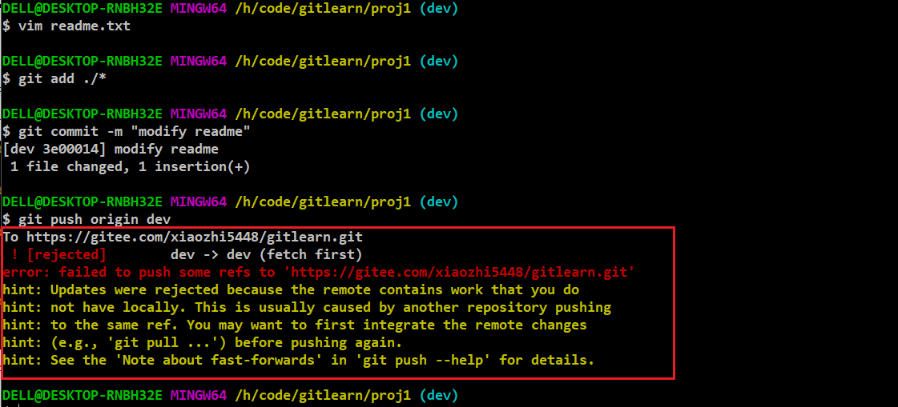

# git指南

## 简介

当我们一个人独自编写程序时，对程序的改动是实时的，修改某一部分，即修改某一部分，十分准确，但是当我们出错时，想要将项目恢复到之前的状态，普通编辑器爱莫能助，需要一种方式记录我们对项目所作的种种改动，以便于我们可以随时回到某个时间点的状态；当团队共同协作一个项目时，版本控制是重要的内容，如何协调大家对源代码的更改使数据一致，如何恢复错误是我们需要关心的问题。linux操作系统之父开发出git版本控制系统并在开源技术推动下得到IT界的广泛使用


git中工作区和暂存区的概念十分重要，工作区即是我们用作版本库的目录，在使用init命令初始化repository时，会在工作区创建.git目录，这个目录是git的版本库，我们对仓库所作的修改都保存在.git目录下，.git目录中有一个区域叫暂存区，用于临时存放我们对版本库的更改，git自动为我们创建主分支master以及指向该分支的指针HEAD，分支与HEAD后面再说。使用add时，是将操作放在暂存区中，使用commit时，将暂存区的操作提交到分支中


## 基本操作

### 版本库的创建

新建立一个空目录，切换到该目录下，使用init子目录使该目录成为一个版本仓库。

```shell
[xiaozhi@localhost ~/code/learngit]
$ pwd
/home/xiaozhi/code/learngit
[xiaozhi@localhost ~/code/learngit]
$ git init
Initialized empty Git repository in /home/xiaozhi/code/learngit/.git/
```

该操作会在当前目录下创建.git目录，如下

```shell
[xiaozhi@localhost ~/code/learngit]
$ ls -a
.  ..  .git  temp.txt
[xiaozhi@localhost ~/code/learngit]
$ ls .git
branches  config  description  HEAD  hooks  info  objects  refs
```

可以使用add子命令向仓库中提交文件，并使用commit子命令来提交我们的更改

```shell
[xiaozhi@localhost ~/code/learngit]
$ cat readme.txt 
Git is a version control system
Git is Free Software
[xiaozhi@localhost ~/code/learngit]
$ git add readme.txt 
[xiaozhi@localhost ~/code/learngit]
# commit表示将该操作写入git目录的配置文件中进行记录，-m选项指定了该操作的说明
$ git commit -m "add readme file"
[master (root-commit) 07606de] add readme file
 1 file changed, 2 insertions(+)
 create mode 100644 readme.txt
```

### 文件修改与管理

#### 文件修改

修改readme文件，使用status查看状态，并使用diff子命令查看文件更改的部分


同样的使用add和commit将其提交到版本库中。

#### 版本回退

每使用commit提交一次，我们就在该文件的时间线上做了一个标记，当发现出错时，可以返回该时间点的状态，或者说该次提交的状态。使用git log查看仓库的提交历史


每次commit后，都会有一个commit ID与该状态对应，使用reset指令回到之前版本


#### 撤销更改

文件变回了第一次提交时的状态。reflog命令可以查看历史commit，并根据这个历史，撤销某次更改


#### 丢弃工作区中的修改

git管理的是我们对文件的修改操作，修改某文件，添加该次操作到暂存区，使用commit提交暂存区的内容，是我们修改文件的一般步骤。当我们在工作区中做了一些操作，突然发现出错了，想要撤销，该如何做呢？git checkout -- <file>可以将某文件恢复到add或者commit之前的状态，即恢复到和暂存区或版本库同样的状态，撤销工作区的更改


有时候已经将操作提交到暂存区了，如何撤销呢？使用reset


#### 文件删除与误删

当我们要删除一个文件时，可以在磁盘上删除该文件，但是在版本库中该文件还存在，要同步的话应该使用git rm file从版本库中删除文件。另一种情况是误删，可以使用checkout恢复到版本库中的状态

删除文件时应使用git rm指令，然后删除磁盘文件，误删时，使用git checkout将文件恢复


## 远程仓库

### 设置远程仓库

github网站是著名的开源分布式代码托管网站，结合git工具，可以让我们在团队管理代码时十分方便
首先注册一个github账号，随后在账号设置中添加自己的公钥。新建仓库，和本地代码关联，随后将本地资源推送到github

```shell
# 在本地添加远程库，并与刚才创建的learn_git相关联
git remote add origin git@github.com:xiaozhi5448/learn_git.git
# 将本地内容推送至origin库，使用了-u选项，将本地master与origin master分支相关联
# 随后推送时使用git push origin master 即可
git push -u origin master
```

### 修改远程仓库

git remote查看远程仓库，git remote show <name>查看远程仓库地址


使用git remote set-url

```shell
git remote set-url --push origin  https://gitee.com/xiaozhi5448/gitlearn.git
```

## 分支管理

分支就好像时间线，一条分支就是一条时间线上我们做的操作集合，在不影响主分支的情况下，创建我们自己的分支，其他人不可见，我们可以在自己创建的分支上作出修改，最后在进行合并使修改可见，这样做的好处是可以在不影响原先代码使用的情况下，对代码进行修改。

#### 分支原理

当我们没有进行分支操作时，默认在主分支上操作，git将我们的commit连接成一条时间线，HEAD是一个指向master的指针，指向当前分支，由于默认分支为master，所以master指向最近的一次commit


当我们新建分支dev，git帮我们新建一个指针dev，并把HEAD执行dev，并将dev当作当前分支


每作出一次更改，dev指针往前移动一步，master指针不变


当我们完成了修改，想要将该操作提交到版本库中，使master指向dev指针指向的地方即可，这个过程叫做分支合并


合并完成之后可以删除dev分支，就是删除dev指针

#### 创建与切换


在dev分支中，修改readme文件，并正常提交


切换回master中，查看readme文件，发现刚才的修改不见了

```shell
git checkout master
```


#### 合并

我们合并dev分支到当前master分支，查看文件变化

```shell
git merge dev
```


#### 冲突

有时候我们在不同分支中改变了相同文件的同一部分，在分支合并时会出现冲突，解决冲突的办法，就是手动修改冲突文件为我们需要的内容，提交后冲突可以得到解决
首先我们新建分支dev，在dev中修改readme文件最后一行后提交，回到master分支以后，修改readme文件最后一行（内容不同），提交后尝试合并


使用git status查看当前状态


我们可以使用--abort取消此次合并。为了处理冲突，我们需要修改发生冲突的文件，当做一次新的提交


查看分支提交的状态

```shell
git log --graph --pretty=oneline
```


最后删除dev分支

```shell
git branch -d dev
```

#### fast-forward

分支管理合并的时侯，有时候我们并不想抹除要合并的分支，可是根据之前的图解，合并以后master与dev指向相同的位置


删除dev分支后，便不能再看到该次更改的信息了。合并分支时有两种方式，一种Fast-Forward，仅仅更改master指针，另一种即是普通方式，将master与dev当前指向的内容进行合并，并新执行一次提交。在合并分支时指定--no-ff选项指定以普通方式合并。图解类似于


#### 分支使用指南

在实际的开发过程中，应该多使用分支，master分支是主要分支，用来发布新版本，dev分支用来开发，每个开发者都有自己的分支，做了一些事情之后就合并到dev分支，随后接着在自己的分支上工作，以此实现团队合作


#### stash

bug是程序开发过程中经常遇到的错误，有时候我们在dev分支上干活，但是突然被告知master分支上已经发布的版本有一个bug，要立刻解决，我们要新建并切换分支，在该分支完成修复bug的操作，随后将该分支与master分支合并，完成bug修复，在此之前，我们应该先将当前分支的工作提交，但是我们的公所还没有完成，无法提交，该如何呢？git中的stash子命令可以让我们将当前工作区的状态保存起来，恢复到上次提交之后的状态，当返回此分支时，使用stash pop弹出内容，恢复到我们之前的工作状态，实践如下，使用stash保存当前工作状态，新建分支issue-001在其中完成bug修复工作


修复完成后，切换会master分支进行合并，随后返回dev分支，


随后切换到dev分支使用`git stash pop`恢复之前的工作状态

```shell
git branch dev
git stash pop
```

`git stash list`可以查看当前保存的状态

`git stash apply`可以应用指定的状态

当软件新添加一个功能时，最后也新建一个分支，在该分支中添加新功能，添加完成后，于master分支合并，并删除该分支，但是有时候，在未合并时，事情有变，不需要该分支了，则需要删除，使用-D选项强制删除一个没有合并过的分支

## 远程协作

一般项目托管在github上，每个人完成功能后便提交到github。从远程仓库克隆数据时，git自动将本地master分支与远程master分支相关联，远程库名称默认为origin。可以使用`git remote`查看远程库信息，添加-v选项可以查看详细信息，origin后面的内容给出了抓取和推送origin库的地址


分支在本地修改完毕以后需要推送到云，推送的时侯指定分支名称和远程库名称，一般来说，master分支用来发布新版本，dev分支用来开发，这两个分支必须保证开发人员的同步，但其余分支不必

```shell
git push origin dev
git push origin master
```

### dev分支的获取

当我们使用git clone克隆版本库时，默认仅仅克隆master分支


但是我们是需要在dev分支下工作的，使用checkout的-b选项创建远程的dev分支到本地。下图中的命令表示以远程库origin中的dev分支为起点，在当前目录创建dev分支，并使其相关联

```shell
git checkout -b dev origin/dev
```


### 远程冲突的解决

团队中的开发者，在dev分支上进行分工合作，当多人更改同一文件时，会出现冲突的情况，要解决这种冲突，和解决本地分支冲突一样，修改引起冲突的文件，随后再push到远程

某人修改了dev分支的某个文件并提交到远程仓库的dev分支


自己在本地也修改了dev分支中相同文件，并尝试提交



提交请求被拒绝。

要修改冲突，需要将远程最新的提交拉取到本地

```shell
 git branch --set-upstream-to=origin/dev dev
 git pull 
```


随后像解决本地冲突一样解决远程代码冲突即可


## 标签

## 配置

中文路径

```shell
 git config --global core.quotepath false
```

