# SpringBoot自动配置框架

`<https://docs.spring.io/spring-boot/docs/2.2.6.RELEASE/reference/html/index.html>`

## 开发环境

### vscode

使用vscode开发java代码需要的依赖包

- java extension pack
- spring boot extension pack

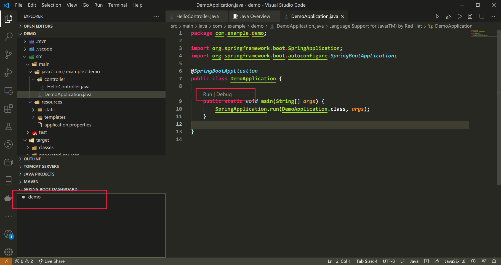

可以像idea一样运行调试程序

## 初识springboot

springboot是一个java 自动配置框架，在使用java+maven开发的项目中，有一些框架需要繁琐复杂的配置，比如ssm，要编写mybatis配置文件，每个pojo也要编写操作接口和对应的mapper，spring配置文件，springmvc配置文件，开发流程中程序化工作非常多，springboot的出现简化了框架的配置操作，让我们更方便快速的开发应用程序。springboot的应用理念是约定优先于配置。有众多配置是大家约定好，用户需要修改的时候再去定制

spingboot可以让我们

- 简化spring应用开发
- 整合spring技术
- j2ee一站式解决方案

### helloworld

idea中使用new project 选择spring initiliazer，创建springboot项目，选择依赖，会从spring 官网下载项目模板，一个springboot脚手架，启用maven autoimport功能后，系统会自动导入maven依赖，位置取决于主机环境maven仓库的位置

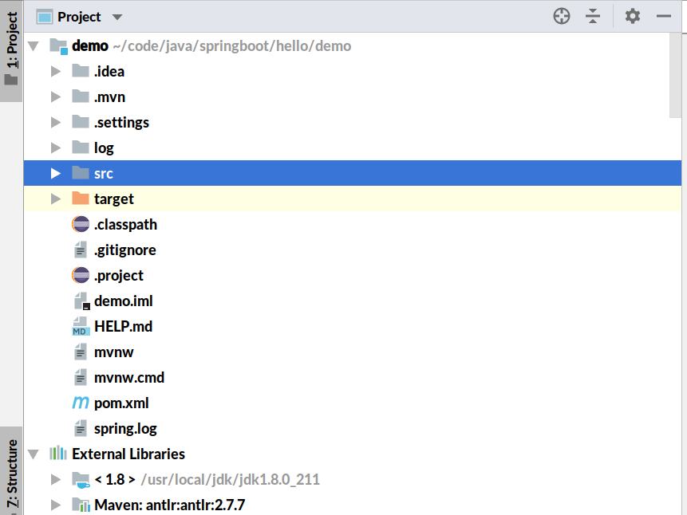

启动类代码如下

```java
@SpringBootApplication
public class DemoApplication {

	public static void main(String[] args) {
		SpringApplication.run(DemoApplication.class, args);
	}

}

```

SpringBootApplication注解包含了许多其他内容

```java
@Target(ElementType.TYPE)
@Retention(RetentionPolicy.RUNTIME)
@Documented
@Inherited
@SpringBootConfiguration
@EnableAutoConfiguration
@ComponentScan(excludeFilters = { @Filter(type = FilterType.CUSTOM, classes = TypeExcludeFilter.class),
		@Filter(type = FilterType.CUSTOM, classes = AutoConfigurationExcludeFilter.class) })
```

这里启用了自动配置，自动组件扫描

编写一个简单的controller

```java
package example.demo.controller;

import org.springframework.web.bind.annotation.RequestMapping;
import org.springframework.web.bind.annotation.RestController;

@RestController
public class HelloController {

    @RequestMapping("/")
    String hello(){
        return "hello wrold!";
    }
}

```

直接运行主类，访问8080

即可看到helloworld的返回

#### 打包

使用mvn package命令打包，maven会将项目依赖的所有jar包压缩放入最终生成的jar包中

#### 运行、调试

springboot中所有的代码都可以打断点调试，跟踪调试可以了解springboot框架原理

#### 脚手架解析

父项目

```xml
<parent>
<groupId>org.springframework.boot</groupId>
<artifactId>spring-boot-starter-parent</artifactId>
<version>2.3.7.RELEASE</version>
<relativePath/> <!-- lookup parent from repository -->
</parent>
```

其内容

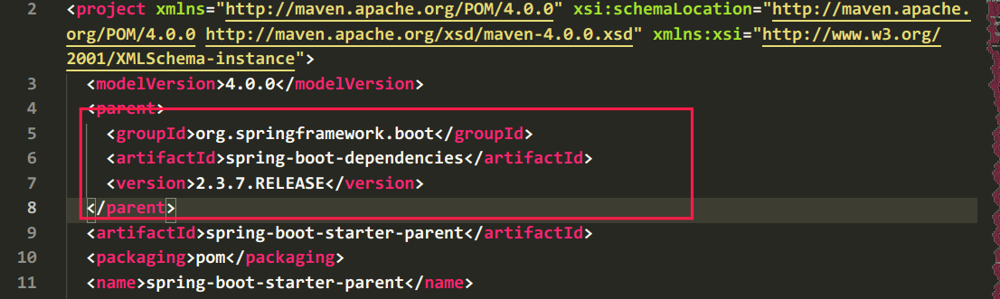

在springboot-dependencies中定义了所有依赖的版本

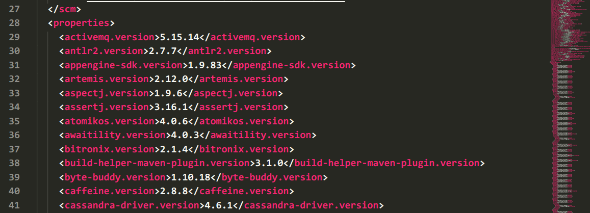


springboot将不同功能场景进行抽取，定义了多个starter，当我们开发web应用，需要在pom文件中导入

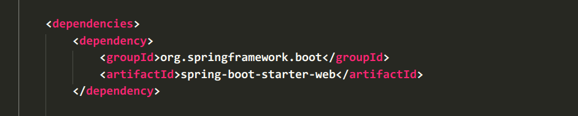

称为web启动器，开发不同功能时，导入不同启动器即可

## 自动配置

### 主程序类

```java
package com.example.demo;

import org.springframework.boot.SpringApplication;
import org.springframework.boot.autoconfigure.SpringBootApplication;
@SpringBootApplication
public class DemoApplication {

	public static void main(String[] args) {
		SpringApplication.run(DemoApplication.class, args);
	}

}
```

#### springbootApplication

核心注解SpringBootApplication是一个组合注解

```java
@Target(ElementType.TYPE)
@Retention(RetentionPolicy.RUNTIME)
@Documented
@Inherited
@SpringBootConfiguration // springboot 配置类
@EnableAutoConfiguration
@ComponentScan(excludeFilters = { @Filter(type = FilterType.CUSTOM, classes = TypeExcludeFilter.class),
		@Filter(type = FilterType.CUSTOM, classes = AutoConfigurationExcludeFilter.class) })
```

##### SpringBootConfiguration

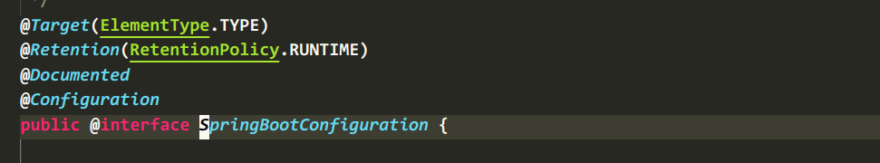

表明是一个配置组件

##### EnableAutoConfiguation

```java
@Target(ElementType.TYPE)
@Retention(RetentionPolicy.RUNTIME)
@Documented
@Inherited
@AutoConfigurationPackage
@Import(AutoConfigurationImportSelector.class)
```

实现自动配置

###### **AutoConfigurationPackage**

```java
@Target(ElementType.TYPE)
@Retention(RetentionPolicy.RUNTIME)
@Documented
@Inherited
@Import(AutoConfigurationPackages.Registrar.class) // spring 底层注解import，给容器中导入一个组件
```

在AutoConfigurationPackages中，有静态类Register

```java
	static class Registrar implements ImportBeanDefinitionRegistrar, DeterminableImports {

		@Override
		public void registerBeanDefinitions(AnnotationMetadata metadata, BeanDefinitionRegistry registry) {
			register(registry, new PackageImports(metadata).getPackageNames().toArray(new String[0]));
		}

		@Override
		public Set<Object> determineImports(AnnotationMetadata metadata) {
			return Collections.singleton(new PackageImports(metadata));
		}

	}
```

会将所有主包下的组件扫描进spring 容器

在register一行打上断点，调试

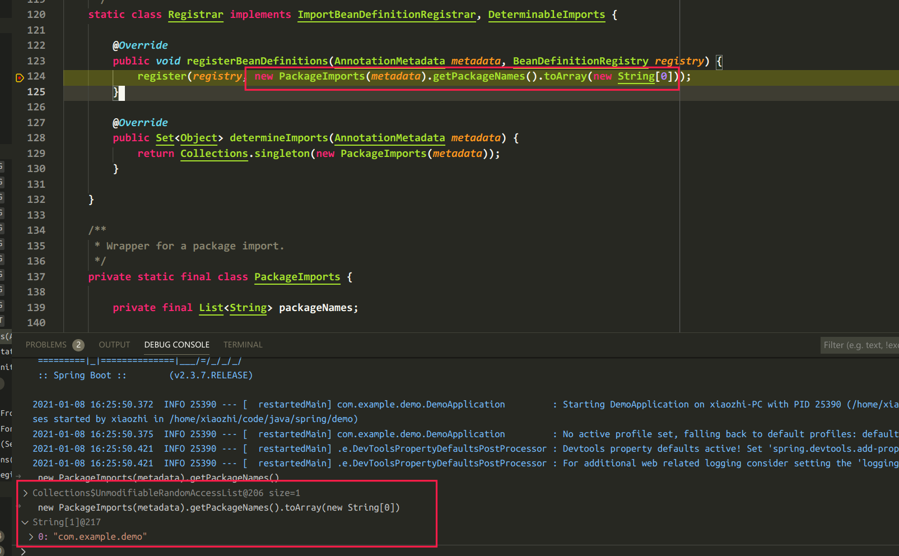

###### AutoConfigurationImportSelector

控制导入哪些组件，将需要导入的组件以全类名的方式返回

```java
	protected AutoConfigurationEntry getAutoConfigurationEntry(AnnotationMetadata annotationMetadata) {
		if (!isEnabled(annotationMetadata)) {
			return EMPTY_ENTRY;
		}
		AnnotationAttributes attributes = getAttributes(annotationMetadata);
		List<String> configurations = getCandidateConfigurations(annotationMetadata, attributes);
		configurations = removeDuplicates(configurations);
		Set<String> exclusions = getExclusions(annotationMetadata, attributes);
		checkExcludedClasses(configurations, exclusions);
		configurations.removeAll(exclusions);
		configurations = getConfigurationClassFilter().filter(configurations);
		fireAutoConfigurationImportEvents(configurations, exclusions);
		return new AutoConfigurationEntry(configurations, exclusions);
	}
```

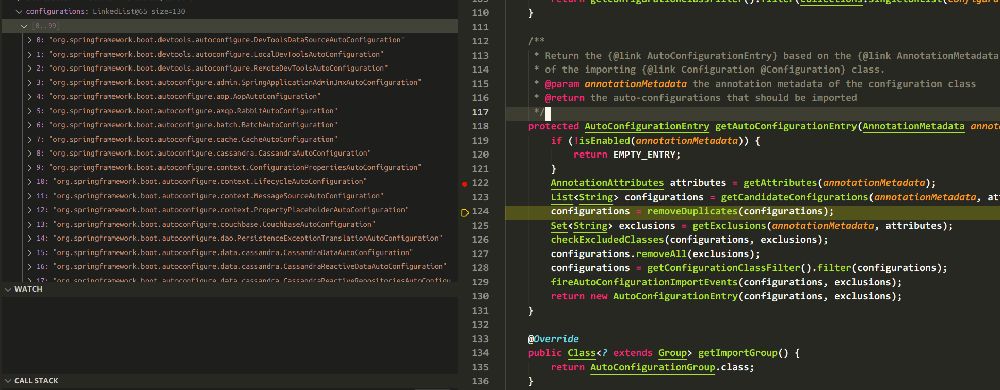

获取了相关的自动配置类

待续···

## springboot配置文件

配置项可以参考官方文档中的说明（appendix）

https://docs.spring.io/spring-boot/docs/2.4.1/reference/htmlsingle/#appendix

springboot默认使用两种类型的配置文件，properties与yml

- application.properties
- application.yml

配置文件用于修改springboot应用的默认值

### 配置文件值的获取

导入starter

```xml
		<dependency>
			<groupId>org.springframework.boot</groupId>
			<artifactId>spring-boot-configuration-processor</artifactId>
			<scope>annotationProcessor</scope>
		</dependency>


```

#### ConfigurationProperties

使用ConfigurationProperties注解将配置文件中的值注入到bean中。我们先新建两个java bean，Dog与Person，并且生成对应的getter与setter

```java

@Component
@ConfigurationProperties(prefix = "person")
public class Person {
    String lastName;
    Integer age;
    Boolean boss;
    java.util.Date birth;
    Map<String, Object> maps;
    List<Object> lists;
    Dog dog;

}


public class Dog {
    String lastName;
    Integer age;

}


```

这里省略了getter与setter方法，@Component表示是spring组件，会被springboot自动发现，ConfigurationProperties表示从配置文件中读取对应属性，prefix制定了父元素

在配置文件中

```yml
person:
    lastName: zhangsan
    age: 18
    boss: false
    birth: 2017/12/12
    maps: 
        k1: v1
        k2: v2
    lists:
        - lisi
        - name
    dog:
        lastName: dog
        age: 2
```

在springboot的test中，测试我们注入的bean

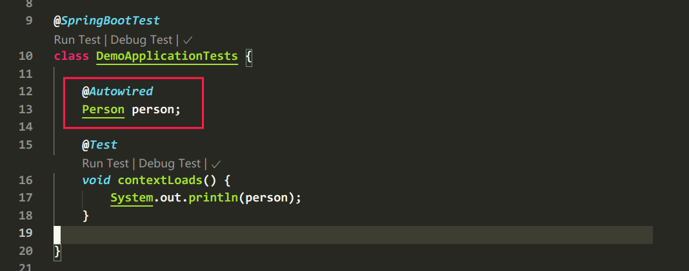

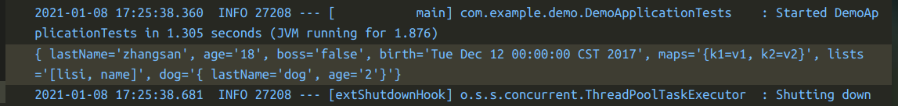

数据被成功注入

使用@Value注解也可以获取配置文件的值，二者稍有不同

如果某个业务逻辑需要获取一个简单的配置文件的值，使用@Value

如果获取的配置项较多，封装为ConfigurationProperties比较好

#### PropertySource

从指定路径加载配置文件进行值的注入

```java
@Component
@PropertySource(value = { "classpath:person.properties" })
@ConfigurationProperties(prefix = "person")
```

#### ImportResource

导入spring配置文件

#### 配置文件占位符

使用随机数:${random.int}

配置属性引用${person.name}, person.name之前已定义

### 给容器中注入组件

#### 配置类

使用@Bean注解而不是配置文件

```java
@Configuration
public class MyConfig {

    @Bean
    public HelloService helloService() {
        return new HelloService();
    }

}
```

容器中会存在一个名为helloService的组件

### 多配置文件

有时开发与生产环境会使用不同的配置文件，需要我们在运行时指定或在配置文件中指定

比如有application-dev.yml 与application-prod.yml


## springboot日志框架


## springboot MVC


## 定制错误数据


## servlet 容器

springboot默认使用嵌入式servlet容器，根据官网描述，最新版springboot支持的servlet容器

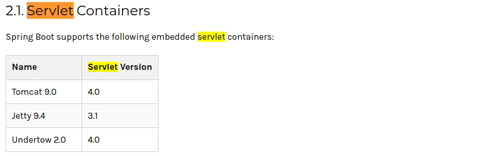


## springboot DAO


### jdbc


### mybatis


### springData JPA


## restful


## 原理解析


## 缓存


## 消息


## 检索-elasticsearch


## 定时任务


## 安全

### 登录认证

### 权限控制


## 分布式


## maven配置

指定jdk

```xml
<profile>
    <id>jdk‐1.8</id>
    <activation>
        <activeByDefault>true</activeByDefault>
        <jdk>1.8</jdk>
    </activation>
    <properties>
        <maven.compiler.source>1.8</maven.compiler.source>
        <maven.compiler.target>1.8</maven.compiler.target>
        <maven.compiler.compilerVersion>1.8</maven.compiler.compilerVersion>
    </properties>
</profile>

```

指定maven镜像

```xml
<mirror>
    <id>nexus-aliyun</id>
    <mirrorOf>central</mirrorOf>
    <name>Nexus aliyun</name>
    <url>http://maven.aliyun.com/nexus/content/groups/public</url>
</mirror>

```

