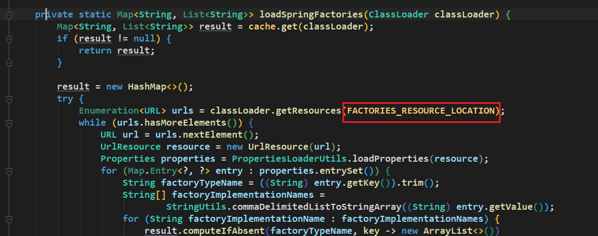
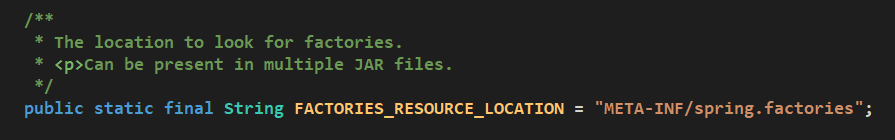
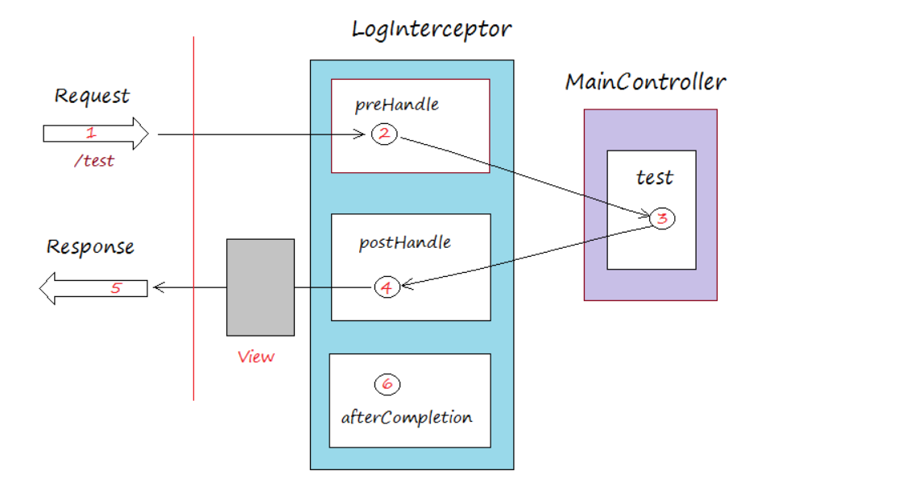
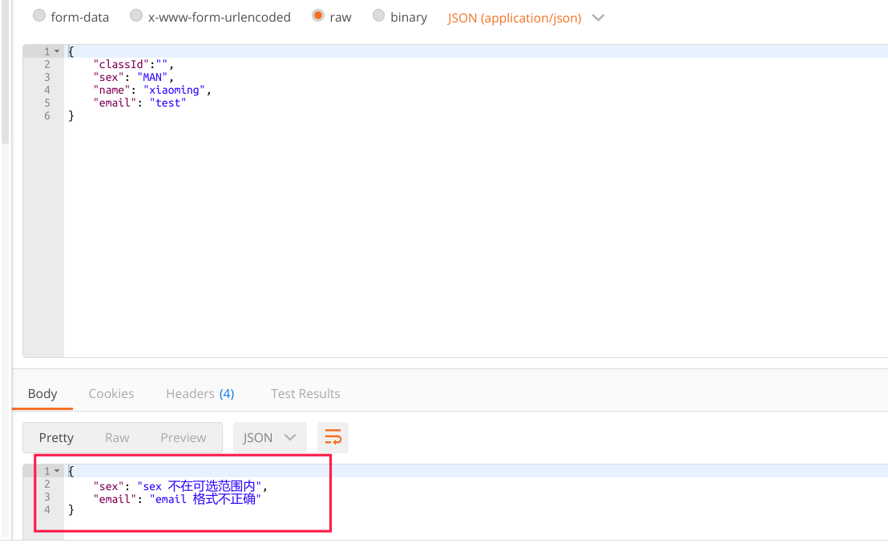
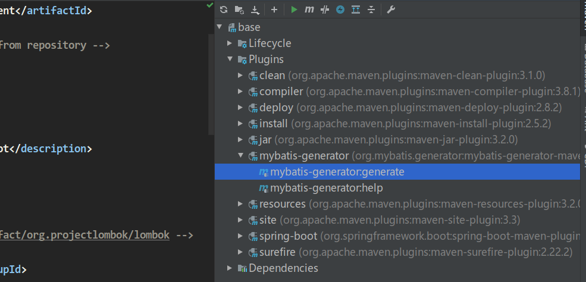
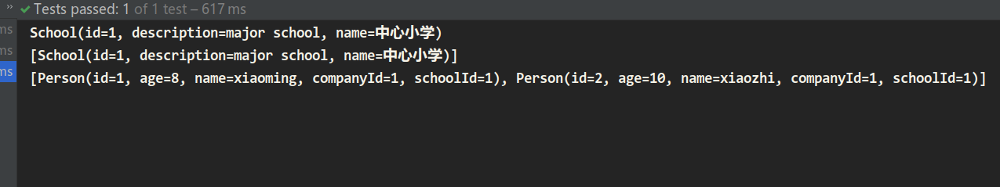
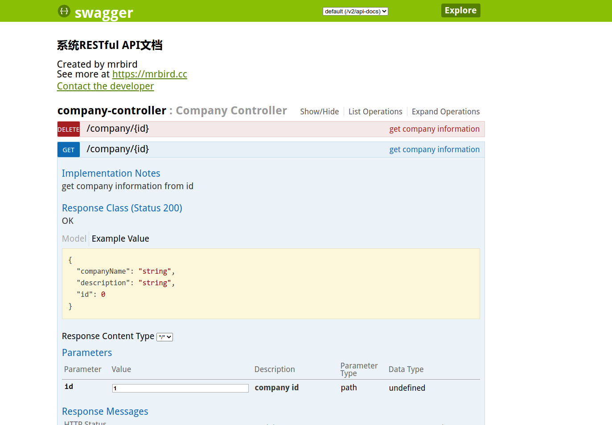

# SpringBoot自动配置框架

`<https://docs.spring.io/spring-boot/docs/2.2.6.RELEASE/reference/html/index.html>`

## 开发环境

### vscode

使用vscode开发java代码需要的依赖包

- java extension pack
- spring boot extension pack

可以像idea一样运行调试程序

## 初识springboot

springboot是一个java 自动配置框架，在使用java+maven开发的项目中，有一些框架需要繁琐复杂的配置，比如ssm，要编写mybatis配置文件，每个pojo也要编写操作接口和对应的mapper，spring配置文件，springmvc配置文件，开发流程中程序化工作非常多，springboot的出现简化了框架的配置操作，让我们更方便快速的开发应用程序。springboot的应用理念是约定优先于配置。有众多配置是大家约定好，用户需要修改的时候再去定制

spingboot可以让我们

- 简化spring应用开发
- 整合spring技术
- j2ee一站式解决方案

### helloworld

idea中使用new project 选择spring initiliazer，创建springboot项目，选择依赖，会从spring 官网下载项目模板，一个springboot脚手架，启用maven autoimport功能后，系统会自动导入maven依赖，位置取决于主机环境maven仓库的位置

启动类代码如下

```java
@SpringBootApplication
public class DemoApplication {

	public static void main(String[] args) {
		SpringApplication.run(DemoApplication.class, args);
	}

}

```

SpringBootApplication注解包含了许多其他内容

```java
@Target(ElementType.TYPE)
@Retention(RetentionPolicy.RUNTIME)
@Documented
@Inherited
@SpringBootConfiguration
@EnableAutoConfiguration
@ComponentScan(excludeFilters = { @Filter(type = FilterType.CUSTOM, classes = TypeExcludeFilter.class),
		@Filter(type = FilterType.CUSTOM, classes = AutoConfigurationExcludeFilter.class) })
```

这里启用了自动配置，自动组件扫描

编写一个简单的controller

```java
package example.demo.controller;

import org.springframework.web.bind.annotation.RequestMapping;
import org.springframework.web.bind.annotation.RestController;

@RestController
public class HelloController {

    @RequestMapping("/")
    String hello(){
        return "hello wrold!";
    }
}

```

直接运行主类，访问8080

即可看到helloworld的返回

#### 打包

使用mvn package命令打包，maven会将项目依赖的所有jar包压缩放入最终生成的jar包中

#### 运行、调试

springboot中所有的代码都可以打断点调试，跟踪调试可以了解springboot框架原理

#### 脚手架解析

父项目

```xml
<parent>
<groupId>org.springframework.boot</groupId>
<artifactId>spring-boot-starter-parent</artifactId>
<version>2.3.7.RELEASE</version>
<relativePath/> <!-- lookup parent from repository -->
</parent>
```

其内容


在springboot-dependencies中定义了所有依赖的版本


springboot将不同功能场景进行抽取，定义了多个starter，当我们开发web应用，需要在pom文件中导入


称为web启动器，开发不同功能时，导入不同启动器即可

## 自动配置

### 主程序类

```java
package com.example.demo;

import org.springframework.boot.SpringApplication;
import org.springframework.boot.autoconfigure.SpringBootApplication;
@SpringBootApplication
public class DemoApplication {

	public static void main(String[] args) {
		SpringApplication.run(DemoApplication.class, args);
	}

}
```

#### springbootApplication

核心注解SpringBootApplication是一个组合注解

```java
@Target(ElementType.TYPE)
@Retention(RetentionPolicy.RUNTIME)
@Documented
@Inherited
@SpringBootConfiguration // springboot 配置类
@EnableAutoConfiguration
@ComponentScan(excludeFilters = { @Filter(type = FilterType.CUSTOM, classes = TypeExcludeFilter.class),
		@Filter(type = FilterType.CUSTOM, classes = AutoConfigurationExcludeFilter.class) })
```

##### SpringBootConfiguration


表明是一个配置组件

##### EnableAutoConfiguation

```java
@Target(ElementType.TYPE)
@Retention(RetentionPolicy.RUNTIME)
@Documented
@Inherited
@AutoConfigurationPackage
@Import(AutoConfigurationImportSelector.class)
```

实现自动配置

###### **AutoConfigurationPackage**

```java
@Target(ElementType.TYPE)
@Retention(RetentionPolicy.RUNTIME)
@Documented
@Inherited
@Import(AutoConfigurationPackages.Registrar.class) // spring 底层注解import，给容器中导入一个组件
```

在AutoConfigurationPackages中，有静态类Register

```java
	static class Registrar implements ImportBeanDefinitionRegistrar, DeterminableImports {

		@Override
		public void registerBeanDefinitions(AnnotationMetadata metadata, BeanDefinitionRegistry registry) {
			register(registry, new PackageImports(metadata).getPackageNames().toArray(new String[0]));
		}

		@Override
		public Set<Object> determineImports(AnnotationMetadata metadata) {
			return Collections.singleton(new PackageImports(metadata));
		}

	}
```

会将所有主包下的组件扫描进spring 容器

在register一行打上断点，调试

###### AutoConfigurationImportSelector

该类实现了DeferedImportSelector接口，实现了ImportSelector接口，也就实现了selectImports方法，该方法决定导入那些自动配置类

```java
@Override
public String[] selectImports(AnnotationMetadata annotationMetadata) {
    if (!isEnabled(annotationMetadata)) {
        return NO_IMPORTS;
    }
    AutoConfigurationEntry autoConfigurationEntry = getAutoConfigurationEntry(annotationMetadata);
    return StringUtils.toStringArray(autoConfigurationEntry.getConfigurations());
}
```

其中getAutoConfigurationEntry完成了获取自动配置类信息的任务，将需要导入的组件以全类名的方式返回

```java
	protected AutoConfigurationEntry getAutoConfigurationEntry(AnnotationMetadata annotationMetadata) {
		if (!isEnabled(annotationMetadata)) {
			return EMPTY_ENTRY;
		}
		AnnotationAttributes attributes = getAttributes(annotationMetadata);
		List<String> configurations = getCandidateConfigurations(annotationMetadata, attributes);
		configurations = removeDuplicates(configurations);
		Set<String> exclusions = getExclusions(annotationMetadata, attributes);
		checkExcludedClasses(configurations, exclusions);
		configurations.removeAll(exclusions);
		configurations = getConfigurationClassFilter().filter(configurations);
		fireAutoConfigurationImportEvents(configurations, exclusions);
		return new AutoConfigurationEntry(configurations, exclusions);
	}
```

容易看出查找配置类的方法为getCandidateConfigurations

```java
protected List<String> getCandidateConfigurations(AnnotationMetadata metadata, AnnotationAttributes attributes) {
    List<String> configurations = SpringFactoriesLoader.loadFactoryNames(getSpringFactoriesLoaderFactoryClass(),
                                                                         getBeanClassLoader());
    Assert.notEmpty(configurations, "No auto configuration classes found in META-INF/spring.factories. If you "
                    + "are using a custom packaging, make sure that file is correct.");
    return configurations;
}
```

SpringFactoriesLoader.loadFactoryNames

```java
public static List<String> loadFactoryNames(Class<?> factoryType, @Nullable ClassLoader classLoader) {
    ClassLoader classLoaderToUse = classLoader;
    if (classLoaderToUse == null) {
        classLoaderToUse = SpringFactoriesLoader.class.getClassLoader();
    }
    String factoryTypeName = factoryType.getName();
    return loadSpringFactories(classLoaderToUse).getOrDefault(factoryTypeName, Collections.emptyList());
}
```

loadSpringFactories






## springboot配置文件

配置项可以参考官方文档中的说明（appendix）

https://docs.spring.io/spring-boot/docs/2.4.1/reference/htmlsingle/#appendix

springboot默认使用两种类型的配置文件，properties与yml

- application.properties
- application.yml

配置文件用于修改springboot应用的默认值

### 配置文件值的获取

导入starter

```xml
		<dependency>
			<groupId>org.springframework.boot</groupId>
			<artifactId>spring-boot-configuration-processor</artifactId>
			<scope>annotationProcessor</scope>
		</dependency>


```

#### ConfigurationProperties

使用ConfigurationProperties注解将配置文件中的值注入到bean中。我们先新建两个java bean，Dog与Person，并且生成对应的getter与setter

```java

@Component
@ConfigurationProperties(prefix = "person")
public class Person {
    String lastName;
    Integer age;
    Boolean boss;
    java.util.Date birth;
    Map<String, Object> maps;
    List<Object> lists;
    Dog dog;

}


public class Dog {
    String lastName;
    Integer age;

}


```

这里省略了getter与setter方法，@Component表示是spring组件，会被springboot自动发现，ConfigurationProperties表示从配置文件中读取对应属性，prefix制定了父元素

在配置文件中

```yml
person:
    lastName: zhangsan
    age: 18
    boss: false
    birth: 2017/12/12
    maps: 
        k1: v1
        k2: v2
    lists:
        - lisi
        - name
    dog:
        lastName: dog
        age: 2
```

在springboot的test中，测试我们注入的bean


数据被成功注入

使用@Value注解也可以获取配置文件的值，二者稍有不同

如果某个业务逻辑需要获取一个简单的配置文件的值，使用@Value

如果获取的配置项较多，封装为ConfigurationProperties比较好

#### PropertySource

从指定路径加载配置文件进行值的注入

```java
@Component
@PropertySource(value = { "classpath:person.properties" })
@ConfigurationProperties(prefix = "person")
```

#### ImportResource

导入spring配置文件

#### 配置文件占位符

使用随机数:${random.int}

配置属性引用${person.name}, person.name之前已定义

### 给容器中注入组件

#### 配置类

使用@Bean注解而不是配置文件

```java
@Configuration
public class MyConfig {

    @Bean
    public HelloService helloService() {
        return new HelloService();
    }

}
```

容器中会存在一个名为helloService的组件

### 多配置文件

有时开发与生产环境会使用不同的配置文件，需要我们在运行时指定或在配置文件中指定

比如有application-dev.yml 与application-prod.yml

激活方式有如下三种

1、在配置文件中指定 spring.profiles.active=dev
2、命令行：
java -jar spring-boot-02-config-0.0.1-SNAPSHOT.jar --spring.profiles.active=dev；
可以直接在测试的时候，配置传入命令行参数
3、虚拟机参数；
-Dspring.profiles.active=dev

也可以使用yml文档块

```yml
spring:
	profiles:
		active: prod
‐‐‐
server:
	port: 8083
spring:
	profiles: dev
‐‐‐
server:
	port: 8084
spring:
	profiles: prod #指定属于哪个环境
```

#### 配置文件加载位置

springboot 启动会扫描以下位置的application.properties或者application.yml文件作为Spring boot的默认配置文
件
**–file:./config/**
**–file:./**
**–classpath:/config/**
**–classpath:/**
优先级由高到底，高优先级的配置会覆盖低优先级的配置

我们还可以通过**spring.config.location**来改变默认的配置文件位置
项目打包好以后，我们可以使用命令行参数的形式，启动项目的时候来指定配置文件的新位置；指定配置文件和默
认加载的这些配置文件共同起作用形成互补配置；
java -jar spring-boot-02-config-02-0.0.1-SNAPSHOT.jar **--spring.config.location**=G:/application.properties

#### 外部配置加载顺序

SpringBoot也可以从以下位置加载配置； 优先级从高到低；高优先级的配置覆盖低优先级的配置，所有的配置会
形成互补配置
1. 命令行参数
**所有的配置都可以在命令行上进行指定**
java -jar spring-boot-02-config-02-0.0.1-SNAPSHOT.jar --server.port=8087 --server.context-path=/abc
多个配置用空格分开； --配置项=值
2. 来自java:comp/env的JNDI属性
3. Java系统属性（System.getProperties()）
4. 操作系统环境变量
5. RandomValuePropertySource配置的random.*属性值
  由jar包外向jar包内进行寻找；
  优先加载带profile
  6.jar包外部的application-{profile}.properties或application.yml(带spring.profile)配置文件
  7.jar包内部的application-{profile}.properties或application.yml(带spring.profile)配置文件
  再来加载不带profile
  8.jar包外部的application.properties或application.yml(不带spring.profile)配置文件
  9.jar包内部的application.properties或application.yml(不带spring.profile)配置文件
  10.@Configuration注解类上的@PropertySource
  11.通过SpringApplication.setDefaultProperties指定的默认属性

## springboot日志框架

springboot中的日志框架是面向接口的模式，我们配置springboot使用某种日志接口（slf4j），导入该接口的一个实现（Logback）

slf4j日志系统结构图


### 初步使用

```java
import org.slf4j.Logger;
import org.slf4j.LoggerFactory;
public class HelloWorld {
public static void main(String[] args) {
Logger logger = LoggerFactory.getLogger(HelloWorld.class);
logger.info("Hello World");
}
}
```

### 冲突

当我们引入第三方库，它可能使用了与slf4j不同的日志框架实现，这种情况需要我们将原有的日志框架移除，引入适配包，将原有日志接口的调用转换为slf4j接口的调用


### 配置

日志输出格式：
%d表示日期时间，
%thread表示线程名，
%‐5level：级别从左显示5个字符宽度
%logger{50} 表示logger名字最长50个字符，否则按照句点分割。
%msg：日志消息，
%n是换行符
‐‐>
%d{yyyy‐MM‐dd HH:mm:ss.SSS} [%thread] %‐5level %logger{50} ‐ %msg%n

```properties
logging.level.com.atguigu=trace
#logging.path=
# 不指定路径在当前项目下生成springboot.log日志
# 可以指定完整的路径；
#logging.file=G:/springboot.log
# 在当前磁盘的根路径下创建spring文件夹和里面的log文件夹；使用 spring.log 作为默认文件
logging.path=/spring/log
# 在控制台输出的日志的格式
logging.pattern.console=%d{yyyy‐MM‐dd} [%thread] %‐5level %logger{50} ‐ %msg%n
# 指定文件中日志输出的格式
logging.pattern.file=%d{yyyy‐MM‐dd} === [%thread] === %‐5level === %logger{50} ==== %msg%n
```

如果使用不同的日志实现，在类路径下放对应的日志配置文件即可

## web

### 静态资源映射

- 所有/webjars/ ，都去classpath:/META-INF/resources/webjars/找资源
  webjars以jar包的方式引入静态资源
- 静态资源文件夹
  "classpath:/META‐INF/resources/",
  "classpath:/resources/",
  "classpath:/static/",
  "classpath:/public/"
  "/"：当前项目的根路径
- 欢迎页
  静态资源文件夹下所有的index.html
- 图标
  favicon.ico都在静态资源文件夹找

### 模板引擎

thymeleaf

引入

```xml
<dependency>
<groupId>org.springframework.boot</groupId>
<artifactId>spring‐boot‐starter‐thymeleaf</artifactId>
2.1.6
</dependency>
切换thymeleaf版本
<properties>
<thymeleaf.version>3.0.9.RELEASE</thymeleaf.version>
<!‐‐ 布局功能的支持程序 thymeleaf3主程序 layout2以上版本 ‐‐>
<!‐‐ thymeleaf2 layout1‐‐>
<thymeleaf‐layout‐dialect.version>2.2.2</thymeleaf‐layout‐dialect.version>
</properties>
```


### spring MVC


### 定制错误数据


### 异常处理

ControllerAdvice注解与ExceptionHandler的使用,使用ControllerAdvice时最好指定controller，否则会处理所有异常

#### 创建异常实体类

包装异常信息

ErrorResponse.java

```java
package com.example.demo.exception;

public class ErrorResponse {
    String message;
    String errorTypeName;
    public ErrorResponse(Exception e){
        message = e.getMessage();
        errorTypeName = e.getClass().getName();
    }
    public ErrorResponse(String type, String msg){
        message = msg;
        errorTypeName = type;
    }

    public String getMessage() {
        return message;
    }

    public void setMessage(String message) {
        this.message = message;
    }

    public String getErrorTypeName() {
        return errorTypeName;
    }

    public void setErrorTypeName(String errorTypeName) {
        this.errorTypeName = errorTypeName;
    }
}

```

#### 自定义异常信息

一般我们处理的都是 `RuntimeException` ，所以如果你需要自定义异常类型的话直接集成这个类就可以了

```java
package com.example.demo.exception;
// 继承RuntimeException异常
public class ResourceNotFoundException extends  RuntimeException {
    String message;
    public ResourceNotFoundException(){
        super();
    }
    public ResourceNotFoundException(String msg){
        super(msg);
        this.message = msg;
    }

    @Override
    public String getMessage() {
        return message;
    }

    public void setMessage(String message) {
        this.message = message;
    }
}

```

#### 异常处理类

我们只需要在类上加上`@ControllerAdvice`注解这个类就成为了全局异常处理类，当然你也可以通过 `assignableTypes `指定特定的 `Controller `类，让异常处理类只处理特定类抛出的异常。

```java
package com.example.demo.exception;

import com.example.demo.controller.ExceptionController;
import org.springframework.http.ResponseEntity;
import org.springframework.web.bind.annotation.ControllerAdvice;
import org.springframework.web.bind.annotation.ExceptionHandler;
import org.springframework.web.bind.annotation.ResponseBody;

@ControllerAdvice(assignableTypes = {ExceptionController.class})
@ResponseBody
public class GlobalExceptionHandler {
    ErrorResponse e1 = new ErrorResponse(new IllegalArgumentException("参数错误"));
    ErrorResponse e2 = new ErrorResponse(new ResourceNotFoundException("资源未找到"));
    @ExceptionHandler(value = Exception.class)
    public ResponseEntity<ErrorResponse> exceptionHandler(Exception e){
        if(e instanceof IllegalArgumentException){
            return ResponseEntity.status(400).body(e1);
        }else if(e instanceof  ResourceNotFoundException){
            return ResponseEntity.status(400).body(e2);
        }
        return null;
    }
}

```

#### 抛出异常

ExceptionController.java

```java
package com.example.demo.controller;

import com.example.demo.exception.ResourceNotFoundException;
import org.springframework.web.bind.annotation.GetMapping;
import org.springframework.web.bind.annotation.RequestMapping;
import org.springframework.web.bind.annotation.RestController;

@RestController 
@RequestMapping("/exception")
public class ExceptionController {
    @GetMapping("/illegalArgument")
    public void throwIllegalArgu(){
        throw new IllegalArgumentException();
    }

    @GetMapping("/ResourceNotFound")
    public void throwResourceNotFound(){
        throw new ResourceNotFoundException();
    }
}

```

访问指定接口即可看到对应异常信息


#### ResponseStatusException

```java
 @GetMapping("/resourceNotFoundException2")
    public void throwException3() {
        throw new ResponseStatusException(HttpStatus.NOT_FOUND, "Sorry, the resourse not found!", new ResourceNotFoundException());
    }
```


### 过滤器

Filter 过滤器这个概念应该大家不会陌生，特别是对与从 Servlet 开始入门学 Java 后台的同学来说。那么这个东西我们能做什么呢？Filter 过滤器主要是用来过滤用户请求的，它允许我们对用户请求进行前置处理和后置处理，比如实现 URL 级别的权限控制、过滤非法请求等等。Filter 过滤器是面向切面编程——AOP 的具体实现（AOP切面编程只是一种编程思想而已）。

另外，Filter 是依赖于 Servlet 容器，`Filter`接口就在 Servlet 包下面，属于 Servlet 规范的一部分。所以，很多时候我们也称其为“增强版 Servlet”。

如果我们需要自定义 Filter 的话非常简单，只需要实现 `javax.Servlet.Filter` 接口，然后重写里面的 3 个方法即可

其对请求的处理流程如下


#### 自定义filter

##### 自己注册配置

编写filter组件

```java
package com.example.demo.filter;

import java.io.IOException;

import javax.servlet.Filter;
import javax.servlet.FilterChain;
import javax.servlet.FilterConfig;
import javax.servlet.ServletException;
import javax.servlet.ServletRequest;
import javax.servlet.ServletResponse;
import javax.servlet.http.HttpServletRequest;

import org.slf4j.Logger;
import org.slf4j.LoggerFactory;
import org.springframework.stereotype.Component;

@Component
public class HelloFilter implements Filter {
    Logger logger = LoggerFactory.getLogger(HelloFilter.class);

    @Override
    public void init(FilterConfig filterConfig) {
        logger.info("初始化过滤器！");
    }

    @Override
    public void doFilter(ServletRequest request, ServletResponse response, FilterChain chain)
            throws IOException, ServletException {
        // TODO Auto-generated method stub
        // 对请求进行预处理
        logger.info("过滤器开始对请求进行预处理：");
        HttpServletRequest servletRequest = (HttpServletRequest) request;
        String requestUri = servletRequest.getRequestURI();
        System.out.println("请求的接口为：" + requestUri);
        long startTime = System.currentTimeMillis();
        // 通过 doFilter 方法实现过滤功能
        chain.doFilter(request, response);
        // 上面的 doFilter 方法执行结束后用户的请求已经返回
        long endTime = System.currentTimeMillis();
        System.out.println("该用户的请求已经处理完毕，请求花费的时间为：" + (endTime - startTime));
    }

    @Override
    public void destroy() {
        logger.info("销毁过滤器");
    }
}

```

编写配置组件

```sql
package com.example.demo.config;

import java.util.ArrayList;
import java.util.Arrays;

import com.example.demo.filter.HelloFilter;

import org.springframework.beans.factory.annotation.Autowired;
import org.springframework.boot.web.servlet.FilterRegistrationBean;
import org.springframework.context.annotation.Bean;
import org.springframework.context.annotation.Configuration;

@Configuration
public class FilterConfig {
    @Autowired
    HelloFilter helloFilter;

    @Bean
    public FilterRegistrationBean<HelloFilter> thirdFilter() {
        FilterRegistrationBean<HelloFilter> filterRegistrationBean = new FilterRegistrationBean<>();

        filterRegistrationBean.setFilter(helloFilter);

        filterRegistrationBean.setUrlPatterns(new ArrayList<>(Arrays.asList("/hello")));

        return filterRegistrationBean;
    }
}
```


##### 使用预定义注解

在自己的过滤器的类上加上`@WebFilter` 然后在这个注解中通过它提供好的一些参数进行配置。

```sql
@WebFilter(filterName = "helloFilter", urlPatterns = "/hello")
```

另外，为了能让 Spring 找到它，你需要在启动类上加上 `@ServletComponentScan` 注解。

##### 多个拦截器的执行顺序

通过`FilterRegistrationBean` 的`setOrder` 方法可以决定 Filter 的执行顺序

```java
@Configuration
public class FilterConfig {
    @Autowired
    HelloFilter helloFilter;

    @Autowired
    HelloFilter2 helloFilter2;

    @Bean
    public FilterRegistrationBean<HelloFilter> thirdFilter() {
        FilterRegistrationBean<HelloFilter> filterRegistrationBean = new FilterRegistrationBean<>();
        filterRegistrationBean.setOrder(1);
        filterRegistrationBean.setFilter(helloFilter);

        filterRegistrationBean.setUrlPatterns(new ArrayList<>(Arrays.asList("/hello")));

        return filterRegistrationBean;
    }

    @Bean
    public FilterRegistrationBean<HelloFilter2> secondFilter() {
        FilterRegistrationBean<HelloFilter2> filterRegistrationBean = new FilterRegistrationBean<>();
        filterRegistrationBean.setOrder(2);
        filterRegistrationBean.setFilter(helloFilter2);

        filterRegistrationBean.setUrlPatterns(new ArrayList<>(Arrays.asList("/hello")));

        return filterRegistrationBean;
    }
}
```

### 拦截器

**拦截器(Interceptor)同** Filter 过滤器一样，它俩都是面向切面编程——AOP 的具体实现（AOP切面编程只是一种编程思想而已）。

你可以使用 Interceptor 来执行某些任务，例如在 **Controller** 处理请求之前编写日志，添加或更新配置......

在 **Spring中**，当请求发送到 **Controller** 时，在被**Controller**处理之前，它必须经过 **Interceptors**（0或更多）。

**Spring Interceptor**是一个非常类似于**Servlet Filter** 的概念 。

#### 自定义Interceptor

如果你需要自定义 **Interceptor** 的话必须实现 **org.springframework.web.servlet.HandlerInterceptor**接口或继承 **org.springframework.web.servlet.handler.HandlerInterceptorAdapter**类，并且需要重写下面下面3个方法

```java
public boolean preHandle(HttpServletRequest request,
                         HttpServletResponse response,
                         Object handler)
 
 
public void postHandle(HttpServletRequest request,
                       HttpServletResponse response,
                       Object handler,
                       ModelAndView modelAndView)
 
 
public void afterCompletion(HttpServletRequest request,
                            HttpServletResponse response,
                            Object handler,
                            Exception ex)
```

拦截器处理流程



我们定义logInterceptor模拟日志记录

```java
package com.example.demo.interceptor;

import org.springframework.web.servlet.ModelAndView;
import org.springframework.web.servlet.handler.HandlerInterceptorAdapter;

import javax.servlet.http.HttpServletRequest;
import javax.servlet.http.HttpServletResponse;

public class LogInterceptor extends HandlerInterceptorAdapter {
    @Override
    public boolean preHandle(HttpServletRequest request, HttpServletResponse response, Object handler) throws Exception {
        long startTime = System.currentTimeMillis();
        System.out.println("\n-------- LogInterception.preHandle --- ");
        System.out.println("Request URL: " + request.getRequestURL());
        System.out.println("Start Time: " + System.currentTimeMillis());
        request.setAttribute("startTime", startTime);
        return true;
    }

    @Override
    public void postHandle(HttpServletRequest request, HttpServletResponse response, Object handler, ModelAndView modelAndView) throws Exception {
        System.out.println("\n-------- LogInterception.postHandle --- ");
        System.out.println("Request URL: " + request.getRequestURL());
    }

    @Override
    public void afterCompletion(HttpServletRequest request, HttpServletResponse response, Object handler, Exception ex) throws Exception {
        System.out.println("\n-------- LogInterception.afterCompletion --- ");
        long startTime = (Long) request.getAttribute("startTime");
        long endTime = System.currentTimeMillis();
        System.out.println("Request URL: " + request.getRequestURL());
        System.out.println("End Time: " + endTime);
        System.out.println("Time Taken: " + (endTime - startTime));
    }
}

```

adminInteceptor

记录特定url的请求

```java
package com.example.demo.interceptor;

import org.springframework.web.servlet.ModelAndView;
import org.springframework.web.servlet.handler.HandlerInterceptorAdapter;

import javax.servlet.http.HttpServletRequest;
import javax.servlet.http.HttpServletResponse;

public class AdminInterceptor extends HandlerInterceptorAdapter {
    @Override
    public boolean preHandle(HttpServletRequest request, HttpServletResponse response, Object handler) throws Exception {
        System.out.println("\n-------- AdminInterceptor.preHandle --- ");
        return true;
    }

    @Override
    public void postHandle(HttpServletRequest request, HttpServletResponse response, Object handler, ModelAndView modelAndView) throws Exception {
        System.out.println("\n-------- AdminInterceptor.postHandle --- ");
    }

    @Override
    public void afterCompletion(HttpServletRequest request, HttpServletResponse response, Object handler, Exception ex) throws Exception {
        System.out.println("\n-------- AdminInterceptor.afterCompletion --- ");
    }
}

```

AdminLoginInteceptor模拟重定向

```java
package com.example.demo.interceptor;

import org.springframework.web.servlet.ModelAndView;
import org.springframework.web.servlet.handler.HandlerInterceptorAdapter;

import javax.servlet.http.HttpServletRequest;
import javax.servlet.http.HttpServletResponse;

public class OldLoginInterceptor extends HandlerInterceptorAdapter {
    @Override
    public boolean preHandle(HttpServletRequest request, HttpServletResponse response, Object handler) throws Exception {
        System.out.println("\n-------- OldLoginInterceptor.preHandle --- ");
        System.out.println("Request URL: " + request.getRequestURL());
        System.out.println("Sorry! This URL is no longer used, Redirect to /admin/login");
        response.sendRedirect(request.getContextPath() + "/admin/hello");
        return false;
    }

    @Override
    public void postHandle(HttpServletRequest request, HttpServletResponse response, Object handler, ModelAndView modelAndView) throws Exception {
        System.out.println("\n-------- OldLoginInterceptor.postHandle --- ");
    }

    @Override
    public void afterCompletion(HttpServletRequest request, HttpServletResponse response, Object handler, Exception ex) throws Exception {
        System.out.println("\n-------- QueryStringInterceptor.afterCompletion --- ");
    }
}

```

使用注解方式进行配置

```java
package com.example.demo.config;

import com.example.demo.interceptor.AdminInterceptor;
import com.example.demo.interceptor.LogInterceptor;
import com.example.demo.interceptor.OldLoginInterceptor;
import org.springframework.context.annotation.Configuration;
import org.springframework.web.servlet.config.annotation.InterceptorRegistry;
import org.springframework.web.servlet.config.annotation.WebMvcConfigurer;

@Configuration
public class InterceptorConfig implements WebMvcConfigurer {
    @Override
    public void addInterceptors(InterceptorRegistry registry) {
        registry.addInterceptor(new LogInterceptor());
        registry.addInterceptor(new OldLoginInterceptor()).addPathPatterns("/admin/oldlogin");
        registry.addInterceptor(new AdminInterceptor()).addPathPatterns("/admin/*").excludePathPatterns("/admin/oldlogin");
    }
}

```

编写映射到/admin/login与/admin/oldlogin的controller进行测试

### 参数校验

#### 校验bean与方法参数

参数校验使用jsr303标准，springboot中实现该标准的校验器为hibernate-validator，使用前引入依赖

```xml
		<dependency>
			<groupId>javax.validation</groupId>
			<artifactId>validation-api</artifactId>
			<version>2.0.1.Final</version>
		</dependency>
		<dependency>
			<groupId>org.hibernate</groupId>
			<artifactId>hibernate-validator</artifactId>
			<version>6.0.16.Final</version>
		</dependency>
```

bean属性校验，使用注解，规定bean属性值

```java
package com.example.demo.bean;

import lombok.AllArgsConstructor;
import lombok.Data;
import lombok.NoArgsConstructor;

import javax.validation.constraints.Email;
import javax.validation.constraints.NotNull;
import javax.validation.constraints.Pattern;
import javax.validation.constraints.Size;
@Data
@AllArgsConstructor
@NoArgsConstructor
public class Student {
    @NotNull(message = "class 不能为空")
    String classId;
    @Size(max = 33)
    @NotNull(message = "name 不能为空")
    String name;

    @Pattern(regexp = "((^Man$| ^Woman$|^UGM$))", message = "sex 不在可选范围内")
    @NotNull(message = "sex 不能为空")
    String sex;

    @Email(message = "email 格式不正确")
    @NotNull(message = "email 不能为空")
    String email;
}
```

在controller中，测试该校验结果

```java
package com.example.demo.controller;

import com.example.demo.bean.Student;
import org.springframework.http.ResponseEntity;
import org.springframework.validation.annotation.Validated;
import org.springframework.web.bind.annotation.*;

import javax.validation.Valid;
import javax.validation.constraints.Size;

@RestController
@Validated // 添加该注解使spring校验方法参数
public class ValidatorController {
    @PostMapping("/test/student")
    // @valid注解表示校验之后的参数
    public ResponseEntity<Student> getPerson(@Valid @RequestBody Student student){
        return ResponseEntity.ok().body(student);
    }

    @GetMapping("/test/name")
    public String getValidate(@Size(min = 3, max = 10,message = "name在3到10之间") @RequestParam("name") String name){
        return "validated!";
    }
}
```

当校验bean属性失败时，产生MethodArgumentNotValidException异常，我们处理全局异常时，编写该异常处理代码如下

```java
@ExceptionHandler(value = {MethodArgumentNotValidException.class})
public ResponseEntity<Map<String, String>> handlerValidationException(MethodArgumentNotValidException ex){
    Map<String, String> map = new HashMap<>();
    ex.getBindingResult().getAllErrors().forEach((error)->{
        String name = ((FieldError)error).getField();
        String msg = error.getDefaultMessage();
        map.put(name, msg);
    });
    return ResponseEntity.status(HttpStatus.BAD_REQUEST).body(map);
}
```



当校验方法参数失效，产生ConstraintViolationException异常

```java
    @ExceptionHandler(value = {ConstraintViolationException.class})
    public ResponseEntity<String> handlerConstraintException(ConstraintViolationException ex){
        return ResponseEntity.status(HttpStatus.BAD_REQUEST).body(ex.getMessage());
    }
```


**JSR提供的校验注解**:

- `@Null` 被注释的元素必须为 null
- `@NotNull` 被注释的元素必须不为 null
- `@AssertTrue` 被注释的元素必须为 true
- `@AssertFalse` 被注释的元素必须为 false
- `@Min(value) `被注释的元素必须是一个数字，其值必须大于等于指定的最小值
- `@Max(value) `被注释的元素必须是一个数字，其值必须小于等于指定的最大值
- `@DecimalMin(value) `被注释的元素必须是一个数字，其值必须大于等于指定的最小值
- `@DecimalMax(value)` 被注释的元素必须是一个数字，其值必须小于等于指定的最大值
- `@Size(max=, min=) `被注释的元素的大小必须在指定的范围内
- `@Digits (integer, fraction) `被注释的元素必须是一个数字，其值必须在可接受的范围内
- `@Past `被注释的元素必须是一个过去的日期
- `@Future` 被注释的元素必须是一个将来的日期
- `@Pattern(regex=,flag=) `被注释的元素必须符合指定的正则表达式

**Hibernate Validator提供的校验注解**：

- `@NotBlank(message =) `验证字符串非null，且长度必须大于0
- `@Email` 被注释的元素必须是电子邮箱地址
- `@Length(min=,max=) `被注释的字符串的大小必须在指定的范围内
- `@NotEmpty `被注释的字符串的必须非空
- `@Range(min=,max=,message=)` 被注释的元素必须在合适的范围内

#### 手动校验

```java
@Test
void testVAlidator(){
    ValidatorFactory factory = Validation.buildDefaultValidatorFactory();
    Validator validator = factory.getValidator();
    Student student = new Student();
    student.setSex("MAN*");
    student.setClassId("888");
    student.setEmail("test");
    Set<ConstraintViolation<Student>> violations = validator.validate(student);
    //output:
    //email 格式不正确
    //name 不能为空
    //sex 值不在可选范围
    for (ConstraintViolation<Student> constraintViolation : violations) {
        System.out.println(constraintViolation.getMessage());
    }
}
```

validator也可以使用Autowired注入

#### 自定义validator

预设的validator无法满足我们的要求，可以自定义验证器

实现ConstraintValidator接口，实现isvalid方法

```java
import javax.validation.ConstraintValidator;
import javax.validation.ConstraintValidatorContext;
import java.util.HashSet;

public class RegionValidator implements ConstraintValidator<Region, String> {

    @Override
    public boolean isValid(String value, ConstraintValidatorContext context) {
        HashSet<Object> regions = new HashSet<>();
        regions.add("China");
        regions.add("China-Taiwan");
        regions.add("China-HongKong");
        return regions.contains(value);
    }
}
```

使用该注解时，被该注解表名的参数验证时会被传入isvalid的第一个参数，在isvalid方法中编写验证逻辑，返回布尔值即可

随后我们编写注解，指定上面编写的类为验证器

```java
@Target({FIELD})
@Retention(RUNTIME)
@Constraint(validatedBy = RegionValidator.class)
@Documented
public @interface Region {

    String message() default "Region 值不在可选范围内";

    Class<?>[] groups() default {};

    Class<? extends Payload>[] payload() default {};
}
```

随后我们可以使用该注解

@Region

String region；

## servlet 容器

springboot默认使用嵌入式servlet容器，根据官网描述，最新版springboot支持的servlet容器


## springboot DAO


一般在web服务中，数据访问层我们会抽象出来，在我们的controller中，只使用我们定义的service，而不直接使用mybatis的mapper或jpa的reposotory。

### jdbc


### mybatis

springboot 配置mybatis，使用配置文件的方式对mybatis进行配置，我们在数据库中创建好数据表，通过mybatis-generator生成对应的实体类，对应的mappers，对应的xml配置文件。

#### 导入依赖

```xml
<dependency>
    <groupId>org.mybatis.spring.boot</groupId>
    <artifactId>mybatis-spring-boot-starter</artifactId>
    <version>1.3.1</version>
</dependency>
<dependency>
    <groupId>mysql</groupId>
    <artifactId>mysql-connector-java</artifactId>
    <version>8.0.22</version>
</dependency>
<dependency>
    <groupId>org.mybatis.generator</groupId>
    <artifactId>mybatis-generator</artifactId>
    <version>1.4.0</version>
    <type>pom</type>
</dependency>
<!-- https://mvnrepository.com/artifact/org.mybatis.generator/mybatis-generator-maven-plugin -->
<dependency>
    <groupId>org.mybatis.generator</groupId>
    <artifactId>mybatis-generator-maven-plugin</artifactId>
    <version>1.4.0</version>
</dependency>
```

随后我们编写数据库连接配置

```properties
db.url=jdbc:mysql://127.0.0.1:3306/person
db.username=root
db.password=wodemima
```

编写mybatis-generator的配置文件config/mybatis-generator.xml,该配置文件配置项参考

http://mybatis.org/generator/configreference/xmlconfig.html

```xml
<!DOCTYPE generatorConfiguration PUBLIC
        "-//mybatis.org//DTD MyBatis Generator Configuration 1.0//EN"
        "http://mybatis.org/dtd/mybatis-generator-config_1_0.dtd">
<generatorConfiguration>
    <properties resource="config/database.properties"></properties>
    <context id="simple" targetRuntime="MyBatis3">
        <jdbcConnection driverClass="com.mysql.cj.jdbc.Driver"
                        connectionURL="${db.url}"
                        userId="${db.username}"
                        password="${db.password}"/>
		<!-- 实体类生成位置-->
        <javaModelGenerator targetPackage="com.example.base.dao.model" targetProject="src/main/java"/>
		<!--mapper的xml配置文件生成位置-->
        <sqlMapGenerator targetPackage="mapper" targetProject="src/main/resources"/>
		<!--mapper接口的位置-->
        <javaClientGenerator type="XMLMAPPER" targetPackage="com.example.base.dao.client" targetProject="src/main/java"/>
		<!-- 需要映射的数据表-->
        <table tableName="person" />
        <table tableName="company"/>
        <table tableName="school"/>
    </context>
</generatorConfiguration>
```

在idea的maven界面plugin中可以找到mybatis-generator，双击运行即可生成对应文件



**在生成的mapper接口类的上方我们添加@Mapper注解**

随后编写mybatis主配置文件mybatis-config.xml

```xml
<?xml version="1.0" encoding="UTF-8"?>
<!DOCTYPE configuration
        PUBLIC "-//mybatis.org//DTD Config 3.0//EN"
        "http://mybatis.org/dtd/mybatis-3-config.dtd">

<configuration>
    <properties resource="config/database.properties"></properties>
    <settings>
        <!-- changes from the defaults for testing -->
        <setting name="cacheEnabled" value="false" />
        <setting name="useGeneratedKeys" value="true" />
        <setting name="defaultExecutorType" value="REUSE" />
    </settings>
    <typeAliases>
    </typeAliases>
    <environments default="development">
        <environment id="development">
            <transactionManager type="jdbc"/>
            <dataSource type="POOLED">
                <property name="driver" value="com.mysql.cj.jdbc.Driver"/>
                <property name="url" value="${db.url}"/>
                <property name="username" value="${db.username}"/>
                <property name="password" value="${db.password}"/>
            </dataSource>
        </environment>
    </environments>
    <mappers>
<!--        <mapper resource="mapper/CompanyMapper.xml" />-->
<!--        <mapper resource="mapper/PersonMapper.xml" />-->
<!--        <mapper resource="mapper/SchoolMapper.xml" />-->
        <package name="mapper"/>
    </mappers>
</configuration>
```

在项目配置文件application.yml中制定mybatis主配置位置

```yml
mybatis:
  config-location: classpath:mybatis-config.xml
  mapper-locations: classpath:mapper/*.xml
```

随后就可以像使用jpa一样使用mybatis为我们生成的mapper

注入mapper并进行测试

```java
@SpringBootTest
class BaseApplicationTests {
    @Autowired
    PersonMapper personMapper;
    @Autowired
    SchoolMapper schoolMapper;
    @Autowired
    CompanyMapper companyMapper;
    @Test
    void testMybatis(){
        SchoolExample schoolExample = new SchoolExample();
        schoolExample.or().andIdEqualTo(1L);
        School school = schoolMapper.selectByPrimaryKey(1L);
        System.out.println(school.toString());
        List<School> schools = schoolMapper.selectByExample(schoolExample);
        System.out.println(schools.toString());
        PersonExample personExample = new PersonExample();
        personExample.or().andSchoolIdEqualTo(1L);
        List<Person> persons = personMapper.selectByExample(personExample);
        System.out.println(persons.toString());
    }

}
```



### springData JPA

需要的依赖

```xml
<dependency>
    <groupId>org.springframework.boot</groupId>
    <artifactId>spring-boot-starter-data-jpa</artifactId>
</dependency>
<dependency>
    <groupId>mysql</groupId>
    <artifactId>mysql-connector-java</artifactId>
    <scope>runtime</scope>
</dependency>
```

配置springboot jpa数据源

```yml
spring:
  profiles: prod
  datasource:
    url: jdbc:mysql://127.0.0.1:3306/person
    username: root
    password: wodemima
    driver-class-name: "com.mysql.cj.jdbc.Driver"
  jpa:
    properties:
      hibernate:
        enable_lazy_load_no_trans: true
    show-sql: true
    hibernate:
      ddl-auto: update
    open-in-view: false
  h2:
    console:
      enabled: true
```

其中ddl_auto:

1. `create`:每次重新启动项目都会重新创新表结构，会导致数据丢失
2. `create-drop`:每次启动项目创建表结构，关闭项目删除表结构
3. `update`:每次启动项目会更新表结构
4. `validate`:验证表结构，不对数据库进行任何更改

实体类

```java
package com.example.demo.entity;

import lombok.Data;
import lombok.NoArgsConstructor;

import javax.persistence.*;

@Entity
@Data
@NoArgsConstructor
public class Person {
    @Id
    @GeneratedValue(strategy = GenerationType.IDENTITY)
    private Long id;
    @Column(unique = true)
    private String name;
    private Integer age;

    public Person(String name, Integer age) {
        this.name = name;
        this.age = age;
    }
}
```

创建repository

```java
package com.example.demo.repository;

import com.example.demo.entity.Person;
import org.springframework.data.jpa.repository.JpaRepository;
import org.springframework.data.jpa.repository.Query;
import org.springframework.data.repository.query.Param;
import org.springframework.stereotype.Repository;

import java.util.List;
import java.util.Optional;

@Repository
public interface PersonRepository extends JpaRepository<Person, Long> {
    Optional<Person> findAllByAgeAfter(Integer age);
    Optional<Person> findPersonByNameStartingWith(String prefix);
    @Query("select p.name from Person p where p.id= :id")
    String findPersonNameById(@Param("id") Long id);
}
```

可以使用repository进行增删查改的操作

test

```java
package com.example.demo.repository;

import com.example.demo.entity.Person;
import org.junit.Before;
import org.junit.Test;
import org.junit.runner.RunWith;
import org.springframework.beans.factory.annotation.Autowired;
import org.springframework.boot.test.context.SpringBootTest;
import org.springframework.test.context.junit4.SpringRunner;

import java.util.List;
import java.util.Optional;

import static org.junit.jupiter.api.Assertions.*;
@SpringBootTest
@RunWith(SpringRunner.class)
public class PersonRepositoryTest {
    @Autowired
    PersonRepository personRepository;
    Long id;
    @Before
    public void setUp() {
        assertNotNull(personRepository);
        Person person = new Person("SnailClimb", 23);
        Person savedPerson = personRepository.saveAndFlush(person);// 更新 person 对象的姓名
        savedPerson.setName("UpdatedName");
        personRepository.save(savedPerson);

        id = savedPerson.getId();
    }
    @Test
    public void should_get_person() {
        Optional<Person> personOptional = personRepository.findById(id);
        assertTrue(personOptional.isPresent());
        assertEquals("UpdatedName", personOptional.get().getName());
        assertEquals(Integer.valueOf(23), personOptional.get().getAge());

//        List<Person> personList = personRepository.findByAgeGreaterThan(18);
//        assertEquals(1, personList.size());
        // 清空数据库
        personRepository.deleteAll();
    }

    @Test
    public void should_get_person_use_custom_query() {
        // 查找所有字段
        Optional<Person> personOptional = personRepository.findAllByAgeAfter(3);

        System.out.println(personOptional.toString());
//        Optional<Person> personOptional = personRepository.findByNameCustomeQuery("SnailClimb");
//        assertTrue(personOptional.isPresent());
//        assertEquals(Integer.valueOf(23), personOptional.get().getAge());
//        // 查找部分字段
        String personName = personRepository.findPersonNameById(id);
        assertEquals("UpdatedName", personName);
//        System.out.println(id);
//        // 更新
//        personRepository.updatePersonNameById("UpdatedName", id);
//        Optional<Person> updatedName = personRepository.findByNameCustomeQuery("UpdatedName");
//        assertTrue(updatedName.isPresent());
        // 清空数据库
        personRepository.deleteAll();
    }
}
```

repository中可以自定义sql查询语句，详情可参考

https://docs.spring.io/spring-data/jpa/docs/2.4.3/reference/html/#jpa.query-methods


#### 关联查询

### 缓存

#### redis

##### redisTemplate

##### Jedis


## 定时任务


## 异步任务


## restful


## swagger2接口文档

Swagger是一款可以快速生成符合RESTful风格API并进行在线调试的插件。本文将介绍如何在Spring Boot中整合Swagger。

在此之前，我们先聊聊什么是**REST**。REST实际上为**Re**presentational **S**tate **T**ransfer的缩写，翻译为“表现层状态转化” 。如果一个架构符合REST 原则，就称它为**RESTful**架构。

导入swagger依赖

```xml
<dependency>
    <groupId>io.springfox</groupId>
    <artifactId>springfox-swagger2</artifactId>
    <version>2.6.1</version>
</dependency>
<dependency>
    <groupId>io.springfox</groupId>
    <artifactId>springfox-swagger-ui</artifactId>
    <version>2.6.1</version>
</dependency>
```

使用配置类的方式进行配置

```java
package com.example.base.config;

import org.springframework.context.annotation.Bean;
import org.springframework.context.annotation.Configuration;
import springfox.documentation.builders.ApiInfoBuilder;
import springfox.documentation.builders.PathSelectors;
import springfox.documentation.builders.RequestHandlerSelectors;
import springfox.documentation.service.ApiInfo;
import springfox.documentation.service.Contact;
import springfox.documentation.spi.DocumentationType;
import springfox.documentation.spring.web.plugins.Docket;
import springfox.documentation.swagger2.annotations.EnableSwagger2;

@Configuration
@EnableSwagger2
public class SwaggerConfig {
    @Bean
    public Docket buildDocket() {
        return new Docket(DocumentationType.SWAGGER_2)
                .apiInfo(buildApiInf())
                .select()
                .apis(RequestHandlerSelectors.basePackage("com.example.base.controller"))
                .paths(PathSelectors.any())
                .build();
    }

    private ApiInfo buildApiInf() {
        return new ApiInfoBuilder()
                .title("系统RESTful API文档")
                .contact(new Contact("mrbird", "https://mrbird.cc", "852252810@qq.com"))
                .version("1.0")
                .build();
    }
}

```

常用注解https://github.com/swagger-api/swagger-core/wiki/Annotations

- `@Api`：修饰整个类，描述Controller的作用；
- `@ApiOperation`：描述一个类的一个方法，或者说一个接口；
- `@ApiParam`：单个参数描述；
- `@ApiModel`：用对象来接收参数；
- `@ApiProperty`：用对象接收参数时，描述对象的一个字段；
- `@ApiResponse`：HTTP响应其中1个描述；
- `@ApiResponses`：HTTP响应整体描述；
- `@ApiIgnore`：使用该注解忽略这个API；
- `@ApiError` ：发生错误返回的信息；
- `@ApiImplicitParam`：一个请求参数；
- `@ApiImplicitParams`：多个请求参数。

如下所示的api

```java
@ApiOperation(value = "get company information", notes = "get company information from id")
@ApiImplicitParam(name="id", value="company id", required = true, dataType = "Integer", paramType = "path")
@RequestMapping("/company/{id}")
public Company getCompany(@PathVariable("id") Integer id){
    Company res = companyService.queryById(id);
    return res;
}
```

产生下面的接口说明



## 消息


## 检索


## 测试

### 了解junit4重要注解的作用

- @Before
- @After
- @BeforeClass
- @AfterClass

### 了解常用断言含义

- `assertEquals("message",A,B)`，判断A对象和B对象是否相等，这个判断在比较两个对象时调用了`equals()`方法。
- `assertSame("message",A,B)`，判断A对象与B对象是否相同，使用的是`==`操作符。
- `assertTrue("message",A)`，判断A条件是否为真。
- `assertFalse("message",A)`，判断A条件是否不为真。
- `assertNotNull("message",A)`，判断A对象是否不为`null`。
- `assertArrayEquals("message",A,B)`，判断A数组与B数组是否相等。

### 了解springboot测试方法

#### 测试类注解

@RunWith（SpringRunner.class）

@SpringbootTest

#### 使用MockMvc测试web接口

初始化mockmvc的方法

```java
MockMvc mockMvc;
@Autowired
WebApplicationContext wac;
@Before
public void before() {
    mockMvc = MockMvcBuilders.webAppContextSetup(wac).build();
}
```

使用MockMvc测试web请求

```java
@Test
public void getCompany() throws Exception {
    mockMvc.perform(MockMvcRequestBuilders.get("/company/{id}", 1))
        .andExpect(MockMvcResultMatchers.status().isOk());
}
```

#### 请求构造

模拟一个get请求：

```
mockMvc.perform(MockMvcRequestBuilders.get("/hello?name={name}","mrbird"));
```

模拟一个post请求：

```
mockMvc.perform(MockMvcRequestBuilders.post("/user/{id}", 1));
```

模拟文件上传：

```java
mockMvc.perform(MockMvcRequestBuilders.fileUpload("/fileupload").file("file", "文件内容".getBytes("utf-8")));
```

模拟请求参数：

```java
// 模拟发送一个message参数，值为hello
mockMvc.perform(MockMvcRequestBuilders.get("/hello").param("message", "hello"));
// 模拟提交一个checkbox值，name为hobby，值为sleep和eat
mockMvc.perform(MockMvcRequestBuilders.get("/saveHobby").param("hobby", "sleep", "eat"));
```

也可以直接使用`MultiValueMap`构建参数：

```java
MultiValueMap<String, String> params = new LinkedMultiValueMap<String, String>();
params.add("name", "mrbird");
params.add("hobby", "sleep");
params.add("hobby", "eat");
mockMvc.perform(MockMvcRequestBuilders.get("/hobby/save").params(params));
```

模拟发送JSON参数：

```java
String jsonStr = "{\"username\":\"Dopa\",\"passwd\":\"ac3af72d9f95161a502fd326865c2f15\",\"status\":\"1\"}";
mockMvc.perform(MockMvcRequestBuilders.post("/user/save").content(jsonStr.getBytes()));
```

实际测试中，要手动编写这么长的JSON格式字符串很繁琐也很容易出错，可以借助Spring Boot自带的Jackson技术来序列化一个Java对象（可参考[Spring Boot中的JSON技术](https://mrbird.cc/Spring-Boot中的JSON技术.html)），如下所示：

```java
User user = new User();
user.setUsername("Dopa");
user.setPasswd("ac3af72d9f95161a502fd326865c2f15");
user.setStatus("1");

String userJson = mapper.writeValueAsString(user);
mockMvc.perform(MockMvcRequestBuilders.post("/user/save").content(userJson.getBytes()));
```

其中，mapper为`com.fasterxml.jackson.databind.ObjectMapper`对象。

模拟Session和Cookie：

```java
mockMvc.perform(MockMvcRequestBuilders.get("/index").sessionAttr(name, value));
mockMvc.perform(MockMvcRequestBuilders.get("/index").cookie(new Cookie(name, value)));
```

设置请求的Content-Type：

```java
mockMvc.perform(MockMvcRequestBuilders.get("/index").contentType(MediaType.APPLICATION_JSON_UTF8));
```

设置返回格式为JSON：

```
mockMvc.perform(MockMvcRequestBuilders.get("/user/{id}", 1).accept(MediaType.APPLICATION_JSON));
```

模拟HTTP请求头：

```
mockMvc.perform(MockMvcRequestBuilders.get("/user/{id}", 1).header(name, values));
```

#### 处理返回结果

期望成功调用，即HTTP Status为200：

```
mockMvc.perform(MockMvcRequestBuilders.get("/user/{id}", 1))
    .andExpect(MockMvcResultMatchers.status().isOk());
```

期望返回内容是`application/json`：

```
mockMvc.perform(MockMvcRequestBuilders.get("/user/{id}", 1))
    .andExpect(MockMvcResultMatchers.content().contentType(MediaType.APPLICATION_JSON));
```

检查返回JSON数据中某个值的内容：

```
mockMvc.perform(MockMvcRequestBuilders.get("/user/{id}", 1))
    .andExpect(MockMvcResultMatchers.jsonPath("$.username").value("mrbird"));
```

这里使用到了`jsonPath`，`$`代表了JSON的根节点。更多关于`jsonPath`的介绍可参考 https://github.com/json-path/JsonPath。

判断Controller方法是否返回某视图：

```
mockMvc.perform(MockMvcRequestBuilders.post("/index"))
    .andExpect(MockMvcResultMatchers.view().name("index.html"));
```

比较Model：

```
mockMvc.perform(MockMvcRequestBuilders.get("/user/{id}", 1))
    .andExpect(MockMvcResultMatchers.model().size(1))
    .andExpect(MockMvcResultMatchers.model().attributeExists("password"))
    .andExpect(MockMvcResultMatchers.model().attribute("username", "mrbird"));
```

比较forward或者redirect：

```
mockMvc.perform(MockMvcRequestBuilders.get("/index"))
    .andExpect(MockMvcResultMatchers.forwardedUrl("index.html"));
// 或者
mockMvc.perform(MockMvcRequestBuilders.get("/index"))
    .andExpect(MockMvcResultMatchers.redirectedUrl("index.html"));
```

比较返回内容，使用`content()`：

```
// 返回内容为hello
mockMvc.perform(MockMvcRequestBuilders.get("/index"))
    .andExpect(MockMvcResultMatchers.content().string("hello"));

// 返回内容是XML，并且与xmlCotent一样
mockMvc.perform(MockMvcRequestBuilders.get("/index"))
    .andExpect(MockMvcResultMatchers.content().xml(xmlContent));

// 返回内容是JSON ，并且与jsonContent一样
mockMvc.perform(MockMvcRequestBuilders.get("/index"))
    .andExpect(MockMvcResultMatchers.content().json(jsonContent));
```

输出响应结果：

```
mockMvc.perform(MockMvcRequestBuilders.get("/index"))
    .andDo(MockMvcResultHandlers.print());
```

**在测试中，有时候我们会往数据库中插入数据造成侵入，在方法前加上@Transactional可以避免真实插入**

#### 使用session

```java
private MockMvc mockMvc;
private MockHttpSession session;

@Autowired
private WebApplicationContext wac;

@Before
public void setupMockMvc(){
    mockMvc = MockMvcBuilders.webAppContextSetup(wac).build();
    session = new MockHttpSession();
    User user =new User();
    user.setUsername("Dopa");
    user.setPasswd("ac3af72d9f95161a502fd326865c2f15");
    session.setAttribute("user", user); 
}
```

## 监控-actuator

## 邮件


## 安全

### 登录认证

### 权限控制


## 分布式


## maven配置

指定jdk

```xml
<profile>
    <id>jdk‐1.8</id>
    <activation>
        <activeByDefault>true</activeByDefault>
        <jdk>1.8</jdk>
    </activation>
    <properties>
        <maven.compiler.source>1.8</maven.compiler.source>
        <maven.compiler.target>1.8</maven.compiler.target>
        <maven.compiler.compilerVersion>1.8</maven.compiler.compilerVersion>
    </properties>
</profile>

```

指定maven镜像

```xml
<mirror>
    <id>nexus-aliyun</id>
    <mirrorOf>central</mirrorOf>
    <name>Nexus aliyun</name>
    <url>http://maven.aliyun.com/nexus/content/groups/public</url>
</mirror>

```

