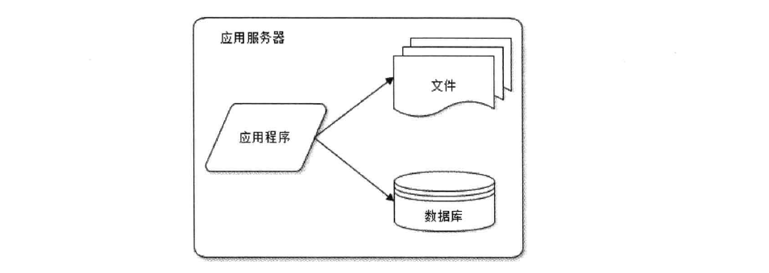
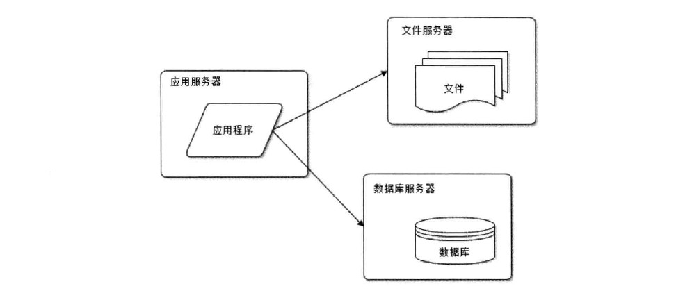
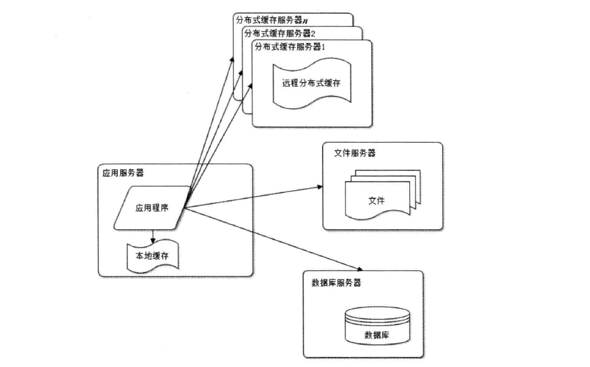
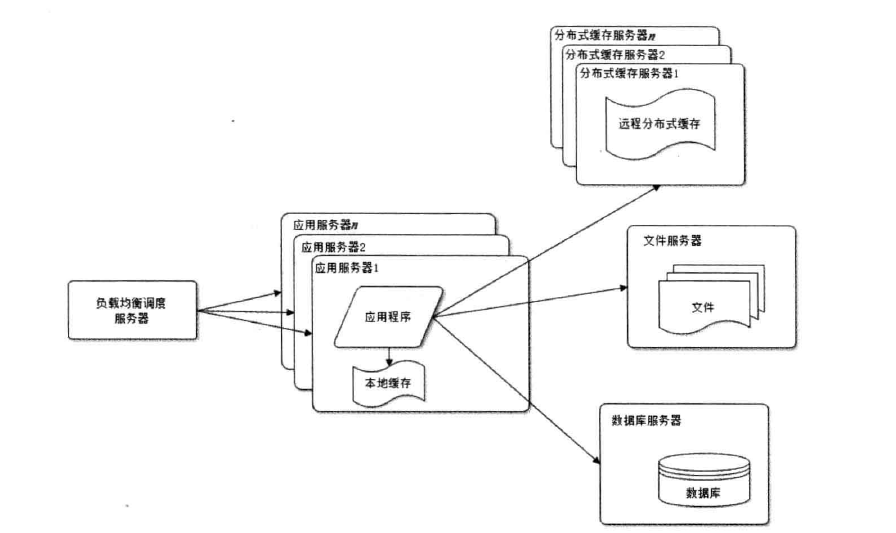
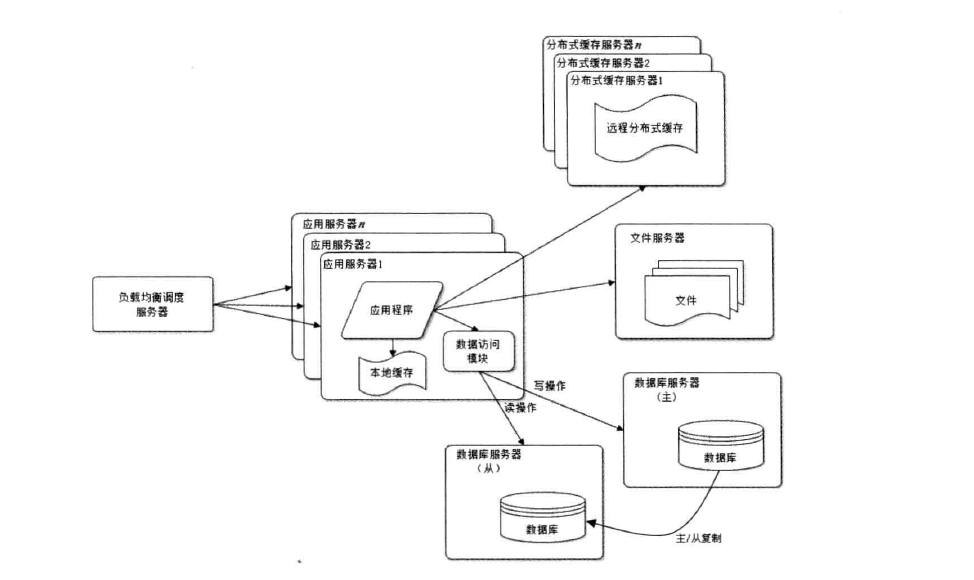
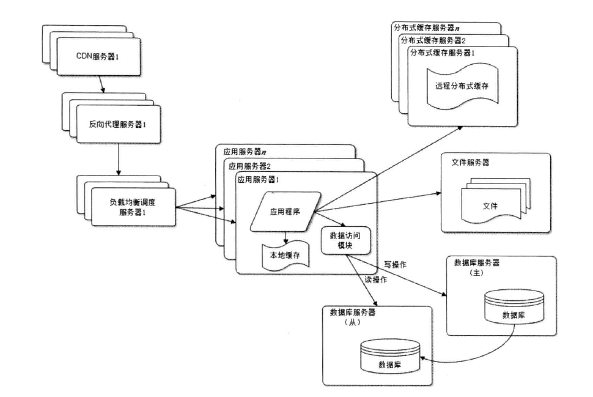
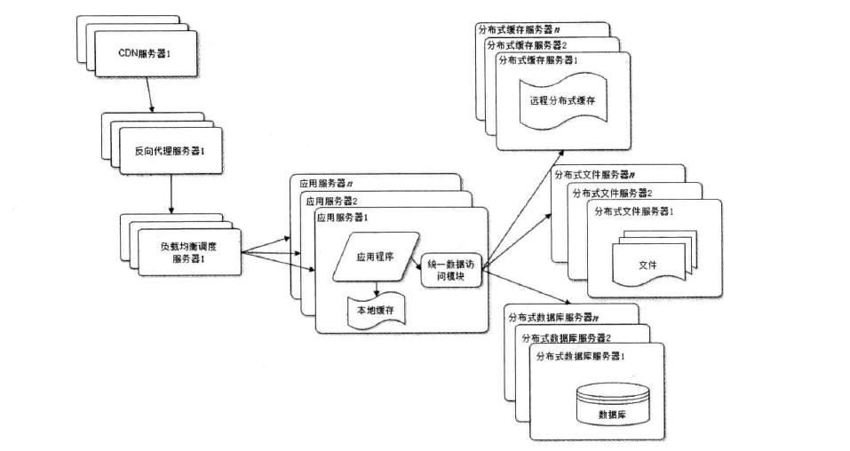
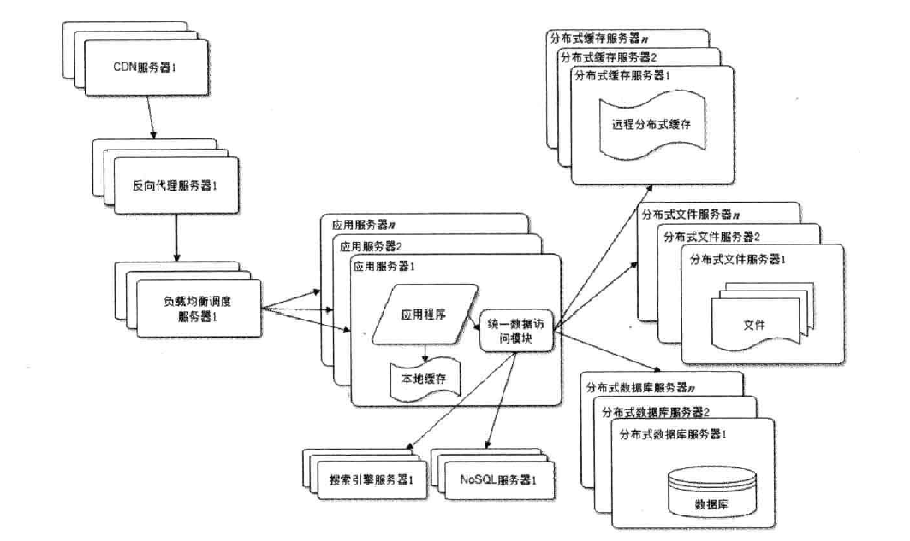
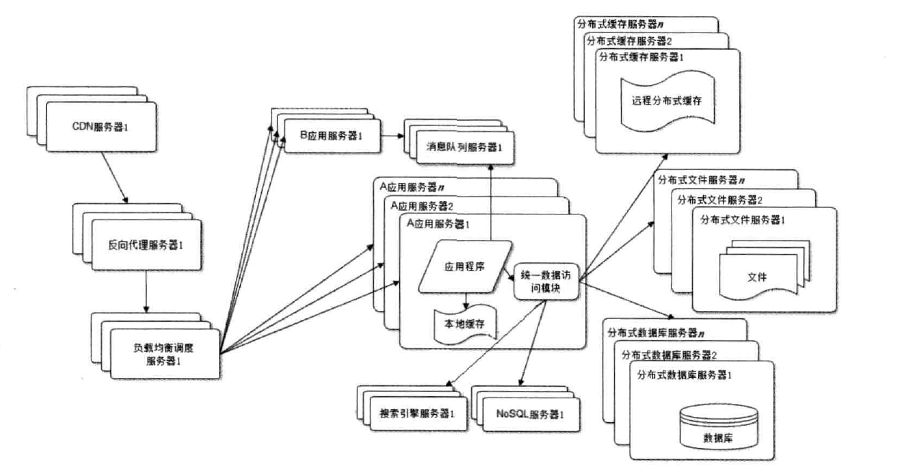
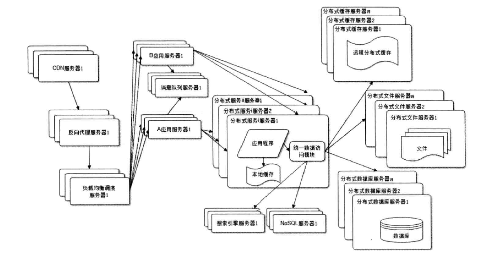

# 架构

## 架构演化

### 初始阶段

小型网站。最开始没有太多用户访问，单台应用服务器即可满足系统要求

### 应用与数据分离

随着用户量增加，单台服务器集成三个组件的功能显得捉襟见肘，将应用、文件、数据分别存放在不同的服务器上，获得性能上的提升

### 使用缓存

网站访问的特点遵循二八定律，80%的业务访问集中在20%的数据上。将热点数据缓存在内存中，改善数据库的访问压力

### 应用服务器集群

应用服务器集群，减小单台应用服务器压力

### 数据库读写分离

网站使用缓存后，多数的读操作可以不再请求数据库，但仍有部分读操作和全部的写操作需要访问数据库，用户数量到达一定值，数据库性能成为网站性能瓶颈。通过主从热备，配置master数据库与slave数据库，实现数据库读写分离。读操作访问slave，写操作访问master

### 反向代理和CDN

### 分布式文件系统和分布式数据库

### 使用NoSQL和搜索引擎

### 业务拆分（微服务雏形）

### 分布式&微服务

## 架构模式

### 分层

应用层

服务层

数据层

### 分割

将某个复杂模块，纵向分割成可复用的模块

### 分布式

分布式应用和服务

分布式静态资源

分布式数据和存储

分布式计算

集群

#### 缓存

CDN

反向代理

本地缓存

分布式缓存

### 异步

消息队列

### 冗余

高可用，故障不会导致数据丢失

### 自动化

自动化发布

自动化代码管理

功能测试

安全测试

部署

监控

报警

故障转移

服务降级

失效恢复

### 安全

## 高性能架构

性能测试指标

- 响应时间
- 并发数
- 吞吐量
    - TPS（transaction per second）
    - QPS（Query per second）
    - HPS（Http per second）
- 服务器性能指标（system load， cpu等）

### 性能优化

#### 前端性能优化

##### 浏览器端

- 减少http请求
- 使用浏览器缓存
- 启用压缩
- css放顶部，js放尾部
- 减少cookie传输

##### CDN加速

##### 反向代理

#### 应用服务器性能优化

##### 分布式缓存

缓存预热

缓存穿透

数据不一致与脏读

同步（JBoss cache）or 不同步（memcache）

##### 异步操作

消息队列

##### 集群

#####  代码优化（数据结构与算法）

#### 存储性能优化

raid&hdfs

### 高可用

### 可伸缩

不需要改变网站的软硬件结构，仅仅改变服务器数量，就可以扩大或者缩小网站的服务处理能力

#### 应用服务器集群伸缩性

负载均衡

#### 分布式缓存的伸缩性

**一致性hash**

#### 数据存储服务的伸缩性

##### 关系型数据库

分库

主从复制

分表：单表很大，需要放在不同的数据库中（cobar）

##### 非关系型数据库

HBase

### 可扩展

对现有系统影响最小的情况下，系统功能可持续扩展或提升的能力。

开闭原则（对扩展开放，对修改关闭）

基础设施稳定不需要经常变更，应用之间较少依赖和耦合

### 安全

