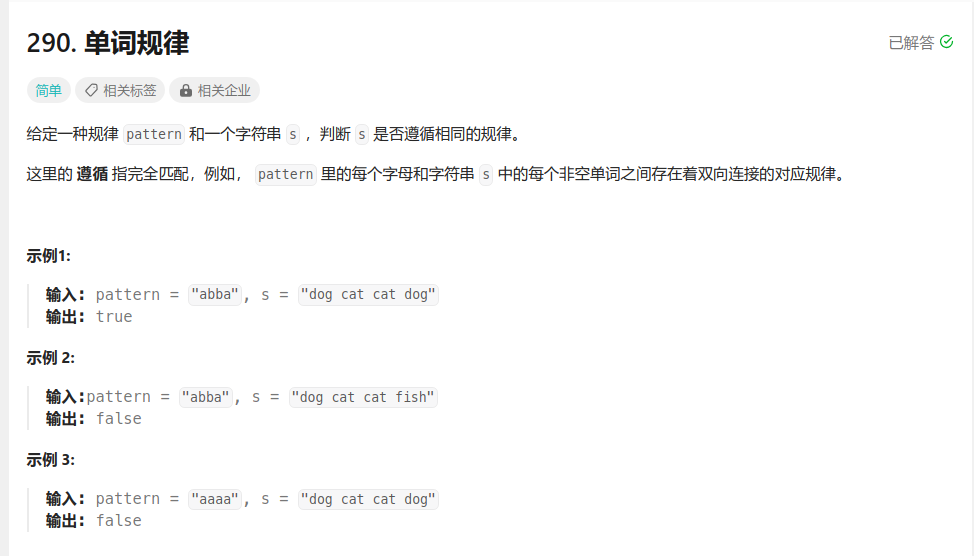
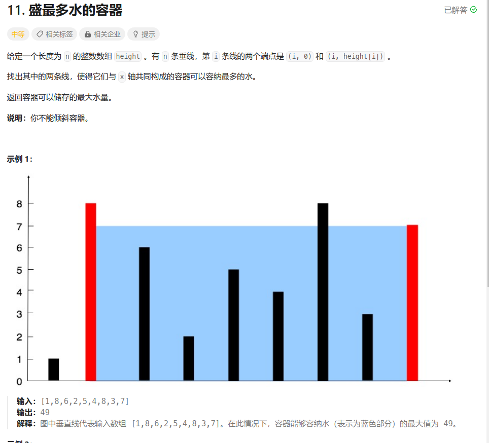
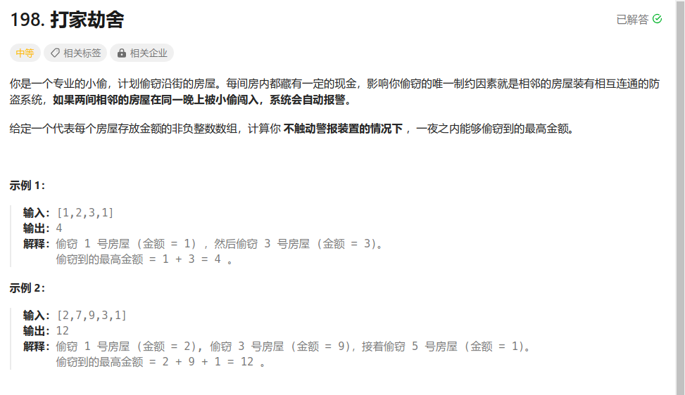

# leetcode刷题日志


## 哈希表

290 单词规律



```python
class Solution:
    def wordPattern(self, pattern: str, s: str) -> bool:
        word_map = {}
        words = s.split(' ')
        if len(pattern) != len(words):
            return False
        for i in range(len(pattern)):
            if pattern[i] not in  word_map:
                word_map[pattern[i]] = words[i]
            else:
                if word_map[pattern[i]] != words[i]:
                    return False
        word_map.clear()
        for i in range(len(pattern)):
            if words[i] not in word_map:
                word_map[words[i]] = pattern[i]
            else:
                if word_map[words[i]] != pattern[i]:
                    return False
        return True
```

## 双指针

11 蓄水池面积



```python
class Solution:
    def maxArea(self, height: List[int]) -> int:
        left = 0
        right = len(height) - 1
        area = 0
        while left < right:
            area = max(area, min(height[left], height[right]) * (right - left))
            if height[left] < height[right]:
                left += 1
            else:
                right -= 1
        return area
```

关键：移动长板，面积一定减小或不变，移动短板，面积一定增大或不变

## 动态规划

打家劫舍



 ```python
 class Solution:
     def rob(self, nums: List[int]) -> int:
         dp = [[0,0] for _ in range(len(nums))]
         dp[0][0] = nums[0]
         for i in range(1, len(nums)):
             dp[i][0] =  max(dp[i-1][1] + nums[i], dp[i-1][0])
             dp[i][1] =  max(dp[i-1][1], dp[i-1][0])
         return max(dp[-1])
 ```

动态规划问题步骤

- 定义子问题
- 确定状态转移规则
- 确定递推关系
- 起始条件
- 空间优化