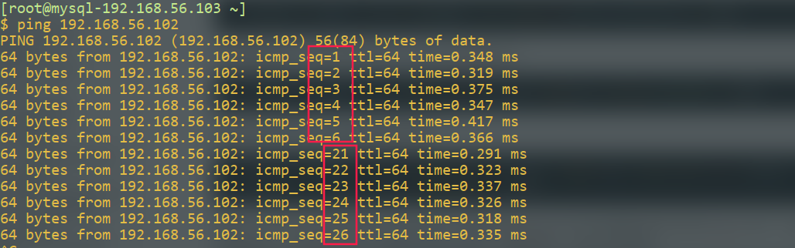

# iptable 应用详解

## 1. netfilter机制

### 1.1 netfilter是什么

是www.netfilter.com开发出的开源防火墙，功能强大并且完善，所以被www.kernel.com集成在linux内核中充当linux原生防火墙

### 1.2 netfilter工作的位置

netfilter工作在网络层，在数据包进入内核之前，就可以直接识别网络层数据包的内容，对数据包进行过滤、转发等操作，如下图


### 1.3 功能模块化

netfilter提供的功能以模块的形式嵌入linux内核中，具有易扩展的优点，发展至今，模块已经发展到了与协议无关的地步，netfilter模块存放的位置为

/lib/modules/4.15.0-29deepin-generic/kernel/net/netfilter/

### 1.4 netfilter的功能结构

netfilter需要用户给出一组规则，来控制模块的行为。netfilter为我们提供的基本功能有四种，分别是filter、nat、mangle、raw。

-   filter用于执行数据包过滤
-   nat用于执行网络地址转换，包括SNAT与DNAT
-   mangle来修改经过netfilter的数据包的内容
-   raw负责加快数据包穿过防火墙的速度，提高性能

将执行对应功能的规则放入对应的结构中，称为表。表中包含有若干条链，链是规则的集合，表示在数据包流经linux网络协议栈的特定位置对数据包进行操作。数据包流经filter表的流程如下，filter表中包含了input、output、与FORWARD链，数据包流入，经过路由表，判断是否是发往本机的数据包，如果不是，则转至FORWARD链进行转发，如果是，则进入input链进行过滤，经处理后经过output链流出


## 2. iptables工具

iptables是用户用来操作netfilter规则的用户工具，接收用户书写的规则，将规则添加进对应链中，执行操作

### 2.1 iptables 命令结构

```shell
iptables -t table_name <option> chain <expr> -j <action>
```

table可以是filter、nat、mangle或raw，表示操作对应的表，option可以是如下值

-   -L 列出表中的链
-   -A 向链中添加一条规则
-   -I 向链中插入一条规则
-   D 删除链中的某条规则
-   -F 清空表的内容
-   -R 替换某条规则
-   -P设置链的默认策略

chain即为要操作的链，匹配规则再述

下面是一些常用的语法

列出filter表中的所有链

```shell
iptables -nvL -t filter
```


如果操作filter表的话，-t参数可以省略，iptables默认对filter表进行操作，可以看出现在filter表中没有任何规则，红色框中表示了链的默认策略

清除filter表中所有内容

```
iptables -t filter -F
```

添加一条规则

```
iptables -t filter -A INPUT -p icmp -j ACCEPT
```

设置FORWARD链默认策略

```
iptables -t filter -P FORWARD DROP
```

插入一条规则

```
iptables -t filter -I INPUT 2 -p tcp -j ACCEPT
```

替换一条规则

```
iptables -t filter -R INPUT 2 -p tcp -j ACCEPT
```

删除一条规则

```
iptables -f filter -D INPUT 2
```

### 2.2 iptables规则语法

规则语法包括基本语法与高级语法，基本语法指定匹配的协议，匹配之后的动作，高级语法指定了匹配协议的参数

#### 2.2.1 基本语法

将某主机发过来的icmp数据包丢弃

```
iptables -t filter -A INPUT -p icmp -s 192.168.56.101 -j DROP
```

-   -p指定匹配的协议，常用的有icmp，tcp、udp、all
-   -s指定源ip地址，也可使用-d指定目的IP地址，除了IP地址外，还可以指定网站或域名
-   -j制定了匹配之后的动作（ACCEPT、DROP、REJECT）

不允许某主机访问本机的web服务

```
iptables -A INPUT -p tcp -s 192.168.56.102 --dport 80 -j DROP
```

-   –dport制定了数据包目的端口，也可以用–sport指定源端口

允许某主机连接至本机的telnet服务

```shell
iptables -A INPUT -p tcp -s ipaddr --dport 23 -j ACCEPT
```

允许192.168.1.0/24向本机提出的任何请求

```shell
iptables -A INPUT -p all -s 192.168.1.0/24 -d 192.168.0.1 -j ACCEPT
```

仅允许客户端从eth0接口访问本机ssh

```
iptables -A INPUT -i eth0 -p tcp --dport 22 -j ACCEPT
```

-   -i指定数据包流入的接口
-   -o指定数据包流出的接口

不允许本机应用程序从eth0接口出去访问www.baidu.com

```
iptables -A OUTPUT -o eth0 -p tcp -d www.baidu.com --dport 80 -j REJECT
```

在网关防火墙中，不允许内网主机访问除企业内网的任何网站

```
iptables -A FORWARD -i eth1 -o eth0 -p tcp --dport 80 -j REJECT
```

#### 2.2.2 一个简单的单机防火墙

主机192.168.57.3上运行了ssh与httpd服务，要求，仅允许192.168.57.0/24可以访问本机ssh服务，网络上任何主机都可以访问除了ssh以外的服务

```shell
iptables -A INPUT -p tcp --dport 80 -j ACCEPT
iptables -A INPUT -P tcp -s 192.168.57.0/24 -j ACCEPT
iptables -P INPUT DROP
```

执行完上述命令后，会发现192.168.57.3无法访问互联网，因为经过此主机发出的包返回的应答，也要经过INPUT链，所以被拦截，如何解决且看下文

#### 2.2.3 连接跟踪

防火墙主机无法对外建立连接，十分不便，此处介绍xt_state.ko模块，在此模块的描述中，tcp连接分为四种状态，分别为

-   NEW
    表示tcp连接的第一个数据包，udp连接发出的第一个数据包、以及icmp发出的第一个数据包，其状态都是NEW

-   ESTABLISHED连接已建立

    -   与tcp协议
        如果本机发出的第一个tcp连接数据包可以成功穿越防火墙，那么接下来本次连接的出站入站数据包都是此状态

    -   与udp协议
        udp协议本来是无状态协议，但是在iptables中，udp请求发出以后，接收道的返回信息状态为此状态

    -   与icmp协议
        icmp包括icmp request与icmp reply，如果icmp request可以成功穿越防火墙，接收到的icmp reply状态为已建立

        有时候服务器响应缓慢，就是因为dns返回的信息被过滤，从而导致dns解析超时

        解决防火墙主机无法对外建立连接，只需要将状态为ESTABLISHED的数据包放通即可

        ```shell
        iptables -A INPUT -p all -m state --state ESTABLISHED -j ACCEPT
        ```

        

-   RELATED
    related状态的数据包与协议无关，应答的数据包是因为本机先前送出的数据包，那么此应答包的连接所有包的状态都是related

-   INVALID
    状态不明的数据包

最后，推荐使用shell脚本的方式管理规则列表（方便处理ip地址）

#### 2.2.4 使用filter构建网关防火墙

client:192.168.56.103,server:192.168.57.4,gateway:192.168.56.102:192.168.57.3

使client主机可以访问server主机的ssh与http服务，需要做如下配置

在server端打开80与22端口,并添加到192.168.56.103的路由

```shell
iptables -A INPUT -p tcp -s 192.168.56.103 --dport 80 -j ACCEPT
iptables -A INPUT -p tcp -s 192.168.56.102 --dport 22 -j ACCPET
iptables -P INPUT DROP
ip route add 192.168.56.0/24 via 192.168.57.3
```

在gateway端设置iptables防火墙，使用state模块

```shell
iptables -A INPUT -m state --state INVALID -j DROP
iptables -A INPUT -m state --state ESTABLISHED,RELATED -j ACCEPT
iptables -A INPUT -p tcp --dport 22 -j ACCEPT
iptables -P INPUT DROP

iptables -A FORWARD -m state --state INVALID DROP
iptables -A FORWARD -m state --state ESTABLISHED,RELATED  -j ACCEPT
iptables -A FROWARD  -i enp0s8 -o enp0s9 -p tcp --dport 80 -j ACCEPT
iptables -A FROWARD  -i enp0s8 -o enp0s9 -p tcp --dport 22 -j ACCEPT
iptables -P FORWARD DROP
```

在client设置默认网关为192.168.56.102

```shell
ip route add default via 192.168.56.102 dev enp0s9
```

#### 2.2.5 iptables的匹配动作

原生匹配动作为DROP、ACCEPT、REJECT、return

return表示从用户自定义链返回


## 3. netfilter的nat机制

NAT原理不再赘述，在netfilter的nat机制中，改变源ip叫做SNAT，改变目的ip叫做DNAT，nat表中包含的链如下图所示


数据包流入后，先进入PREROUTING链中，如果有DNAT操作，则进行DNAT，随后到达路由表，决定是发往本机进程还是进行转发，如果转发，则直接送往POSTROUTING链，如果送往本机进程，则处理之后经过OUTPUT链与POSTROUTING链。PREROUTING是执行DNAT的地方，数据包一进入网络栈，其目的IP地址就被改变，而POSTROUTING是执行SNAT的地方，当数据包流出时，才改变其源IP地址

还是上面的例子，在server上做一次源nat，操作不是filter的其它表时，要注意指明表的名称，-o指定输出网络接口，-s指定源ip地址，MASQUERADE表示进行网络地址伪装，也可以使用-j SNAT –to-source ip，最后，在nat中，下达单一方向的指令即可，无需指定返回方向的数据包通过规则

```shell
iptables -t nat -A POSTROUTING -o enp0s9 -s 192.168.56.0/24 -j MASQUERADE
```

同样的操作也可以通过DNAT实现，当数据包到达时，改变其目的ip地址，假设192.168.56.0/24为公网ip段，192.168.57.0/24为私有ip段，在gateway上，将公网ip发送过来的请求，通过DNAT转发到192.168.56.0/24

```shell
iptables -t nat -A PREROUTING -i enp0s8 -p tcp --dport 80 -j DNAT --to 192.168.57.4:80
```

随后，在server主机里要设置默认网关为gateway，这样才能将请求数据包原路返回(或者添加静态路由)

```shell
route add default gw 192.168.57.3
```


## 4. 数据包流经nat与filter的流程


## 5. 常用模块

-   state匹配数据包状态
    `-m state --state NEW|ESTABLISHED|RELATED|INVALID`
-   multiport匹配多端口
    `-m multiport --dports(--sports) 88,22,2000:2005`
-   iprange匹配地址范围
    `-m iprange --src-range(--dst-range) ip1-ip2 `
-   string匹配数据包内容
    `-m string --algo bm --string 'info' `
-   使用limit匹配特定数据包重复
    `-m limit --limit 6/m --limit-burst 10 `
-   recent特定数据包重复率
-   使用log记录数据包日志

## 6. 常用示例

#### 不响应icmp请求

不响应icmp请求，但是本机可以ping其余主机

```shell
iptables -A INPUT -p icmp --icmp-type 8 -j DROP
```

#### 状态匹配

tcp数据包的包头中含有源、目的地址，端口，以及数据表标志位等重要信息，根据这些信息，可以使用iptables匹配三次握手与四次挥手的信息，使用如下规则来仅接收正常的数据包，tcp三次握手第一次发送的数据包标识为syn，此时数据包的状态应该为NEW，此时可以防御一些非法攻击

```shell
iptables -A INPUT -p tcp --syn -m state --state NEW  -j ACCEPT
```

#### tcp标志位

仅检查syn与fin标志位，当syn与fin标记同时为1时，丢弃该数据包

```shell
iptables -A INPUT -p tcp --tcp-flags SYN,FIN SYN,FIN -j DROP
```

检查所有标志位，当syn与fin标识同时为1，丢弃数据包

```shell
iptables -A INPUT -p tcp --tcp-flags ALL SYN,FIN -j DROP
```

#### 多端口

匹配多个端口

```shell
iptables -A INPUT -p tcp -m multiport --dports 80,22 -j ACCEPT
```

#### 多IP

匹配多个ip地址（–dst-range）

```shell
 iptables -A INPUT -p tcp -m iprange --src-range 192.167.0.1-192.167.0.5 -j DROP
```

#### 数据包内容

匹配数据包内容（也可以使用–hex-string "|aalkdjsfm|")

```shell
 iptables -A INPUT -p tcp --dport 80 -m string --algo bm --string "system32" -j DROP
```

#### 数据包重复限制

限制单位时间内进入系统的icmp请求包

```shell
 iptables -A INPUT -p icmp --icmp-type 8 -m limit --limit 6/m --limit-burst 10 -j ACCEPT
 iptables -A INPUT -p icmp --icmp-type 8 -j DROP
```

#### 数据包重复限制

使用recent进行icmp流量控制,从后往前看，将接收到的icmp-type为8的数据包信息记录在icmp_db中，当接收到icmp-type 8的数据包时，检查icmp_db，如果在过去的20秒内，数量达到6，则丢弃该数据包

```shell
iptables -A INPUT -p icmp --icmp-type 8 -m recent --name icmp_db --rcheck --second 20 --hitcount 6 -j DROP
iptables -A INPUT -p icmp --icmp-type 8 -m recent --set --name icmp_db
```

效果如下，使用recent较limit的优点在于，limit不能区分不同主机，假如攻击者的ping请求收到了限制，那么我们的正常ping请求也会受到限制，而使用recent模块的话，不同主机会有不同的记录



更改之前的规则，使持续发送ping请求的客户端，仅能接收到六个回复,将-rcheck改为–update表示每次接收到该种类型的数据包，就更新对应数据库

```shell
iptables -A INPUT -p icmp --icmp-type 8 -m recent --name icmp_db --update --second 20 --hitcount 6 -j DROP
iptables -A INPUT -p icmp --icmp-type 8 -m recent --set --name icmp_db
```

#### 记录ssh请求日志

使用log记录信息

```shell
iptables -A INPUT -p tcp --syn --dport 22 -j LOG --log-level alert --log-prefix="ssh-request"
```

随后在/etc/rsyslog.conf中添加对kern.=alert级别日志的存储位置


ssh登录一次该主机，可以在对应日志文件中看到


## 7. 常见攻击手段及其防御

---

### 7.1 端口扫描

凡是端口扫描工具，都具有一类特殊的行为，连续访问主机的某一段未开放端口，根据这些扫描行为，限制来源IP的访问请求，是解决这类问题的思路，根据上文描述，可以使用recent模块，限制连续发送状态为NEW的发往未开放端口的数据包的主机

```shell
iptables -A INPUT -p all -m state --state ESTABLISHED,RELATED -j ACCEPT
iptables -A INPUT -p all -m state --state NEW -m recent --name port_scan --update --seconds 1800 --hitcount 10 -j DROP
iptables -A INPUT -p tcp -m multiport --dports 22,80,443 -j ACCEPT
iptables -A INPUT -p all -m recent --name port_scan --set
```

### 7.2 密码攻击

密码攻击，常见于一些密码认证系统，通过不断尝试密码字典中的密码，爆破出真实密码

对明文传输的密码爆破，可以使用string模块，匹配数据包内容。每次认证失败，服务端就会返回错误信息，如果匹配到了此错误信息，则说明此次密码认证失败，如果匹配次数过多，说明客户端有攻击嫌疑，封禁IP

```shell
iptables -A INPUT -p tcp --dport 25 -m string --algo bm --string "error message" \
	-m recent --name db --update --seconds 1800 --hitcount 6 -j DROP
iptables -A INPUT -p tcp --dport 25 -m string --algo bm --string "error message" -m recent --name db --set
```

对加密传输的密码攻击，比如ssh密码爆破，可以根据syn数据包的数量来检验，在某段时间内，如果某个主机建立ssh连接的请求过于频繁，封禁其IP

```shell
iptables -A INPUT -p tcp --syn --dport 22 -m recent --name ssh_db --update --seconds 1800 --hitcount 6 -j DROP
iptables -A INPUT -p tcp --syn --dport 22 -m recent --name ssh_db --set
```

## 8. netfilter性能优化


