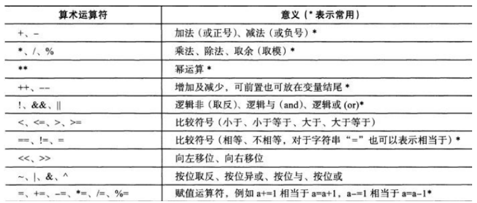
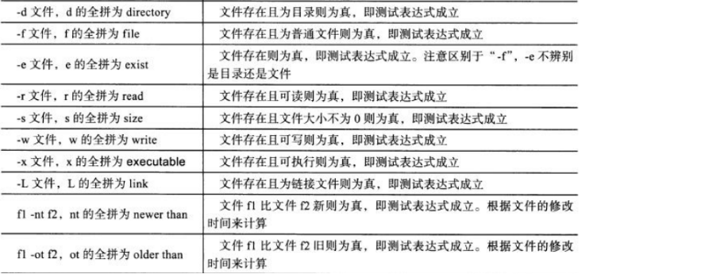
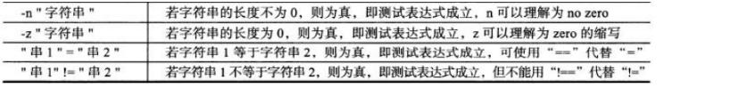
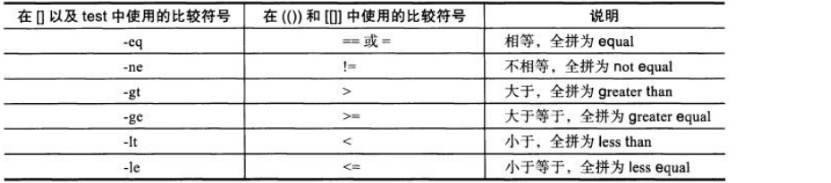
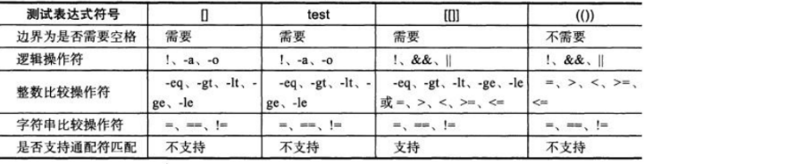
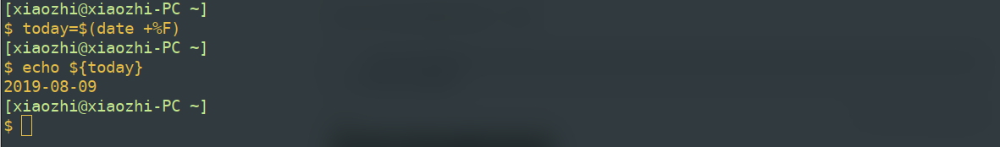
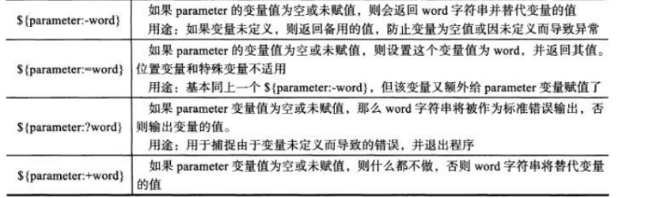

# shell脚本编程指南

## 调试与运行

#### shell脚本首行

`#!/bin/bash`
这里/bin/bash只是一个例子，shell脚本首行一般以#！开头，后面跟的解释器即为执行此脚本的解释器，除了首行，跟在#后面的字符会被认为是注释

### shell脚本的执行方式与区别

- shell脚本执行时，会向系统内核请求启动一个全新的进程，读取用户环境变量，在该进程中执行脚本中的命令
- bash script-name
  当脚本没有可执行权限时，使用此命令也可执行，新建子进程，在子进程中运行scriptname
- path/script-name
  在当前目录下执行脚本，要求脚本必须有可执行权限，该方式也是在子进程中执行shell脚本
- source 或 . script-name
  在当前目录下执行脚本，该方式会在当前shell环境中执行指令
- sh script-name 或 cat script-name | bash

### shell配置文件

shell配置文件有/etc/profile,/etc/bashrc,~/bashrc, ~/bash_profile,/etc/profile.d/*
  加载顺序如下
  

### shell脚本调试技巧

- 使用echo命令输出中间结果
  打印中间结果是调试程序的基本需求，任何可以看到中间结果的方法都有助于调试程序
- 使用sh命令行参数调试程序
  - sh -n查询该脚本语法是否有问题
  - sh -v执行脚本时，先将命令输出至屏幕，在标准输出中可以看到命令，如果有错误，会给出相应提示
  - sh -x在标准输出中，给出执行的命令和该命令的输出
- 使用set命令缩小调试范围
  - set -x开始
  - set +x结束

## 数字与计算

### 算数运算符



### 一些运算指令

#### (())

用于整数计算的运算符，效率高，另外，在（（））语法中不要求有空格，但是有也不会影响结果，在(())中的变量可以不加前导符$

```shell
((i=i+1))       数值计算
i=$((i+1))      同上
((8>7&&7>5))    条件判断
echo $((2+1))   数值判断后输出
```

#### let

用于整数计算，类似于(())

```shell
let i=i+1等同于((i=i+1))
```

#### expr

用于表达式求值

```
expr 1 + 1
```

可以使用expr判断一个数是否为整数，$?变量保存了上一条命令的输出，使用未知变量与一个整数相加，如果返回值是0就代表该未知变量是整数，否则不是整数

```shell
expr $a + 5 &>/dev/null
RETRAL_A=$?
expr $b + 5 &>/dev/null
RETRAL_B=$?
if [ $RETRAL_A -ne 0 -o $RETRAL_B -ne 0 ]
then
echo "your have input two number"
exit 2
fi
```

## shell中的条件判断

有如下几种形式，中括号、逻辑运算符与数字之间需要有空格

```shell
test <expression>
    test -f file || echo exist
[ expression ]
    [ -z "$1" -a -z "$2" ]注意空格的使用
[[ expression ]]
    [[ -f file && -f file2 ]]
(( expression ))
    (($num<10))
```

在[[]]中可以使用通配符进行模式匹配，一些判断符号比如&&, ||, < , >仅仅只在[[]]中使用，在[]中一般使用-a, -o, -lt -gt等条件

#### 文件属性判断



#### 字符串判断



#### 整数判断



#### 逻辑运算符


#### 一些总结



#### 条件执行代码的简介方式

当条件1成立时执行后面代码

```shell
test condition1 && {
  command1
  command2
  }
 [ condition1  ] && {
  command1
  command2
  }
 [[ condition1 ]]  && {
  command1
  command2
  } 
```

条件1成立时执行命令2，否则执行命令3

```
  [ condition1 ] && command2 || command3
```

### if语句

if语句可以嵌套，有如下形式

```shell
if [ condition ]
then
      command
fi

if [ condition ] ; then
      command
fi

if [ condition1 ] 
then
    command1
elif [ condition2 ]
then
    command2
else
    command3
fi
```

#### 判断数字

##### 思路

根据expr返回值判断

```
expr $num + 5 ; [ $? -eq 0 ]
```

示例如下

```shell
while true
do
    read -p "please input:" a
    expr $a + 5 &>/dev/null
    [ $? -eq 0 ] && echo int || echo char
done
```

删除变量中所有数字，看之后字符串是否为空

```
[ -n " echo xiaozhi123 | sed 's/[0-9]//g' " ]
```

例子：验证数据类型后进行四则运算

```shell
[ $# -ne 2 ] && {
    echo -e "your must give two arguments!\n"
    exit 1
}
a=$1
b=$2
expr $a + 5 &>/dev/null
RETRAL_A=$?
expr $b + 5 &>/dev/null
RETRAL_B=$?
if [ $RETRAL_A -ne 0 -o $RETRAL_B -ne 0 ]
then
    echo "your have input two number"
    exit 2
fi

echo "a+b=$(($a+$b))"
echo "a-b=$(($a-$b))"
echo "a*b=$(($a*$b))"
echo "a/b=$(($a/$b))"
```

例子：验证数据类型后比较大小

```shell
read -p "please type two num:" a b
if [ -z "$a" -o -z "$b" ]
then
    echo "you must type two arguments"
    exit 1
fi
expr $a + 5 &> /dev/null
RETRAL_A=$?
expr $b + 5 &> /dev/null
RETRAL_B=$?
if [ $RETRAL_A -eq 0 -a $RETRAL_B -eq 0 ]
then
	if [ $a -lt $b ]
	then
		echo "$a<$b"
	elif [ $a -gt $b ]
	then
		echo "$a>$b"
	else
		echo "$a=$b"
	fi
else
	echo "you must input two num"
fi	
```

## 变量与数组

#### 变量定义

name=value，等号两侧不能有空格

#### 环境变量

一般指用于export导出的变量，用于定义shell的运行环境，保证shell命令的正确执行，环境变量一般采用大写命名，使用env,declare,set命令可以查看系统环境变量。使用下列方法定义环境变量

```shell
export name='value'
name='value' ; export name
declare -x name='value'
```

使用echo打印变量，使用unset可以清除变量

#### 变量定义与引用

定义,注意‘与“在shell脚本中的区别，’表示强引用，类似于python字符串前的r，表示原始字符串，而“为弱引用，可以包含特殊字符

```shell
name=value
name='value'
name="value"
```

使用

```shell
$name
${name}
```

取得命令执行的输出，赋值给另一变量

```shell
name=$(command)
name=`command`
```



#### shell中的特殊变量

```
$0 		表示当前执行脚本的文件名称，可以使用basename和dirname命令得到目录名称和文件名称
$n 		获取第n个参数值，当n大于9时，使用${n}的形式
$# 		运行shell脚本时后面所接参数的个数
$* 		获取脚本所有的运行参数，当不加双引号时，和$@相同，表示所有参数，当加上双引号时，"$*"表示将所有			参数列表当作一个字符串，相当于"$1 $2 ... $n","$@"表示单个参数列表 "$1" "$2" ... "$n"
$@ 		获取脚本所有的运行参数
另外set -- para1 para2 para3表示清除所有的参数变量，并重新设为para1 para2 para3
$? 		表示上一条命令的返回值
$$ 		当前进程pid
```

#### 与变量相关的命令

echo打印字符串

eval 执行后面字符串表示的内容

exec 当当前shell中执行后面的指令，并在执行完成之后退出当前shell

read -p “prompt” var 读取用户输入，保存到变量var中

shift 使变量左移

#### 变量内容截断

```
${parameter} 获取变量parameter的内容
${#parameter}获取parameter的长度
${parameter:offset}提取从offset开始到最后的子字符串
${parameter:offset:length}提取从offset开始的length个字符串
${parameter#word}从开头删除最短匹配word的字符串
${parameter##word}最长
${parameter%word}从结尾删除最短匹配word的字符串
${parameter%%word}最长
${parameter/pattern/string}用string代替第一个匹配的pattern
${parameter//pattern/string}用string代替所有匹配的pattern
```

#### 变量扩展



#### 数组

定义

```
`array=(1 2 3)`
`array=($(command))`
`array=(`command`)`
```

输出所有元素

```
echo ${array[*]}`或`echo ${array[@]}`
```

获取长度

```
echo ${#array[*]}
```

下标索引

```
echo ${array[1]}
```

例子：输出满足长度要求的字符串

```shell
str=(the test string is used to testsetset)
for word in ${str[*]}
do
    if [ `expr length $word` -lt 6 ]
    then
	    echo $word
    fi
done
```

另外 seq指令可以生成数字序列，使用方法如下


## 函数

shell中的函数与一般程序设计语言中的函数概念相同，将一组语句定义为一个函数，当想执行该组语句时调用该函数即可，通过参数可变实现功能扩展，提高代码重用性，而且模块儿化开发更容易维护

### 定义函数

```shell
function fun1() { 
command
}
function fun2 {
command
}
fun3(){
command
}
```

以上三种方式都可以定义函数，推荐使用第一种方式，在函数中可以使用return语句返回一个值，在函数结束时返回给当前程序，可用$?取得。函数调用时，使用`fun_name`的形式，不需要加括号，这和一般编程语言语法出入较大，需注意。

### 函数的调用与运行时参数

函数调用
`funname para1 para2 para3`
在函数中可以通过$1 $2 $3 $# $? $* $@使用这些参数，父脚本参数临时被隐藏。

```bash
function f1(){
	    echo "you type $# param"
    echo "they are $@ "
}
function f2(){
    echo "you type $# param in f2 call"
    echo "they are $@"
}
f1 
f2 1 2 3 4 5
```

输出如下

```bash
$ bash test_param.sh 
you type 0 param
they are  
you type 5 param in f2 call
they are 1 2 3 4 5
```

### 函数示例

（检测url是否可达，使用wget工具，根据返回值来判断）

```bash
function usage(){
    echo "usage: $0 url"
    exit 1
}
function check(){
    wget --spider -q -o /dev/null -T 5 $1
    if [ $? -eq 0 ]
    then
    	    echo "url test susscefully"
    else
	    echo "failed"
    fi
}
function main(){
    if [ $# -ne 1 ]
    then
	    usage
    fi
    check $1
}
main $*
```


## case与循环

### case语法

```bash
case "var" in 
    value1 )
        command_block1
        ;;
    value2 )
        command_block2
        ;;
    * )
        command_block3
esac
```

示例

```bash
read -p "please input a number in [0-9]>" num
case $num in 
    1)
    	    echo "you typed 1!"
	    ;;
    2)
	    echo "you typed 3!"
	    ;;
    [3-9])
	    echo "you typed $num"
	    ;;
    *)
	    echo "invalid augument!"
esac
```

### while循环

语法格式

```bash
while condition
do
    command_block
done

until condition
do 
    command_block
done
```

while会在条件成立时进入循环体，直到条件不成立退出，until会在条件不成立时进入循环体，直到条件成立退出
while循环按行读取文件

```bash
exec <test.sh
while read line
do
    echo $line
done

cat test.sh | while read line
do
	    echo $line
done
```

### for循环与select

select用于菜单选项执行,循环过程中取值列表可省略，表示$@

```bash
for var in (val1 val2 val3)
do 
    command_block
done

for((exp1;exp2;exp3))
do
    command_block
done

select var in [ var list ]
do
    command_block
done
```

select示例（PS3代表命令提示符，$REPLY代表选择的数字)

```bash
PS3="select a num for menu>"
select name in xiaoming xiaohong xiaobai
do
    echo "you selected : $REPLY)$name"
done	
```

continue、break、return、exit对比其他语言理解

## 信号

### 信号是什么

信号作为一种进程间通信的方式，是linux进程管理使用最为广泛的方式，通过给进程发送信号，来传递信息，比如按下crtl-c，向当前进程发送INT信号，linux常见信号列表如下


### 重要信号说明


### 使用trap命令管理应用进程信号

`trap command signal`
command表示捕捉到signal时执行的命令，使用信号名称时需要省略SIG前缀

```
trap 'ls /tmp/xiaozhi_* | xargs rm -f && exit' INT
while true
do
    touch /tmp/xiaozhi_`date +%F-%H:%M:%S`.txt
    sleep 3
    ls /tmp/xiaozhi_*
done
```

## 常用操作

### 数字序列

```bash
seq 5 -1 1 | xargs
```


### 使用{..}生成数值序列

```bash
echo {1..9}
输出
1 2 3 4 5 6 7 8 9
```

### 随机数

-   使用$RANDOM生成范围在0-32767之间的随机数，为保证随机性，可使用md5sum命令产生随机序列并截取其中某些位
    `echo $RANDOM | md5sum | cut -c 8-15` 
    `75d6c028`
-   使用openssl产生随机数
    `openssl rand -base64 8`
    `WJeQaLlePm8=`