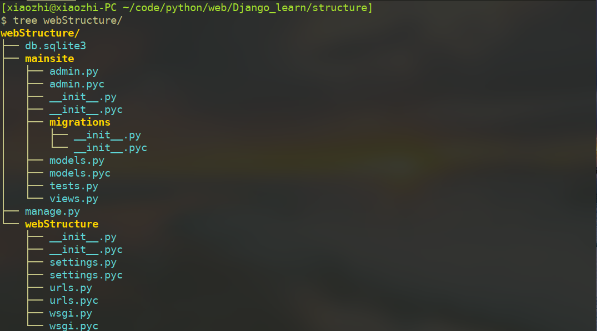
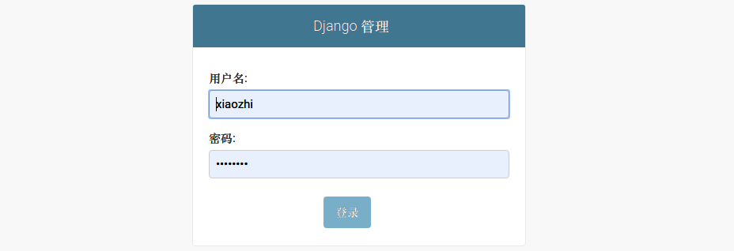
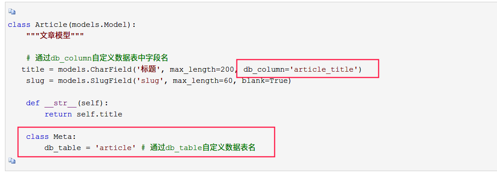
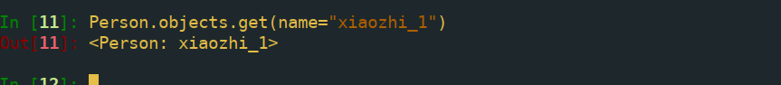
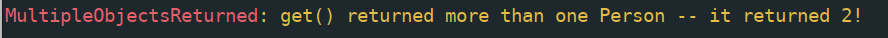

# Django完全教程

## 从一个例子开始

我们需要理解，一个web应用的本质是处理浏览器request请求返回html页面的容器。开始浏览器产生一个http请求，服务器接收到请求后，生成html文档作为返回数据的body，返回给浏览器，浏览器提取数据进行显示。常用的web容器有apache，tomcat等。如果要动态生成html内容，就需要手动处理上述过程，wsgi定义了一组接口，它要求开发者写出符合该标准的应用程序，wsgi来处理底层http处理的细节。使用原生wsgi编写程序依然十分繁琐，所以出现了功能不断完善的web框架，让程序员免于在底层信息处理中迷失。python最著名的网络框架有两个，一个是flask，小巧轻便，灵活，另一个是Django，框架较为庞大，功能扩展多。在搭建web应用的时候，经常碰到不同项目python包冲突的情况，为此我们使用虚拟环境。虚拟环境pyenv可以，官方的virtualenv亦可，都可以达到项目与系统分离的目的。

### django的运行流程

python web框架一般运行于web容器之中，各个容器都可以配置wsgi标准应用，与web框架进行耦合。apache安装mod_wsgi模块后，可以将浏览器发送的httprequest请求以wsgi标准的形式发送给web后端，web后端处理该请求，返回response，其中的操作包括url映射、通过ORM技术从数据库中取出数据、模板渲染，最后将生成的response内容返回给web容器，由web容器返回给浏览器

### django的安装

在虚拟环境中使用pip即可，如果我们要安装特定版本的

```
pip install django==1.8.3
```
### django项目结构与基本概念

项目是django中最为宏观的概念，即web项目。一个web应用可能需要许多不同的功能模块儿，这些模块儿叫做application。在处理request和response时如果我们希望可以自己对它们做出一些更改，需要通过中间件来完成，使用loader从模板中加载内容。使用如下命令创建一个web应用，名称为webStructure

```
django-admin startproject webStructure
```
该操作会在当前目录下生成一个名为webStructure的文件夹，其目录结构如下

manager.py是django用来管理项目的工具程序，可以接收命令行参数，在项目内的所有命令都需要该文件的支持。二层目录webStructure下，urls.py文件定义了url与处理url的视图函数之间的映射关系，settings定义了项目配置信息，wsgi则是djangoweb应用的wsgi接口，该文件是web项目的启动入口。在执行以上操作后，我们只是有了一个大体的框架，没有加入任何的功能，进入webStructure目录，使用如下命令新建一个application

```
django-admin startapp mainsite
```
新建立了一个app，此时项目结构如下

views.py定义了一系列处理url请求的函数，称为视图，models.py定义了网站要使用的数据结构，这里需要说明一下，django使用ORM技术存取数据库信息，这样做的好处是我们无需关心数据库类型，无需关心连接数据库的语句是那些，只要我们按照一定的标准定义数据结构，django自动帮我们完成数据库的操作。mainsite下的migrations文件夹下存放的文件是网站migrate的历史记录，什么是migrate呢，我们定义了models数据结构，要将models文件中的数据结构与数据库关联起来，需要执行migrate操作。在setting文件中，加入我们刚才创建的app

```python
INSTALLED_APPS = (
    'django.contrib.admin',
    'django.contrib.auth',
    'django.contrib.contenttypes',
    'django.contrib.sessions',
    'django.contrib.messages',
    'django.contrib.staticfiles',
    'mainsite',
)
```


设置时区与语言

```python
LANGUAGE_CODE = 'zh-hans'

TIME_ZONE = 'Asia/Shanghai'
```

配置mysql数据库

```python
DATABASES = {
    'default': {
        'ENGINE': 'django.db.backends.mysql',
        'NAME': 'shop',  # 数据库名字
        'USER': 'root',  # 账号
        'PASSWORD': 'wodemima',  # 密码
        'HOST': '127.0.0.1',  # IP
        'PORT': '3306',  # 端口
    }
}
```

使用下面的命令执行migrate操作，创建对应的数据库与数据表

```
python manage.py migrate
```
看到如下输出

每次对models文件做出更改时，都要执行该操作以将更改同步至数据库中。另外，在初始的时候，执行makemigrations命令以创建django与数据库之间的中间文件。该操作将在app目录下创建migrations目录，并在该目录下记录我们对models文件的所有改动（未同步至数据库），执行migrate后，该操作都会同步至数据库中。

### django中的models

models文件中定义了网站使用的数据结构，我们在models中定义数据，并通过migrate同步至数据库，随后我们对该类型数据的操作，可以反映至数据库中，这是使用ORM的便捷之处。django默认使用sqlite数据库，如果需要使用其他的数据库类型，需要在settings文件中配置相关选项，并且安装相应的python驱动。使用如下代码在models中定义一个类型

```
# -*- coding: utf-8 -*-
from __future__ import unicode_literals
from django.utils import timezone
from django.db import models

# Create your models here.
class Post(models.Model):
    title = models.CharField(max_length=200)
    slug = models.CharField(max_length=200)
    body = models.TextField()
    pub_date = models.DateTimeField(default=timezone.now)

    def __unicode__(self):
        return self.title

    class Meta:
        ordering = ('-pub_date',)
```
同步至数据库中
```
python manage.py makemigrations
python manage.py migrate
```
### 启用admin管理界面

django项目创建之时，有web页面管理功能的支持，在使用这个功能之前，需要新建一个管理员用户

```shell
python manage.py createsuperuser
```

输入用户名与密码创建超级账户


在admin文件中，注册我们刚在创建的Post类，让我们可以在web控制台操作该对象

```
# -*- coding: utf-8 -*-
from __future__ import unicode_literals

from django.contrib import admin
from .models import Post
# Register your models here.
class PostAdmin(admin.ModelAdmin):
    list_display = ('title', 'slug', 'pub_date')
admin.site.register(Post, PostAdmin)
```
其中PostAdmin类为我们为了更改默认的显示方式而创建的，使用migrate命令将内容同步至数据库中，随后使用如下命令启动测试模式
`python manage.py runserver 127.0.0.1:8000`
访问根网页，我没没有为根目录设置任何内容，下面的结果只是告诉我们服务器运行成功了

访问管理页面`http://127.0.0.1:8000/admin`,看到如下图所示的登录窗体，使用我们刚才创建的管理员账户登录即可

登录以后看到我们刚才创建的Post类

可以在web控制台手动添加Post实例，这些更改都会被同步到数据库中。

### django中的视图

一般来说，web应用包含两部分，前端页面和后端逻辑。前台通过post或get请求与后台交互，后台根据传递的参数进行系列动作，返回需要的内容。在Django中，这些后台逻辑，就是视图需要完成的工作。表面上看，视图是定义在views.py文件中的一系列函数，当用户请求某个网址时，根据urls.py文件中的动态网址映射到某个视图函数，执行某个动作，并返回HTTPResponse对象，返回给客户端

### django中的模板

html页面的内容应该是可重用的，页面是动态的、可渲染的，才有可能建立动态的网站，python中的jinja2模板引擎很好的应用在了web开发中，将原始html页面看做模板，模板中有一些变量，变量的内容会根据运行时视图函数传递过来的参数而变化，从而达到动态渲染的目的。这样方便了后端程序传值，但是网页解析与特定模板引擎绑定，并且最近几年逐渐出现了前后端分离的模式，尽量采用前端原生网页的形式。

### django中的模型

模型是网站要使用的数据结构，比如用户模型，定义了用户这个类别的数据结构，可能包含用户名、密码、邮箱地址等等信息。本来这些信息需要自己组织在数据库的表中，用户认证时，我们从数据库表中取出对应内容进行比对。Django使用ORM技术为我们简化了上述过程，我们仅需创建一个类，包含必要的字段，django会自动为我们在数据库中创建该类对应的表，而且为我们简化数据查询操作，这些类，定义自models.py文件中

### 创建我们的视图函数

在mainsite下的views.py文件中，创建一个函数，处理http请求

```python
from .models import Post
from datetime import datetime
from django.http import HttpResponse
from django.template.loader import get_template
def homepage(request):
    # 查询对应的内容
    posts = Post.objects.all()
    now = datetime.now()
    # get_template是Django中一个加载模板的函数，使用之前需先导入
    template = get_template('mainsite/index.html')
    # render函数用来渲染html页面，将必要的数据传过去，locals（）是python的一个全局
    # 函数，表示所有本地变量字典
    html = template.render(locals())
    return HttpResponse(html)
```

函数必须有一个固定参数request，表示请求上下文， 从中可以获取http请求的所有信息

get_template是django提供的快捷函数，获取模板文件，其render函数将变量渲染进模板中，最后返回HttpResponse对象。

### 配置模板

在使用模板之前，需要配置django模板文件目录，当收到读取模板请求，django默认会去各个app目录下寻找templates目录，从该目录中找对应名称的模板文件，我们有多个app的时候，为了放置模板名称冲突，最好在模板目录下新建app名称目录，将模板文件放在该目录中，在此例子中，配置项目根目录下的templates目录为模板目录


#### 静态文件目录

另外，在django的模板文件中使用静态文件比如css，js，图片资源时，不能简单的使用相对路径引入，而要用static请求请求资源。配置静态文件路径如下

```python
STATICFILES_DIRS=[
    os.path.join(BASE_DIR, 'static'),
]
```

在静态目录static中建立相应文件夹，并放入静态资源文件，供模板使用


#### 编写模板文件

使用jinjia2模板的继承功能，base.html文件内容

```jinja2
<!DOCTYPE html>
<html>


<head>
    <meta charset="utf-8">
    <meta name="viewport" content="width=device-width, initial-scale=1, shrink-to-fit=no">
    <!-- Bootstrap CSS -->
    <link rel="stylesheet" href="">
    <link rel="stylesheet" href="">
    <link rel="stylesheet" href="">
    <link rel="stylesheet" href="">
    <link rel="stylesheet" href="">
    <link rel="stylesheet" href="">
    <title>
         
    </title>
</head>

<body>
    <div class="container-fluid">
        
        <div class="row">
            <div class="col-sm-4">
                <div class="card">
                    <div class="card-header">
                        <h3>MENU</h3>
                    </div>
                    <div class="card-body">
                        <div class="list-group">
                            <a href='/' class="list-group-item">HOME</a>
                            <a href='#' class="list-group-item">实时新闻</a>
                            <a href='#' class="list-group-item">电视新闻</a>
                        </div>
                    </div>
                </div>
            </div>
            <div class="col-sm-8">
                <div class="card">
                    <div class="card-header">
                        
                    </div>
                    <div class="card-body">
                        
                    </div>
                    <div class="card-footer">
                        
                    </div>
                </div>
            </div>
        </div>

    </div>
    <script src="https://cdn.bootcss.com/jquery/3.2.1/jquery.min.js"></script>
    <script src=""></script>
    <script src=""></script>
    <script src=""></script>
    <script src=""></script>
</body>

</html>
```

index.html文件如下

```jinja2
 
 欢迎光临我的博客  

<h3>本站文章列表</h3>
 
 
    
        <div class="card">
            <div class="card-header">
                <p>
                    <a href="/post/{{post.slug}}">{{post.title}}</a>
                </p>
            </div>
            <div class="card-body">
                <p>
                    {{ post.body | truncatechars:40 }}
                </p>
            </div>
            <div class="card-footer">
                <p>
                    发布时间:{{ post.pub_date | date:"Y M d, h:m:s"}}
                </p>
            </div>
        </div>

 

```

header.html

```html
<h1 style="font-family: 'Microsoft Sans Serif'">欢迎光临，文学天地</h1>
```

footer.html

```jinja2


<p style="font-family: 'Microsoft Sans Serif'">现在时刻：{{ now }}</p>

<p style="font-family: 'Microsoft Sans Serif'">内容来自网络，如有侵权请通知下架。。。</p>


```


使用之前在admin管理界面为django添加几条数据

### 配置url映射

在webStructure目录下的urlspy添加url映射

```python
from django.contrib import admin
from django.urls import path
from django.conf.urls import url, include
from mainsite.views import homepage
urlpatterns = [
    url('^$', homepage),
    path('admin/', admin.site.urls),
]
```

## django网站部署

django 的manage.py的runserver参数可以在本地启动单线程的调试服务器，但正常项目上线的时候都使用web容器+wsgi+django的方式，web容器可以选择apache2或者nginx，作为解析http请求的应用，wsgi处理web容器转发给django的请求，最后django应用响应http请求

### 在centos中配置django+apache

#### python环境配置

```shell
unzip webStructure.zip
cd webStructure
```

使用yum安装的python没有sqlite支持，并且为了python版本的管理，我们使用pyenv工具

```
https://github.com/pyenv/pyenv-installer.git
```

使用该工具安装pyenv

```
curl https://pyenv.run | bash
```

编辑.bashrc

```
export PATH="$HOME/.pyenv/bin:$PATH"
eval "$(pyenv init -)"
eval "$(pyenv virtualenv-init -)"
```

重新登录shell激活pyenv工具，pyenv install 3.7.0会从源码镜像中下载3.7.0源码包并编译安装，可以先下载该文件，放入pyenv缓存中


如

```shell
makedir ~/.pyenv/cache
cd ~/.pyenv/cache
wget  https://www.python.org/ftp/python/3.7.0/Python-3.7.0.tar.xz
```

随后再安装3.7.0版本python时不需要再重新下载，另外编译安装python的时候需要一些系统依赖，比如C编译环境，以及一些库的源码包

```shell
yum install sqlite-devel sqlite readline readline-devel readline-static openssl openssl-devel openssl-static bzip2-devel bzip2-libs mysql-devel libffi-devel make gcc xz-devel
```

编译可能要花费一点时间，需要耐心等待，安装完成后切换回项目目录，创建虚拟环境，安装依赖，并且运行django进行测试。安装django时，最好使用2.1版本，否则会因为sqlite版本不满足要求服务无法运行

```shell
cd /var/www/webStructure
pyenv virtualenv 3.7.0 django_deps
pyenv activate django_deps
pip install -r requirements -i https://pypi.tuna.tsinghua.edu.cn/simple
python manage.py runserver
```

#### 修改settings.py

关闭调试模式，放通主机访问


设置static_root


#### apache服务配置

安装apache插件

```
mod_wsgi mod_proxy_uwsgi
```

随后在httpd主配置文件中加载该模块


在conf.d目录中新建django网站配置

```xml
<VirtualHost *:80>

WSGIScriptAlias / /var/www/webStructure/webStructure/wsgi.py
Alias /static/ /var/www/static/

ServerName 192.168.56.103
#ServerName example.com
#ServerAlias www.example.com

<Directory /var/www/static>
    Options Indexes  FollowSymLinks
    AllowOverride None
    Require all granted
</Directory>

<Directory /var/www/webStructure/>
    Require all granted
</Directory>
    ErrorLog   /etc/httpd/logs/django.error.log
    LogLevel warn
</VirtualHost>

```

在django项目目录下收集静态文件

```shell
python manage.py collectstatic
```


### 在centos中配置django + uwsgi + nginx

创建python虚拟环境此处就不再赘述了，需要安装pyenv，建立虚拟python环境，安装相应的django依赖，保证python manage.py runserver可以正常启动

#### 安装uwsgi

```
pip install uwsgi
```

编辑wsgi配置文件，在项目目录中（项目名称为mysite，使用socket方式）

```ini
[uwsgi]
# Django-related settings
# the base directory (full path)
chdir           = /root/django_projs/mysite
# Django's wsgi file  django项目中的wsgi文件
module          = mysite.wsgi
# the virtualenv (full path)python虚拟环境的目录
home            = /root/.pyenv/versions/django_deps
# process-related settings
# master
master          = true
# maximum number of worker processes
processes       = 1
# the socket (use the full path to be safe
socket          = :8000
# ... with appropriate permissions - may be needed
# chmod-socket    = 664
# clear environment on exit
vacuum          = true
```

保证uwsgi --ini wsgi.ini可以正常启动并接收请求

#### 配置nginx

```
yum install nginx
```

在nginx的默认配置文件中，加入如下选项


表示加载uwsgi参数，并将/的请求转发给uwsgi，nginx中也常采用upstream的方式。此时使用nginx可以访问uwsgi接口

## django中的orm

ORM即关系对象模型，django帮我们实现了简易使用的orm，操作关系型数据库时，只需要操作对应的类即可。就像上面例子展示的那样，在models.py中定义好类，随后使用python manager.py makemigrations 与python manager.py migrate 同步到数据库中后，就可以使用orm增删改查数据

django默认使用的数据库后端是sqlite，但是一般开发中小型应用的时候我们会选择mysql，将后端数据迁移至mysql，需要我们安装mysqlclient包，并配置好mysql数据库，随后在项目settings文件中修改内容如下

```python
DATABASES = {
    'default': {
        'ENGINE': 'django.db.backends.mysql',
        'NAME': 'movies',
        'HOST': '127.0.0.1',
        'USER': 'xiaozhi',
        'PASSWORD': 'wodemima',
        'PORT': '3306',
    }
}
```

我们新建一个应用learn_models，随后新建应用people，要做的有将people添加到主配置文件中，配置好数据库，设置时区，语言。练习 基本的orm操作


随后我们在models中新建模型people

```python
from django.db import models

# Create your models here.
class Person(models.Model):
    name = models.CharField(max_length=50)
    age = models.IntegerField()
    def __str__(self):
        return self.name
```

db_table与db_column可以自定义表名与字段名



将模型同步到数据库中


进入django提供的shell环境中，测试api

```
python manager.py shell
```

### 创建新对象

新建一个对象的方法有三种

-   使用objects子类的create方法
    Person.objects.create(name="xiaozhi", age=10)
-   使用类
    p = Person(name="xiaozhi", age=10)
-   使用get_or_create方法
    Person.objects.get_or_create(name="xiaozhi", age=23)


### 查询

可以使用objects.all()获取所有对象，用切片操作获取排名前几的对象，使用get方法获取某个特定对象，使用filter获取满足特定条件的对象，使用exclude排除特定对象

创建测试数据


查询所有对象


获取某一个对象



需要注意的是，当get得到的结果多余一个时，会抛出如下异常



当get查不到元素时，同样会抛出异常


在程序中处理时需要注意

使用filter方法查询对象


#### queryset api

从objects查询返回的对象是queryset，有许多方法方便我们对该对象集合的访问

先新建三个类

```python

class Blog(models.Model):
    name = models.CharField(max_length=100)
    tagline = models.TextField()

    def __str__(self):
        return self.name

class Author(models.Model):
    name = models.CharField(max_length=50)
    email = models.EmailField()

    def __str__(self):
        return self.name

class Entry(models.Model):
    blog = models.ForeignKey(Blog, on_delete=models.CASCADE)
    headline = models.CharField(max_length=255)
    body_text = models.TextField()
    pub_date = models.DateField()
    mod_date = models.DateField()
    authors = models.ManyToManyField(Author)
    n_comments = models.IntegerField()
    n_pingbacks = models.IntegerField()
    rating = models.IntegerField()

    def __str__(self):
        return self.headline
```

### 删除

使用filter得到的queryset可以使用delete删除

```
Person.objects.filter(name__contains="abc").delete() # 删除 名称中包含 "abc"的人
```

### 修改


最后queryset是可以迭代操作的

支持链式查询


### 排序


当在views执行长时间操作导致myslq连接断开，进行数据操作会引发如下异常


出现这种情况是由于mysql数据库连接时长限制导致的，我们可以在执行完耗时操作以后先关闭旧连接

```
django.db.close_old_connections()
```

随后再进行数据操作，就不会报错了

## django中的url匹配

### 规则入口

在django的主配置文件中

```
ROOT_URLCONF = 'learn_models.urls'
```

表明了url规则匹配的入口

url匹配有2个方法可以实现

```
django.urls path
django.conf.urls url
```

url是re_path的别名，使用更加复杂一些，path使用较为简单

```
path('add/<int:a>/<int:b>/', calc_views.add2, name='add2')
```

前边是int代表参数的类型，后面代表参数的名称


当应用比较小时，url与网址的匹配可以放在项目主配置文件相同的urls.py中

就像下图所示


### 结构化url

当应用较多，url匹配更整洁的是各个应用分别编写自己的url匹配规则，最后汇总到主配置文件

比如在mainsite应用中


要声明应用名称

```
app_names = 'mainsite'
```

在主urls文件中


### 通过url传递参数

url传递参数需要使用正则表达式

```
url(r'(?P<modelId>.+)/(?P<taskId>.+)/delete/$', task_delete)
```

这个url匹配两个参数，一个modelId，一个taskId，同样的，在task_delete的声明中，也要声明两个位置参数modelId与taskId

path

也可以指定数据类型，不使用正则表达式

```
path('add/<int:a>/<int:b>/', calc_views.add2, name='add2')
```

表示两个整数a与b

### url的名称

现在生产开发使用前后端分离，所以该功能在模板中的应用不再说明。django可以给一个url起一个别名，在程序中，使用这个名称，来引用这个url来进行一些功能操作比如重定向等等。以重定向为例，比如我们现在有一个做加法的服务

名字是add2

```
path('add/<int:a>/<int:b>/', calc_views.add2, name='add2')
```

需要重定向时，我们可以这样做

```python
from django.http import HttpResponseRedirect
from django.urls import reverse
 
 
def old_add2_redirect(request, a, b):
    return HttpResponseRedirect(
        reverse('add2', args=(a, b))
    )
```

网址写活有许多好处，当修改url时，不必修改所有引用该url的地方。

## django中编写restful api

django编写定制性不强的api可以使用drf，并且使用jwt进行接口token认证.现在各种语言框架对restful接口的处理模式，大致相同。需要程序员定义后端模型model，数据序列化类serializer，以及处理请求的代码模板。

### 普通应用中的restful api

```python
def register(request):
    if request.method == 'POST':
    	...
    	pass
    elif request.method=='GET':
    	...
    	pass
    else:
    	pass
    HttpResponse(json.dumps(res_dict, ensure_ascii=False), 					                  content_type="application/json,charset=utf-8",
                 status=status_code)
```

定义函数，根据request判断请求类型，操作要返回的数据结构，最后通过http返回json数据。

### restframework & jwt

django restframework用于编写可浏览的restful接口，通过众多的模板简化用户代码复杂度。如果要编写的接口数量很少，使用原来的view方式也不是不可以，只是需要自己处理数据的打包处理，以及认证过程。

#### 示例

##### 环境配置

```
pip install djangorestframework djangorestframework-jwt
```

在app中注册


在setting中配置restframework的默认值，主要是认证与权限

```python
REST_FRAMEWORK = {
    # Use Django's standard `django.contrib.auth` permissions,
    # or allow read-only access for unauthenticated users.
    # 'DEFAULT_PERMISSION_CLASSES': (
    #     'rest_framework.permissions.IsAuthenticated',
    # ),
    'DEFAULT_PAGINATION_CLASS': 'rest_framework.pagination.PageNumberPagination',
    'PAGE_SIZE': 10,
    # 'DEFAULT_AUTHENTICATION_CLASSES': (
    #     'django.contrib.auth.backends.ModelBackend',
    #     'rest_framework_jwt.authentication.JSONWebTokenAuthentication'
    #     'rest_framework.authentication.TokenAuthentication',
    #     'rest_framework.authentication.SessionAuthentication',
    #     'rest_framework.authentication.BasicAuthentication',
    #
    # ),
}
```


##### models

新建django工程与应用，并且进行初始化配置，建立我们的model数据模型

```python
from django.db import models
import datetime

# Create your models here.

class Category(models.Model):

    category_name = models.CharField(verbose_name='category_name', max_length=50, unique=True, blank=False)
    description = models.TextField(verbose_name='description_name', max_length=200, unique=False, blank=True)

    def __str__(self):
        return "{}: {}......".format(self.category_name, self.description[:10])


class Goods(models.Model):

    category = models.ForeignKey(Category, on_delete=models.CASCADE)
    name = models.CharField(max_length=50, blank=False, unique=True)
    amount = models.FloatField()
    time = models.DateTimeField(auto_now=True)

    def __str__(self):
        return "{}: {}".format(self.category.category_name, self.name)

    # 用于在序列化过程中返回类别名称
    @property
    def category_name(self):
        return self.category.category_name


class Record(models.Model):

    action_choice = (
        ('add', 'add'),
        ('sub', 'sub'),
        ('delete', 'delete'),
        ('modify', 'modify')
    )

    action = models.CharField(choices=action_choice, blank=True, max_length=20)
    category_choice = (
        ('category', 'category'),
        ('goods', 'goods')
    )
    dest_obj = models.CharField(choices=category_choice, blank=False, max_length=20)
    dest_val = models.CharField(blank=False, max_length=50)
    amount = models.FloatField(null=True)
    username = models.CharField(max_length=50)
    time = models.DateTimeField(auto_now=True)

    def __str__(self):
        return "{}: {}: {} with value: {} at {}".format(self.username, 		self.action, self.dest_obj, self.dest_val,                                                       self.amount)

```

这是一个简单的超市管理的小demo，category表示商品类别，goods表示商品，record表示商品操作记录。

##### serializer

随后创建serializer

```python
from .models import Goods, Category, Record
from rest_framework import serializers
class CategorySerializer(serializers.ModelSerializer):
    class Meta:
        model = Category
        fields = ('category_name', 'description', 'id')
        
class GoodSerializer(serializers.ModelSerializer):
    # category =  serializers.CharField(source='category.category_name')
    category_name = serializers.ReadOnlyField()
    class Meta:
        model = Goods
        fields= ('category_name', 'name', 'amount', 'id', 'time','category')
class RecordSerializer(serializers.ModelSerializer):
    class Meta:
        model = Record
        fields = ('username', 'action', 'dest_obj', 'dest_val', 'amount', 'id','time')
```

在Meta中声明serializer的对象是哪个数据源，要序列化的字段有哪些

##### views

随后编写需要的views

```python
from django.shortcuts import render
from django.http import HttpResponse
import jwt
from .serializer import GoodSerializer, RecordSerializer, CategorySerializer
from .models import Category, Goods, Record

from rest_framework import status
from rest_framework.response import Response
from rest_framework import generics
from rest_framework import permissions
from rest_framework_jwt.authentication import JSONWebTokenAuthentication
from rest_framework.authentication import BasicAuthentication
from django.views.decorators.csrf import csrf_exempt
import datetime
from django.contrib.auth.models import User
from django.contrib.auth.hashers import make_password
import requests
from django.conf import settings

auth_classes = (JSONWebTokenAuthentication, BasicAuthentication)
perm_classes = (permissions.IsAuthenticated,)


class CategoryList(generics.ListCreateAPIView):
    queryset = Category.objects.all()
    serializer_class = CategorySerializer

    authentication_classes = auth_classes
    permission_classes = perm_classes

    def perform_create(self, serializer):
        serializer.save()

    def get(self, request, *args, **kwargs):
        return self.list(request, *args, **kwargs)

    def post(self, request, *args, **kwargs):
        category_name = request.data['category_name']
        auth_str = request.auth.decode('utf-8')
        data = jwt.decode(auth_str, key=settings.SECRET_KEY)
        username = data['username']
        create_res = self.create(request, *args, **kwargs)
        record = Record.objects.create(action='add',
                                       dest_obj='category',
                                       dest_val=category_name,
                                       username=username,
                                       )
        record.save()
        return create_res


class CategoryDetail(generics.RetrieveUpdateDestroyAPIView):
    queryset = Category.objects.all()
    serializer_class = CategorySerializer
    authentication_classes = auth_classes
    permission_classes = perm_classes

    def get(self, request, *args, **kwargs):
        return self.retrieve(request, *args, **kwargs)

    def put(self, request, *args, **kwargs):
        category_name = request.data['category_name']
        auth_str = request.auth.decode('utf-8')
        data = jwt.decode(auth_str, key=settings.SECRET_KEY)
        username = data['username']
        record = Record.objects.create(action='modify',
                                       dest_obj='category',
                                       dest_val=category_name,
                                       username=username
                                       )
        record.save()
        return self.update(request, *args, **kwargs)

    def delete(self, request, *args, **kwargs):
        category_id = kwargs['pk']
        cate = Category.objects.get(id=category_id)
        category_name = cate.category_name
        auth_str = request.auth.decode('utf-8')
        data = jwt.decode(auth_str, key=settings.SECRET_KEY)
        username = data['username']
        record = Record.objects.create(action='delete',
                                       dest_obj='category',
                                       dest_val=category_name,
                                       username=username
                                       )
        record.save()
        return self.destroy(request, *args, **kwargs)


class GoodsList(generics.ListCreateAPIView):
    queryset = Goods.objects.all()
    serializer_class = GoodSerializer
    authentication_classes = auth_classes
    permission_classes = perm_classes

    def get(self, request, *args, **kwargs):
        if 'query' in request.query_params:
            input_category_name = request.query_params['input_category_name']
            input_good_name = request.query_params['input_good_name']
            from_date = request.query_params['from_date']
            to_date = request.query_params['to_date']
            if input_category_name:
                self.queryset = self.queryset.filter(
                category__category_name__icontains=input_category_name
                )
            if input_good_name:
                self.queryset = self.queryset.filter(name__icontains=input_good_name)
            if from_date:
                year, month, day = [int(item) for item in from_date.split('-')]
                from_time = datetime.datetime(year=year, month=month, day=day)
                self.queryset = self.queryset.filter(time__gt=from_time)
            if to_date:
                year, month, day = [int(item) for item in to_date.split('-')]
                to_time = datetime.datetime(year=year, month=month, day=day)
                self.queryset = self.queryset.filter(time__lt=to_time)

        return self.list(request, *args, **kwargs)

    def post(self, request, *args, **kwargs):
        data_res = self.create(request, *args, **kwargs)
        category_id = request.data['category']
        cate = Category.objects.get(id=category_id)
        auth_str = request.auth.decode('utf-8')
        data = jwt.decode(auth_str, key=settings.SECRET_KEY)
        username = data['username']
        record = Record.objects.create(action='add',
                                       dest_obj='good',
                                       dest_val=cate.category_name,
                                       username=username
                                       )
        record.save()
        return data_res


class GoodsDetail(generics.RetrieveUpdateDestroyAPIView):
    queryset = Goods.objects.all()
    serializer_class = GoodSerializer
    authentication_classes = auth_classes
    permission_classes = perm_classes

    def put(self, request, *args, **kwargs):
        good_id = request.data['id']
        good = Goods.objects.get(id=good_id)

        if request.data['action'] == 'sub':
            if good.amount >= float(request.data['action_amount']):
                good.amount -= float(request.data['action_amount'])
            else:
                return Response({'code': 455, 'msg': 'amount greater than original value'},
                                status=status.HTTP_304_NOT_MODIFIED)
        elif request.data['action'] == 'add':
            good.amount += int(request.data['action_amount'])

        good.save()
        auth_str = request.auth.decode('utf-8')
        data = jwt.decode(auth_str, key=settings.SECRET_KEY)
        username = data['username']
        record = Record.objects.create(action='modify',
                                       dest_obj='good',
                                       dest_val=good.name,
                                       username=username,
                                       amount=float(request.data['action_amount'])
                                       )
        record.save()
        return Response({'code': 656, 'msg': 'update success'}, status.HTTP_202_ACCEPTED)

    def delete(self, request, *args, **kwargs):
        good_id = kwargs['pk']
        good = Goods.objects.get(id=good_id)
        good_name = good.name
        auth_str = request.auth.decode('utf-8')
        data = jwt.decode(auth_str, key=settings.SECRET_KEY)
        username = data['username']
        record = Record.objects.create(action='delete',
                                       dest_obj='good',
                                       dest_val=good_name,
                                       username=username
                                       )
        record.save()
        return self.destroy(request, *args, **kwargs)

```

如果class继承了RetrieveUpdateDestroy，那么可以覆盖的方法有get，put，delete，表示单个对象的获取，修改，删除操作，如果继承了ListCreateAPIView，可以覆盖get与post，表示列表对象的获取，新建。

##### url

配置请求url

```python
from django.urls import path
from .views import CategoryList, CategoryDetail, GoodsList, GoodsDetail, RecordList, RecordDetail,register
app_names = 'management'

urlpatterns = [
    path('categories/', CategoryList.as_view(), name='categoriy list'),
    path('categories/<int:pk>/',CategoryDetail.as_view() ),
    path('records/', RecordList.as_view()),
    path('records/<int:pk>/', RecordDetail.as_view()),
    path('goods/', GoodsList.as_view()),
    path('goods/<int:pk>/', GoodsDetail.as_view()),
    path('register/', register)
]
```

然后在主url入口

```python
path('management/', include('management.urls')),
```

##### 处理跨域

cors

```
pip install django-cors
```

在app中注册

```
'corsheaders',
```

注册中间件

```
'corsheaders.middleware.CorsMiddleware',
```

注意要放在CsrfViewMiddleware之前

配置允许访问的源列表

```python
CORS_ORIGIN_WHITELIST = [
    "http://127.0.0.1:9000",
    "http://localhost:9000",
    "http://localhost:8000"
]

```

启动应用， 在不配置认证的情况下，现在已经可以访问哪些api接口了

##### 配置jwt认证

在app中注册

```
'rest_framework.authtoken'
```

jwt配置项

```python
JWT_AUTH = {
    'JWT_EXPIRATION_DELTA': datetime.timedelta(days=1),
    'JWT_AUTH_HEADER_PREFIX': 'JWT',  # 设置 请求头中的前缀
    'JWT_RESPONSE_PAYLOAD_HANDLER': 'jwt_util.util.jwt_response_payload_handler',
}
```

url注册

```python
from rest_framework_jwt.views import obtain_jwt_token, refresh_jwt_token, verify_jwt_token
path('api-token-auth/', obtain_jwt_token),
path('api-token-refresh/', refresh_jwt_token),
path('api-token-verify/', verify_jwt_token),
```

views的认证


###### 配置jwt认证失败与成功返回的内容

建立jwt_util目录，声明两个函数

```python
def jwt_response_payload_handler(token, user=None, request=None):
    """
    自定义jwt认证成功返回数据
    """
    return {
        'token': token,
        'user_id': user.id,
        'username': user.username
    }

def jwt_response_payload_error_handler(serializer, request):
    return {
        'msg': '用户名或密码错误',
        'code': '400',
        'error': serializer.errors
    }
```

认证成功返回的内容只需要在配置中声明一下就好

```
'JWT_RESPONSE_PAYLOAD_HANDLER': 'jwt_util.util.jwt_response_payload_handler',
```

配置认证失败的内容需要修改部分源码

rest_framework_jwt/settings.py

DEFAULTS中添加

```
'JWT_RESPONSE_PAYLOAD_ERROR_HANDLER':
'rest_framework_jwt.utils.jwt_response_payload_error_handler',
```

IMPORT_SETTINGS中添加

```
'JWT_RESPONSE_PAYLOAD_ERROR_HANDLER'
```

rest_framework_jwt/views.py

```
jwt_response_payload_error_handler = api_settings.JWT_RESPONSE_PAYLOAD_ERROR_HANDLER
```


71行

```
		error_data = jwt_response_payload_error_handler(serializer, request)
        return Response(error_data, status=status.HTTP_400_BAD_REQUEST)
```


在setting中声明

```
'JWT_RESPONSE_PAYLOAD_ERROR_HANDLER': 'jwt_util.util.jwt_response_payload_error_handler'
```

### 在普通views函数中返回json对象

```python
HttpResponse(json.dumps(result, ensure_ascii=False), content_type="application/json,charset=utf-8")
```


## Vue与django的整合

### 主页映射

前后端分离设计中，vue构建好的前端静态界面，在django中需要以模板的方式存在。

建立django工程与应用，在django工程目录中创建frontend目录，在其中配置vue。

```
vue-init webpack projectname directoryname
```

从网上下载模板的时候可能需要chromedriver，这个github下载速度很慢，安装可以

```
npm install chromedriver --chromedriver_cdnurl=https://npm.taobao.org/mirrors/chromedriver
```

安装好后，构建成功的文件是frontend/dist/index.html

我们需要把这个文件映射到django的根url，

在django的模板配置中

```python
TEMPLATES = [
    {
        'BACKEND': 'django.template.backends.django.DjangoTemplates',
        'DIRS': [os.path.join(BASE_DIR, 'frontend/dist/')],
        'APP_DIRS': True,
        'OPTIONS': {
            'context_processors': [
                'django.template.context_processors.debug',
                'django.template.context_processors.request',
                'django.contrib.auth.context_processors.auth',
                'django.contrib.messages.context_processors.messages',
            ],
        },
    },
]
```

将frontend/dist/添加进dirs中，在url入口

```python
path(r'', TemplateView.as_view(template_name='index.html')),
```

此时vue构建之后访问django主页，就是vue界面了


### vue中的bootstrap与jquery

vue2.x里使用bootstrap与jquery

安装依赖

```shell
npm install jquery --save
npm install bootstrap --save
npm install popper.js --save
```

webpack.base.conf.js

```js
//在顶部添加
const webpack = require('webpack')

//在module.exports = {}末尾添加下面代码
module.exports = {
...
plugins: [
    new webpack.ProvidePlugin({
      $: "jquery",
      jQuery: "jquery"
    })
  ]
}
```

main.js

```js
import $ from 'jquery'
import 'bootstrap'
import 'bootstrap/dist/css/bootstrap.min.css'
```

### axios的使用

axios可以在js中方便的发送http请求，github上的文档非常清晰，这里说一个需要注意的点，axios的默认配置使用起来非常的方便。后端url接口是一个常量，硬编码在代码里不太好，放在vuex中统一管理，并在应用创建之前，设置为axios的默认值，这样整个vue应用过程中使用axios都无需在指定基础url

```
 created() {
    axios.defaults.baseURL = this.$store.getters.backend_base_url;
 }
```

如果后端接口需要token认证的话，axios需要配置请求头，也可以采用默认值，将vuex实例的token映射到app中，然后监控该token变化时，设置axios请求的token默认值

```js
watch: {
    token: function(newVal){
      axios.defaults.headers.common['Authorization'] = this.$store.getters.auth_str;
    }
  }
```

这样解决了axios的认证。

一个使用get的例子

```js
axios
.get("management/categories/")
.then(response => {
// console.log(response);
this.categories = response.data.results;
console.log(`category list fetched!`);
// console.log(this.categories);
})
.catch(error => {
console.log("get category list failed!");
console.log(error.response);
});
```

一个使用post的例子

```js
axios
    .post(add_good_url, {
    category: cate.id,
    name: this.input_good_name,
    amount: 0
},{
    // headers:{
    //   'Authorization':this.$store.getters.auth_str
    // }
})
    .then(response => {
    this.update_goods();
    console.log(`good ${this.input_good_name} added!`);
    this.$emit("update-records");
})
    .catch(error => {
    console.log(error);
});
```

一个使用put的例子

```js
axios
    .put(modify_url, {
    id: good.id,
    name: good.name,
    action: this.select_action_str,
    action_amount: this.input_good_amount
},{
    // headers:{
    //   'Authorization':this.$store.getters.auth_str
    // }
})
    .then(response => {
    this.update_goods();
    console.log(`good ${good.name} updated!`)
    this.$emit("update-records");
})
    .catch(error => {
    console.log(error);
});
```

一个使用delete的例子

```js
axios
    .delete(delete_url,{
    // headers:{
    //   'Authorization':this.$store.getters.auth_str
    // }
})
    .then(response => {
    this.update_goods();
    console.log(`good ${id} deleted!`)
    this.$emit("update-records");
})
    .catch(error => {
    console.log(error);
});
```

### tips

vue中，在mounted钩子函数中使用methods中的函数时，需要将mounted声明为匿名函数

```js
mounted:function(){
    
}
```

vue父子组件事件渲染顺序

父组件beforeCreate => 父组件created => 父组件beforeMount => 子组件beforeCreate => 子组件created => 子组件 beforeMount => 子组件mounted => 父组件mounted => 父组件beforeDestroy => 子组件 beforeDestroy

## 环境配置指南

### mysql的docker环境配置

## errors解决方案

### 数据库OperationalError， Mysql server has gone away

#### 原因

由于耗时操作时长超过了连接时长的限制导致连接断开

#### 解决方法

设置mysql连接时长

也可以在耗时操作之后重新连接mysql，方法

```python
django.db.close_old_connections()
```


