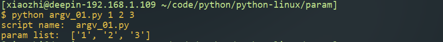
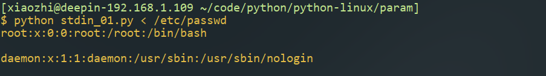
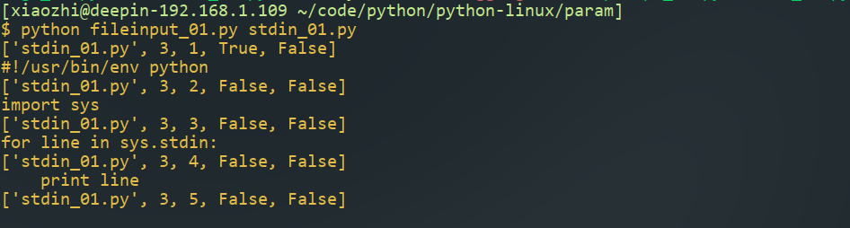
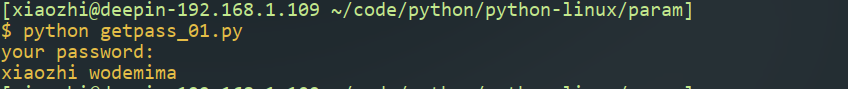
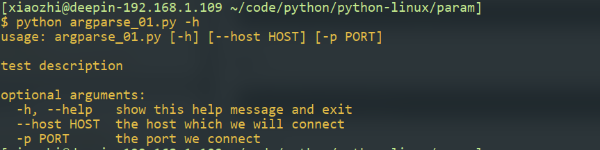
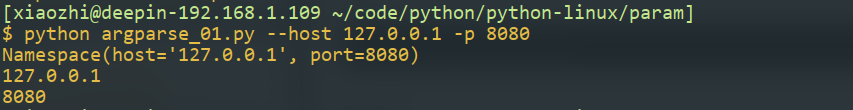
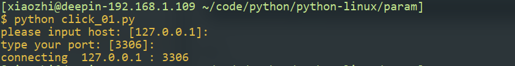
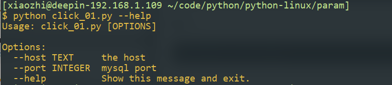
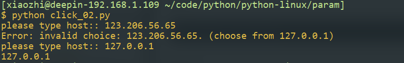
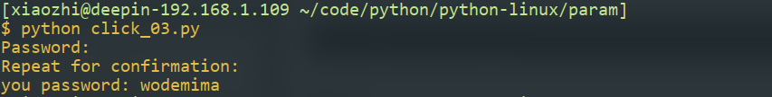

# 二、命令行工具

命令行是linux下执行程序的主要方式，使用python解析命令行是简单的，有许多有用的模块可供选择，传统程序设计解析参数较为复杂，python以一种较为优雅的方式帮助我们完成这一复杂的过程

### sys模块

#### argv

模块sys中的argv列表中存放了运行python模块时给出的参数列表，argv[0]表示脚本名称，其后为给出的参数。它是一个普通的列表，可以修改

```
#!/usr/bin/env python
import sys
print 'script name: ', sys.argv[0]
print 'param list: ', sys.argv[1:]
```


#### stdin&fileinput

使用stdin和fileinput读取标准输入

```
#!/usr/bin/env python
import sys
for line in sys.stdin:
    print line
```

fileinput模块提供了比stdin更加通用的功能，使读取文件的过程更加简单。fileinput会遍历sys.argv[1:]列表，顺序读取文件中的内容，并且提供了一些方法，可以让我们在读取文件时获取一些文件相关的信息

使用示例如下
```python
#!/usr/bin/env python
import sys
import fileinput
for line in fileinput.input():
    meta = [fileinput.filename(), fileinput.fileno(), fileinput.filelineno(), fileinput.isfirstline(), fileinput.isstdin()]
    print meta
    print line,
```


### 读取用户密码

使用getpass
输入密码时，我们不希望密码保存进历史记录中

```
#!/usr/bin/python
import getpass
user = getpass.getuser()
password = getpass.getpass('your password:')
print user, password
```


### 配置文件解析

使用ConfigParser
有时执行系统命令时，查找指定配置文件，读取参数再执行程序是普遍流程，一般配置文件包含一个或多个章节(section)，每个章节下包含许多选项(option)。为了解析配置文件，需要先初始化一个ConfigParser对象，该对象有许多方法可以用来获取，设置选项，初始化时，有一个比较重要的参数allow_no_value，该参数的值决定了是否允许选项值为空，有些配置文件以选项的有无决定操作。
初始化一个ConfigParser，使用read方法从配置文件中读取内容

ConfigParser对象提供了许多方法用于访问配置文件的内容


ConfigParser对象也提供了许多设置选项的方法


写入文件


### 使用argparse解析命令行参数

argparse可以根据程序的定义从argv列表中取出特定参数，并自动生成帮助信息。argparse中最重要的一个类是ArgumentParser，解析命令行参数时，先初始化该类，有一个需要注意的参数description，该参数设置程序提示信息。初始化对象之后，使用add_argument方法为程序添加参数，选项如下


使用parse_args方法获得参数列表（namespace）


```python
#!/usr/bin/env python
import argparse
def _argparser():
    arg = argparse.ArgumentParser(description="test description")
    arg.add_argument('--host', default="127.0.0.1", help="the host which we will connect", dest="host")
    arg.add_argument('-p', default=3306, type=int, help="the port we connect",dest="port")
    return arg.parse_args()

def main():
    args = _argparser()
    print args
    print args.host
    print args.port
if __name__ == '__main__':
    main()
```

自动生成的命令帮助

带参数运行


### 记录应用程序日志

日志对程序来说是不可缺少的一环，将程序运行状态记录下来，可以用于排查错误，审计等等。logging模块简化了我们记录日志的操作，logging模块有debug，error，info，warn，critical五个级别的日志，默认情况下将日志内容输出至标准输出。我们可以通过basicConfig函数设置日志的格式,可指定的参数如下

示例

```python
#!/usr/bin/env python
import logging
logging.basicConfig(filename='app.log',
                format='%(asctime)s  %(filename)s %(lineno)d: %(levelname)s  %(message)s',
               level=logging.INFO)

logging.info('info')
logging.debug('debug')
logging.warn('warn')
logging.error('error')
logging.critical('critical')
```


     [loggers]
     root
     
     [handlers]
     logfile
     
     [formatters]
     generic
     
     [logger_root]
     handlers=logfile
     
     [handler_logfile]
     class = handlers.TimeRotatingFileHandler
     args = ('app.log','midnight',1,10)
     level = DEBUG
     formatter = generic
     
     [formatter_generic]
     format='%(asctime)s %(levelname)-5.5s [%(name)s:%(lineno)s] %(message)s'


理解一些logging模块基本概念是必要的Handler日志处理器决定了日志保存在什么地方保存多久，formatter控制日志输出的格式，logger执行记录日志操作。复杂的项目一般将日志配置写入配置文件中

### 使用click管理命令参数

click是一个命令行开源项目，相对于标准库中的argparse，增强了易用性。函数装饰器的概念是我们需要先前理解的。使用click时，首先使用command（）装饰一个函数使之成为命令行工具，之后通过option添加参数。option函数常用的选项如下

示例

```
 #!/usr/bin/env python
 import click
 
 
 @click.command()
 @click.option('--host',default='127.0.0.1',type=str, prompt='please input host:',help='the host')
 @click.option('--port', default=3306, type=int, prompt="type your port:", help='mysql port')
 def connect(host,port):
     print 'connecting ',host,':',port
 
 connect()
```
当没有给定参数时，函数运行过程中会提示用户输入，另外click会为我们生成程序帮助

帮助信息

使用Choice函数限制参数值的范围
```
 #!/usr/bin/env python
 import click
 
 @click.command()
 @click.option('--host',type=click.Choice(['127.0.0.1']), prompt='please type host:')
 def hash(host):
     print host
 
 hash()
```

设置hide_input为True获取用户密码
```
 #!/usr/bin/env python
 import click
 
 
 @click.command()
 @click.option('--password', prompt=True, hide_input=True, confirmation_prompt=True)
 def getpass(password):
     print 'you password:',password
 
 getpass()
```


### prompt_toolkit处理交互式场景

工具使用非常简单，我们看一些比较常用的特性

```
 #!/usr/bin/env pypthon
 from prompt_toolkit import prompt
 
 while True:
     user_input=prompt(u'>')
     print user_input
```
支持终端的一些快捷键

添加查看历史输入功能
```
 #!/usr/bin/env python
 from prompt_toolkit import prompt
 from prompt_toolkit.history import FileHistory
 
 while True:
     user_input = prompt(u'>', history=FileHistory('history.txt'))
     print user_input
```
支持通过上下按键查看历史输入

添加自动命令提示
```
 #!/usr/bin/env python
 from prompt_toolkit import prompt
 from prompt_toolkit.history import FileHistory
 from prompt_toolkit.auto_suggest import AutoSuggestFromHistory
 
 while True:
     user_input = prompt(u'>', history=FileHistory('history.txt'), auto_suggest=AutoSuggestFromHistory())
     print user_input
```


​    


​      