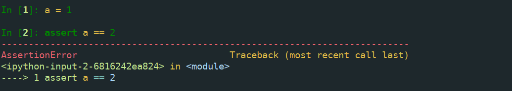

## 引论

### 理解pythonic的概念

#### 交换变量的值

pythonic是充分利用python语言特性的一种编码风格。比如交换两个变量的值，在静态语言中，可能需要我们这样做

```c
int temp;
temp = a;
a= b;
b=temp;
```

但是在python中

```
a,b = b, a
```

#### 尽量使用迭代器

使用迭代器而不是索引来遍历列表，充分使用enumerate函数

#### with语句管理资源

### 编写pythonic的代码

#### 避免劣化代码

代码中的变量名称要具有一定的含义，不要使用a，A这样的无意义字符作为变量名称，且变量名长一些也无所谓

#### 在代码中适当添加注释

#### 适当添加空行

#### 编写函数的原则

-   函数应该尽可能短小
-   函数声明应该合理
-   函数应该考虑向下兼容
-   一个函数只做一件事

#### 将常量集中到一个文件中

## 编程惯用法

### 使用assert检查代码



在python运行时指定-O参数可以禁用所有断言。

断言不应被滥用

### 利用延迟计算的特性